직업과 전공 간 상관관계에 따른 근로현황의 차이
================

요약
----

"직업과 전공 간 상관관계에 따른 근로현황의 차이"를 분석하기 위해 우선 청년들의 첫 직장 구직 시의 근로 현황을 분석해보았다. 첫 직장을 구할 때에는 전공과 연계성 있는 직업을 선택하고자 할 것이라 생각하였고, 전공과 밀접한 직종에서 일할수록 전반적인 근로성과 및 만족도가 높을 것이라 생각하고 분석을 시작하였다. 우선 첫 직장과 전공 간에 연관성 여부를 조사해 본 결과 약 57%가 전공과 관련된 직종에 종사하였고, 약 42%가 그렇지 않은 직종에 종사하였다. 이렇게 두 집단으로 나눈 후 두 집단 간 전반적인 근로 현황의 차이를 분석 해보았다. 우선 두 집단 간 월평균 임금을 분석해 본 결과, 업무와 전공 간의 연관성이 있는 집단의 월 평균 임금이 그렇지 않은 집단에 비해 약 39%정도 높은 것으로 분석되었다. 반면 주당 평균 근로 시간에서는 전공 연관성이 높은 집단이 그렇지 않은 집단에 비해 3시간 정도 많은 것으로 분석되었다. 이를 통해 전공과 업무 간의 연관성이 높을수록 업무에 대한 능력이나 열정이 더 크다는 것을 알 수 있다. 이를 구체적으로 확인하기 위해 두 집단별 종사상 지위의 분포를 분석해본 결과 두 집단 모두 상용직 임금 근로자의 비중이 가장 컸으나, 전공과 연관성이 없는 집단에서의 임시직 비중이 26%로 전공과 연관성이 있는 집단에서의 임시직 비중의 약 두 배 정도 많은 것으로 파악되었다. 즉 직업과 전공 간 연관성이 있을수록 상용직으로 근무할 확률이 높다는 것이다.
한편, 각 집단별로 근무 만족도를 분석하기 위해 현재 이직을 준비하거나 첫 직장을 퇴직한 사람들의 비율을 살펴보았다. 먼저 퇴직자들 중 전공적합성이 높은 집단이 그렇지 않은 집단보다 평균 0.506년 더 오래 일했음을 알 수 있다. 전공과의 연관성이 높은 집단은 주로 소득이 적거나 가사문제 등으로 퇴직하였고, 연관성이 낮은 집단은 주로 장래성이 없다고 생각하거나 소득이 적어서 퇴직하였다. 전공과 연관성이 낮은 집단에서 장래성이 낮다고 판단하거나 적성에 맞지 않아서 퇴직하는 비중이 크기는 하나, 두 집단에서 모두 소득이 낮아서 퇴직한 비중이 20% 정도로 높은 것으로 보아 퇴직을 고려할 때에는 소득과 같은 보다 현실적인 문제를 더 고려한다는 것을 파악할 수 있었다.
이어서 청년들의 우리 사회에 대한 인식이나 자존감 등을 분석해 전공적합성 정도가 개인의 주관적 인식에는 어떤 영향을 미치는지 분석해보았다. 그 결과, 전공적합성 정도가 높은 집단이 그렇지 않은 집단에 비해 사회가 공정하다고 생각하였고 전반적인 자존감도 높은 것으로 파악되었다.

분석주제
--------

사회 진출을 준비하는 청년들의 주요 관심사들 중 하나는 바로 "취업"이다. 최근 대한민국에서 일자리를 구하는 것이 점점 어려워지면서 대학생을 비롯한 20대들의 "구직"에 대한 관심은 날로 더해지고 있다. 우리 조원들 역시 모두 취업을 앞둔 대학생들로 취업에 관한 분석 주제를 잡아보기로 하던 중, 그 중에서도 전공과 직업 간의 상관성이 높을수록 전반적인 근로에 어떤 영향을 미치는지 분석하고자 하였다. 즉, 전공을 살려서 직장을 구하면 그렇지 않은 경우와 비교하였을 때 임금이나 근로시간 등 전반적인 근로 현황에서 차이를 보이는지에 대해 알아보고자 하였다.

분석
----

##### 필요한 함수 불러오기

``` r
library(dplyr)
library(foreign)
library(ggplot2)
library(gridExtra)
```

##### 데이터 불러오기

``` r
data <- read.spss(file = "klips19a.sav", to.data.frame = T)
```

##### 활용코드 해석표

``` r
code_name <- data.frame(English_name=c("suitability","wage","work_time","group","have_work","endwork_reason",
                                       "jobstart_year","jobend_year","countermeasure of employment ",
                                       "unemployment_1","unemployment_2","employment_solution_1",
                                       "employment_solution_2","effort_reward","fail_chance",
                                       "self_fail","self_contentment"),
                      Korean_name=c("전공적합성","임금","노동시간","분류집단","취업여부","퇴직사유",
                                    "취업시기","퇴직시기", "고용대책관심정도","취업난원인_1","취업난원인_2",
                                    "고용문제해결방법_1","고용문제해결방법_2","노력에따른공정대가인식",
                                    "실패해도기회인식","자신이실패작","자신에게만족"),
                          code = c("a199417","a199415","a199416","a199409","a199422","a199423","a199403",
                                   "a199424","a199601","a199634","a199635","a199636","a199637","a199711",
                                   "a199709","a199725","a199717"))

code_name
```

    ##                     English_name            Korean_name    code
    ## 1                    suitability             전공적합성 a199417
    ## 2                           wage                   임금 a199415
    ## 3                      work_time               노동시간 a199416
    ## 4                          group               분류집단 a199409
    ## 5                      have_work               취업여부 a199422
    ## 6                 endwork_reason               퇴직사유 a199423
    ## 7                  jobstart_year               취업시기 a199403
    ## 8                    jobend_year               퇴직시기 a199424
    ## 9  countermeasure of employment        고용대책관심정도 a199601
    ## 10                unemployment_1           취업난원인_1 a199634
    ## 11                unemployment_2           취업난원인_2 a199635
    ## 12         employment_solution_1     고용문제해결방법_1 a199636
    ## 13         employment_solution_2     고용문제해결방법_2 a199637
    ## 14                 effort_reward 노력에따른공정대가인식 a199711
    ## 15                   fail_chance       실패해도기회인식 a199709
    ## 16                     self_fail           자신이실패작 a199725
    ## 17              self_contentment           자신에게만족 a199717

### 첫직장과 전공 적합성 여부

#### 전공 적합성이 높은 응답자

``` r
peo_major <- data %>% 
  filter(a199417 == 1 | a199417 == 2)

623/1089*100
```

    ## [1] 57.20845

#### 전공 적합성이 낮은 응답자

``` r
peo_major_not <- data %>% 
  filter(a199417 == 3 | a199417 == 4)

466/1089*100
```

    ## [1] 42.79155

응답자 중 전공 적합성이 높은 응답자는 57%, 낮은 응답자는 42.8% 이다.

### 집단별 세후 월평균 임금

##### 전공적합성 높은 응답자의 임금 평균

``` r
boxplot(peo_major$a199415) #극단치확인
boxplot(peo_major$a199415)$stats
```

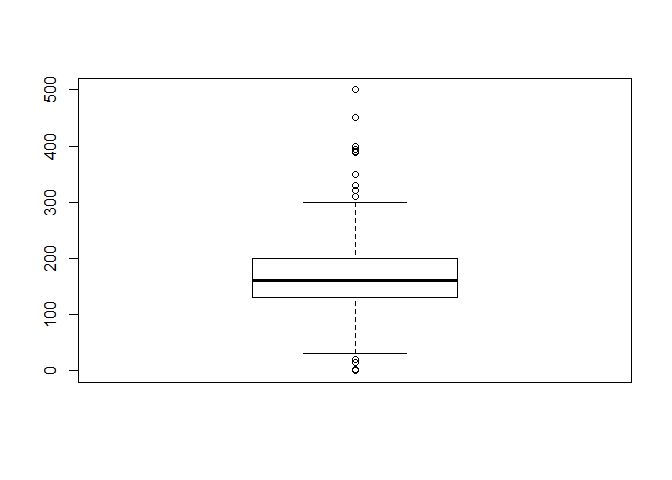

    ##      [,1]
    ## [1,]   30
    ## [2,]  130
    ## [3,]  160
    ## [4,]  200
    ## [5,]  300

``` r
peo_major$a199415<-ifelse(peo_major$a199415>300|peo_major$a199415<30,
                          NA,peo_major$a199415)#결측 처리


peo_major %>% 
  filter(!is.na(a199415)) %>%
  select(a199415) %>% 
  summarise(n=n()) #응답자 count
```

    ##     n
    ## 1 594

``` r
peo_major_wage <- peo_major %>% 
  filter(!is.na(a199415)) %>%
  select(a199415) %>% 
  group_by(a199415) %>% 
  summarise(count = n()) %>% 
  mutate(ratio = (count/594)*100) 


major_mean_wage<-mean(peo_major_wage$a199415) #160.9123
```

##### 전공적합성 낮은 응답자의 임금 평균

``` r
table(peo_major_not$a199415)
```

    ## 
    ##   1   2  12  25  26  40  45  48  50  53  55  56  59  60  65  70  73  75 
    ##   1   2   2   3   1   4   1   1   9   1   2   1   1   5   3   9   1   1 
    ##  80  84  85  90  95 100 104 110 116 120 125 130 135 140 142 145 148 150 
    ##  14   1   1   8   2  55   1   4   1  47   1  32   1   9   1   1   1  78 
    ## 160 164 167 170 180 186 190 200 210 220 228 230 240 250 260 270 290 300 
    ##  14   1   1  13  38   1   2  47   1   6   1   2   5  16   1   4   1   5 
    ## 350 
    ##   1

``` r
boxplot(peo_major_not$a199415) #극단치확인
boxplot(peo_major_not$a199415)$stats
```

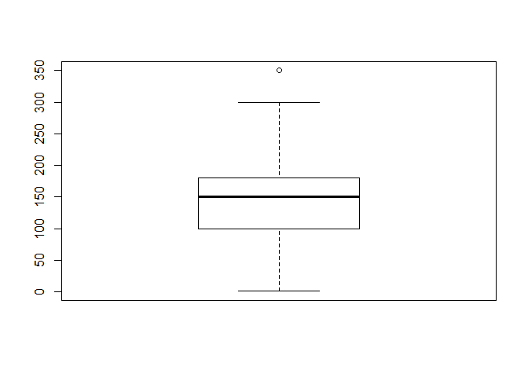

    ##      [,1]
    ## [1,]    1
    ## [2,]  100
    ## [3,]  150
    ## [4,]  180
    ## [5,]  300

``` r
peo_major_not$a199415<-ifelse(peo_major_not$a199415>300,NA,peo_major_not$a199415)#결측 처리

peo_major_not %>% 
  filter(!is.na(a199415)) %>%
  select(a199415) %>% 
  summarise(n=n())
```

    ##     n
    ## 1 465

``` r
peo_major_not_wage <- peo_major_not %>% 
  filter(!is.na(a199415)) %>%
  select(a199415) %>% 
  group_by(a199415) %>% 
  summarise(count = n()) %>% 
  mutate(ratio = (count/465)*100)

notmajor_mean_wage<-mean(peo_major_not_wage$a199415) #126.463
```

#### 두 집단의 임금 격차

``` r
160.9123-126.463
```

    ## [1] 34.4493

두집단의 월 임금 격차는 약 344,500원으로 분석 되었다.

### 집단별세후월평균임금그래프

##### 전체적인 동향

``` r
graph1<-ggplot(data = peo_major_wage, aes(x = a199415, y = count, fill = ratio)) + 
  geom_col() + 
  coord_flip()+
  xlab("wage")+
  ylab("number of person")+
  ggtitle("montly average wage(major suitability)")

graph2<-ggplot(data = peo_major_not_wage, aes(x = a199415, y = count, fill = ratio)) + 
  geom_col() + 
  coord_flip()+
  xlab("wage")+
  ylab("number of person")+
  ggtitle("montly average wage(major not suitability)")

grid.arrange(graph1, graph2, nrow=2)
```

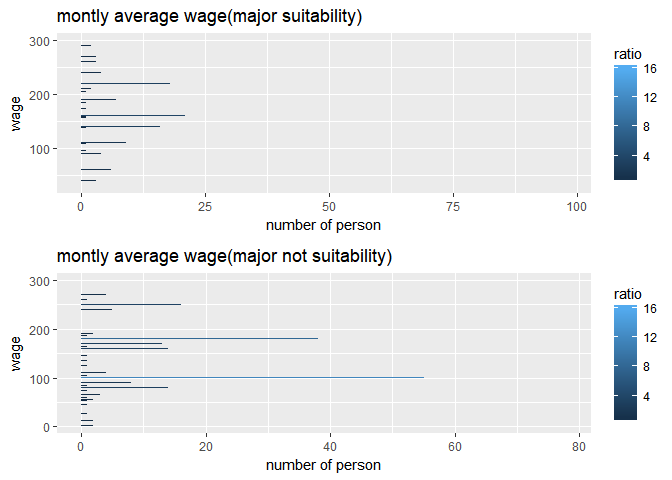 \#\#\#\#평균 비교

``` r
peo_major_wage$suitability <- c("Y")
peo_major_not_wage$suitability<-c("N")
total_wage<-rbind(peo_major_wage,peo_major_not_wage)

total_wage<-total_wage %>%
  group_by(suitability) %>%
  summarise(mean_wage=mean(a199415))

ggplot(data=total_wage, aes(x= reorder(suitability,-mean_wage),y=mean_wage))+
  geom_col()+
  xlab("suitability")+
  ylab("mean_wage")+
  ggtitle("montly average mena_wage")
```

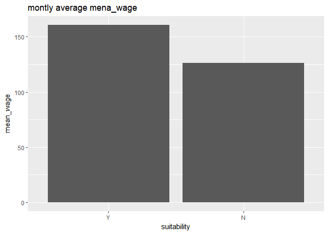

peo\_major\_wage 집단이 세후 월 평균임금이 더 높은걸 볼 수 있다.

### 일주일 평균 근로 시간

#### 전공적합성 높은 응답자의 근로 시간

``` r
table(peo_major$a199416)
```

    ## 
    ##   4   5   6   7   8   9  10  16  20  21  24  25  30  32  35  36  40  42 
    ##   4   3   1   1   3   1   4   1   8   1   2   1   4   1   3   1 394   2 
    ##  43  44  45  46  48  50  52  54  55  56  60  65  66  70  72 120 
    ##   1  22  31   5  42  35   1   7   6   2  21   1   1   5   7   1

``` r
boxplot(peo_major$a199416)#극단치 확인
boxplot(peo_major$a199416)$stats
```

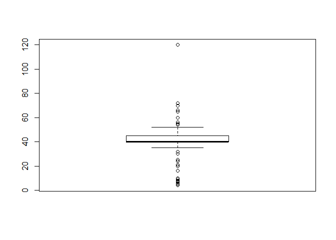

    ##      [,1]
    ## [1,]   35
    ## [2,]   40
    ## [3,]   40
    ## [4,]   45
    ## [5,]   52

``` r
peo_major$a199416<-ifelse(peo_major$a199416>52|peo_major$a199416<35,NA,peo_major$a199416)#결측 처리

peo_major %>% 
  filter(!is.na(a199416)) %>%
  select(a199416) %>% 
  summarise(n=n())
```

    ##     n
    ## 1 537

``` r
peo_major_hour <- peo_major %>% 
  filter(!is.na(a199416)) %>%
  select(a199416) %>% 
  group_by(a199416) %>% 
  summarise(count = n()) %>% 
  mutate(ratio = (count/536)*100)
```

#### 전공적합성 높은 응답자의 평균근로시간

``` r
mean(peo_major_hour$a199416)
```

    ## [1] 43.72727

#### 전공적합성 낮은 응답자의 근로시간

``` r
table(peo_major_not$a199416)
```

    ## 
    ##   2   5   8   9  10  12  16  20  21  24  25  30  32  35  36  40  44  45 
    ##   1   1   2   1   1   1   2   6   2   1   5  12   3   2   2 246  12  24 
    ##  46  48  50  54  55  56  60  63  70  72 
    ##   2  36  43   8   4   1  37   1   7   3

``` r
boxplot(peo_major_not$a199416)#극단치 확인
boxplot(peo_major_not$a199416)$stats
```

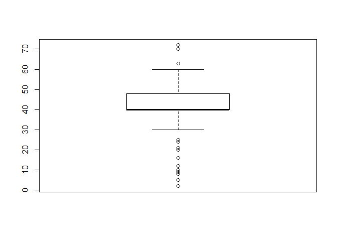

    ##      [,1]
    ## [1,]   30
    ## [2,]   40
    ## [3,]   40
    ## [4,]   48
    ## [5,]   60

``` r
peo_major_not$a199416<-ifelse(peo_major_not$a199416>60|peo_major_not$a199416<30,NA,peo_major_not$a199416)#결측 처리

peo_major_not %>% 
  filter(!is.na(a199416)) %>%
  select(a199416) %>% 
  summarise(n=n())
```

    ##     n
    ## 1 432

``` r
peo_major_not_hour <- peo_major_not %>% 
  filter(!is.na(a199416)) %>%
  select(a199416) %>% 
  group_by(a199416) %>% 
  summarise(count = n()) %>% 
  mutate(ratio = (count/432)*100)
```

#### 전공적합성 낮은 응답자의 평균근로시간

``` r
mean(peo_major_not_hour$a199416) #45.07143
```

    ## [1] 45.07143

#### 두 집단의 근로시간 차이

``` r
45.07143-43.72727
```

    ## [1] 1.34416

두 집단의 근로시간 차이는 약 1시간 30분으로 분석 되었다.

### 일주일 평균 근로 시간그래프

#### 전체적인 동향

``` r
graph3<-ggplot(data = peo_major_hour, aes(x = a199416, y = count, fill = ratio)) + 
  geom_col() + 
  coord_flip() +
  xlab("hour")+
  ylab("number of person")+
  ggtitle("montly average hour(major suitability)")

graph4<-ggplot(data = peo_major_not_hour, aes(x = a199416, y = count, fill = ratio)) + 
  geom_col() + 
  coord_flip()+
  xlab("hour")+
  ylab("number of person")+
  ggtitle("montly average hour(major suitability)")

grid.arrange(graph3,graph4,nrow=2)
```

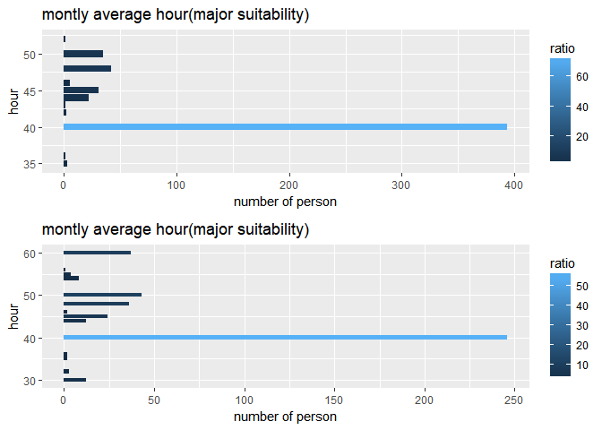

#### 평균 비교

``` r
peo_major_hour$suitability <- c("Y")
peo_major_not_hour$suitability<-c("N")
total_hour<-rbind(peo_major_hour,peo_major_not_hour)

total_hour<-total_hour %>%
  group_by(suitability) %>%
  summarise(mean_hour=mean(a199416))

ggplot(data=total_hour, aes(x= reorder(suitability,-mean_hour),y=mean_hour))+
  geom_col()+
  xlab("suitability")+
  ylab("mean_hour")+
  ggtitle("montly average mean_hour")
```

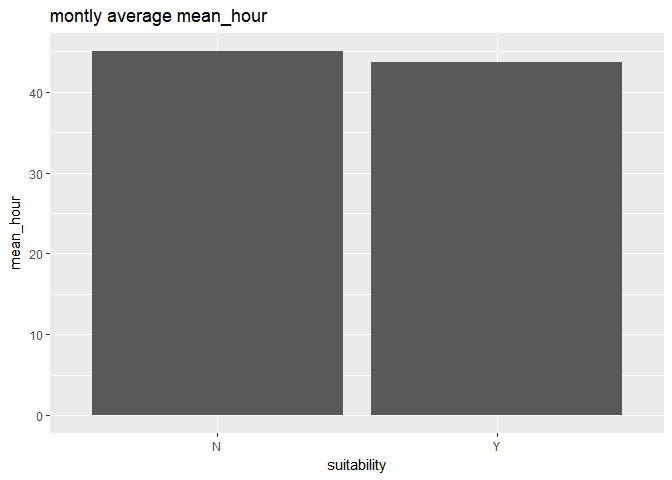

집단별로 근무 만족도를 분석하기 위해 현재 이직을 준비하거나 첫 직장을 퇴직한 사람들의 비율을 분석한다. \#\#\#\#현재 취업여부 파악(현재 이직 준비 및 첫 직장을 퇴직한 상태)

``` r
peo_stop <- data %>% 
  filter(a199422 == 2)
```

``` r
peo_stop_1 <- peo_stop %>% 
  filter(a199417 == 1 | a199417 == 2) #전공 적합성 높은 퇴직자

peo_stop_2 <- peo_stop %>% 
  filter(a199417 == 3 | a199417 == 4) #전공 적합성 낮은 퇴직자 
```

#### 퇴직 사유 빈도표

``` r
peo_stop_1_table <- peo_stop_1 %>% 
  group_by(a199423) %>% 
  summarise(count = n()) %>% 
  mutate(ratio = (count/324)*100) %>% 
  arrange(desc(ratio)) %>% 
  head(5)  #전공적합성 높음 

peo_stop_2_table <- peo_stop_2 %>% 
  group_by(a199423) %>% 
  summarise(count = n()) %>% 
  mutate(ratio = (count/294)*100) %>% 
  arrange(desc(ratio)) %>% 
  head(5) #전공적합성 낮음 
```

#### 퇴직사유 빈도표(그래프)

``` r
peo_stop_1_table$a199423  <- ifelse(peo_stop_1_table$a199423==6,"소득 또는 보수가 적어서",
                        ifelse(peo_stop_1_table$a199423==8,"일이 임시적이거나 장래성이 없어서",
                               ifelse(peo_stop_1_table$a199423==9,"적성, 지식, 기능 등이 맞지 않아서",
                                      ifelse(peo_stop_1_table$a199423==10,"근로시간 또는 근로환경이 나빠서",
                                             "결혼, 육아, 가사 등 가사문제로"))))
peo_stop_2_table$a199423  <- ifelse(peo_stop_2_table$a199423==6,"소득 또는 보수가 적어서",
                                    ifelse(peo_stop_2_table$a199423==8,"일이 임시적이거나 장래성이 없어서",
                                           ifelse(peo_stop_2_table$a199423==9,"적성, 지식, 기능 등이 맞지 않아서",
                                                  ifelse(peo_stop_2_table$a199423==10,"근로시간 또는 근로환경이 나빠서",
                                                         "결혼, 육아, 가사 등 가사문제로"))))
                                                                                
graph9<-ggplot(data = peo_stop_1_table, 
               aes(x = reorder(a199423, count),
                   y = count, 
                   fill = ratio)) + 
  geom_col() + 
  coord_flip()+
  xlab("")+
  ylab("number of person")+
  ggtitle("reason for retirement (major suitability)")


graph10<-ggplot(data = peo_stop_2_table, 
                aes(x = reorder(a199423, count),
                    y = count, 
                    fill = ratio)) + 
  geom_col() + 
  coord_flip()+
  xlab("")+
  ylab("number of person")+
  ggtitle("reason for retirement (major not suitability)")

grid.arrange(graph9,graph10,nrow=2)
```

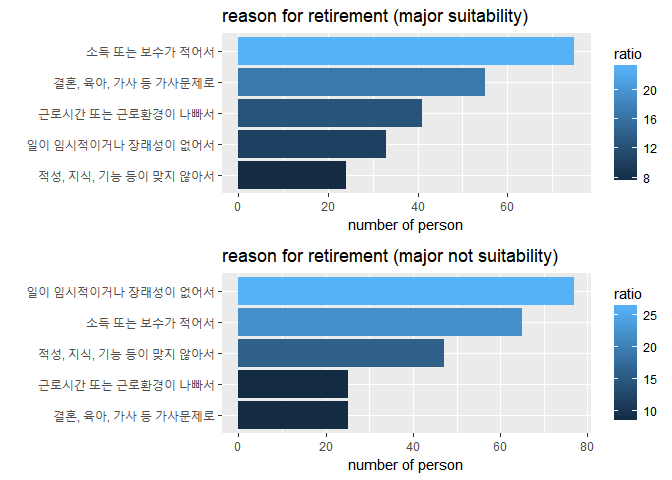

### 전공적합성에 따른 퇴직시기

#### 전공 적합성 높은 퇴직자

``` r
table(peo_stop_1$a199403) #취업시기(년)
```

    ## 
    ##   -1 1999 2000 2001 2002 2003 2004 2005 2006 2007 2008 2009 2010 2011 2012 
    ##    2    3    1    7    7   12   12   28   18   25   37   30   28   17   34 
    ## 2013 2014 2015 
    ##   26   22   15

``` r
table(peo_stop_1$a199424) #퇴직시기(년)
```

    ## 
    ## 2000 2002 2003 2004 2005 2006 2007 2008 2009 2010 2011 2012 2013 2014 2015 
    ##    2    7    2    5    8   11   17   18   19   34   28   24   37   40   48 
    ## 2016 
    ##   24

``` r
boxplot(peo_stop_1$a199403)
```


``` r
boxplot(peo_stop_1$a199424)  #극단치 확인
```

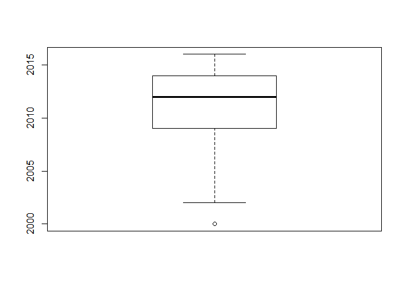

``` r
peo_stop_1$a199403<-ifelse(peo_stop_1$a199403==-1,NA,peo_stop_1$a199403)
peo_stop_1$a199424<-ifelse(peo_stop_1$a199424==2000,NA,peo_stop_1$a199424) #결측 처리 

peo_stop_1 %>%
  filter(!is.na(a199403)) %>%
  summarise(start_year=mean(a199403)) #취업시기평균값2008.811
```

    ##   start_year
    ## 1   2008.811

``` r
peo_stop_1 %>%
  filter(!is.na(a199424)) %>%
  summarise(stop_year=mean(a199424)) #퇴직시기평균값2011.37
```

    ##   stop_year
    ## 1   2011.37

``` r
2011.37-2008.811 #첫 직장 일한 기간 2.559년
```

    ## [1] 2.559

#### 전공 적합성 낮은 퇴직자

``` r
table(peo_stop_2$a199403) #취업시기(년)
```

    ## 
    ##   -1 1999 2000 2001 2002 2003 2004 2005 2006 2007 2008 2009 2010 2011 2012 
    ##    2    1    1   10    9   12   16   26   17   20   34   19   27   17   28 
    ## 2013 2014 2015 
    ##   17   20   18

``` r
table(peo_stop_2$a199424) #퇴직시기(년)
```

    ## 
    ##   -1 2000 2001 2002 2003 2004 2005 2006 2007 2008 2009 2010 2011 2012 2013 
    ##    1    1    2    7    6   10    9   13   16   16   20   31   19   33   20 
    ## 2014 2015 2016 
    ##   35   46    9

``` r
boxplot(peo_stop_2$a199403)
```


``` r
boxplot(peo_stop_2$a199424)   #극단치 확인
```

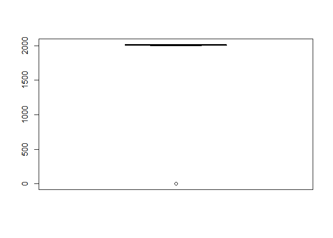

``` r
peo_stop_2$a199403<-ifelse(peo_stop_2$a199403==-1,NA,peo_stop_2$a199403)
peo_stop_2$a199424<-ifelse(peo_stop_2$a199424==-1,NA,peo_stop_2$a199424) #결측처리 

peo_stop_2 %>%
  filter(!is.na(a199403)) %>%
  summarise(start_year_2=mean(a199403)) #취업시기평균값2008.582
```

    ##   start_year_2
    ## 1     2008.582

``` r
peo_stop_2 %>%
  filter(!is.na(a199424)) %>%
  summarise(stop_year_2=mean(a199424)) #퇴직시기평균값2010.635
```

    ##   stop_year_2
    ## 1    2010.635

``` r
2010.635-2008.582 #첫 직장 일한 기간 2.053년
```

    ## [1] 2.053

전공 적합성이 높은 응답자가 아닌 응답자 보다 평균 0.506년 더 근무 하였다.

### 청년 고용 대책의 방향성 여부

#### 현재 일자리 여부

##### 전공 적합성 높은 응답자 중 현재 일자리를 가진 사람

``` r
dim(peo_major) #623
```

    ## [1] 623 292

``` r
peo_major %>%
  filter(a199601==1 | a199601==2 | a199601==3 | a199601==4 | a199601==5) %>%
  summarise(n=n()) #623명(모두 해당)
```

    ##     n
    ## 1 623

##### 전공 적합성 낮은 응답자 중 현재 일자리를 가진 사람

``` r
dim(peo_major_not) #466명
```

    ## [1] 466 292

``` r
peo_major_not %>%
  filter(a199601==1 | a199601==2 | a199601==3 | a199601==4 | a199601==5) %>%
  summarise(n=n()) #466명(모두 해당)
```

    ##     n
    ## 1 466

### 청년층 취업난의 주요 원인\_1순위를 무엇이라 생각할까?

#### 전공 적합성 높은 응답자

``` r
table(peo_major$a199634) #이상치 확인
```

    ## 
    ##   1   2   3   4   5   6   7   8 
    ## 249  79  81  29  82  29   4  70

``` r
peo_major %>%
  select(a199634) %>%
  group_by(a199634) %>%
  summarise(count = n()) %>% 
  mutate(ratio = (count/623)*100) %>%
  arrange(desc(ratio)) %>%
  head(5)
```

    ## # A tibble: 5 x 3
    ##   a199634 count ratio
    ##     <dbl> <int> <dbl>
    ## 1      1.   249  40.0
    ## 2      5.    82  13.2
    ## 3      3.    81  13.0
    ## 4      2.    79  12.7
    ## 5      8.    70  11.2

#### 전공 적합성 낮은 응답자

``` r
table(peo_major_not$a199634) #이상치 확인
```

    ## 
    ##   1   2   3   4   5   6   7   8 
    ## 198  54  40  24  70  26  13  41

``` r
peo_major_not %>%
  select(a199634) %>%
  group_by(a199634) %>%
  summarise(count = n()) %>% 
  mutate(ratio = (count/466)*100) %>%
  arrange(desc(ratio)) %>%
  head(5)
```

    ## # A tibble: 5 x 3
    ##   a199634 count ratio
    ##     <dbl> <int> <dbl>
    ## 1      1.   198 42.5 
    ## 2      5.    70 15.0 
    ## 3      2.    54 11.6 
    ## 4      8.    41  8.80
    ## 5      3.    40  8.58

### 청년층 고용 문제 해결 방법(1순위)을 무엇이라 생각할까?

#### 전공 적합성 높은 응답자

``` r
table(peo_major$a199636) #이상치 확인
```

    ## 
    ##   1   2   3   4   5   6   7 
    ## 171 219  44  63  66  41  19

``` r
major_solution_1<-peo_major %>%
  select(a199636) %>%
  group_by(a199636) %>%
  summarise(count = n()) %>% 
  mutate(ratio = (count/623)*100) %>%
  arrange(desc(ratio)) %>%
  head(5)
```

#### 전공 적합성 낮은 응답자

``` r
table(peo_major_not$a199636) #이상치 확인
```

    ## 
    ##   1   2   3   4   5   6   7 
    ## 114 171  35  51  44  37  14

``` r
notmajor_solution_1<-peo_major_not %>%
  select(a199636) %>%
  group_by(a199636) %>%
  summarise(count = n()) %>% 
  mutate(ratio = (count/466)*100) %>%
  arrange(desc(ratio)) %>%
  head(5)
```

#### 청년층 고용 문제 해결 방법\_1순위(그래프)

``` r
major_solution_1$a199636  <- ifelse(major_solution_1$a199636==1,"대기업의 일자리 창출 유도",
                                    ifelse(major_solution_1$a199636==2,"중소기업의 일자리 질개선",
                                           ifelse(major_solution_1$a199636==3,"기존 근로자의 일자리 나누기",
                                                  ifelse(major_solution_1$a199636==4,"과도한 대학진학 억제",
                                                         "직업교육의 강화"))))

notmajor_solution_1$a199636  <- ifelse(notmajor_solution_1$a199636==1,"대기업의 일자리 창출 유도",
                                    ifelse(notmajor_solution_1$a199636==2,"중소기업의 일자리 질개선",
                                           ifelse(notmajor_solution_1$a199636==6,"청년층 구직자 소득 보장",
                                                  ifelse(notmajor_solution_1$a199636==4,"과도한 대학진학 억제",
                                                         "직업교육의 강화"))))

graph11<-ggplot(data = major_solution_1, 
               aes(x = reorder(a199636, count),
                   y = count, 
                   fill = ratio)) + 
  geom_col() + 
  coord_flip()+
  xlab("")+
  ylab("number of person")+
  ggtitle("first solution for employment problem (major suitability)")


graph12<-ggplot(data = notmajor_solution_1, 
                aes(x = reorder(a199636, count),
                    y = count, 
                    fill = ratio)) + 
  geom_col() + 
  coord_flip()+
  xlab("")+
  ylab("number of person")+
  ggtitle("first solution for employment problem (major not suitability)")

grid.arrange(graph11,graph12,nrow=2)
```

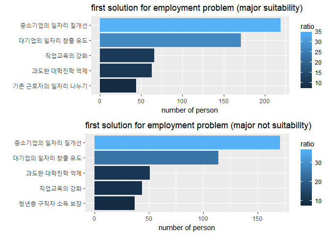 두 집단 모두 중소기업의 일자리 질개선을 청년층 고용문제 해결방안으로 뽑았다.

### 주관적인식

#### 우리사회는 노력에 따른 공정한 대가가 제공되고 있다.

##### 전공 적합성 높은 응답자

``` r
table(peo_major$a199711)
```

    ## 
    ##   1   2   3   4   5 
    ##  25 141 254 195   8

``` r
peo_major %>%
  select(a199711) %>%
  summarise(n=n())
```

    ##     n
    ## 1 623

``` r
major_socialperception_1<- peo_major %>%
  select(a199711) %>%
  group_by(a199711) %>%
  summarise(ratio=n()/623*100) %>%
  arrange(desc(ratio))

major_socialperception_1
```

    ## # A tibble: 5 x 2
    ##   a199711 ratio
    ##     <dbl> <dbl>
    ## 1      3. 40.8 
    ## 2      4. 31.3 
    ## 3      2. 22.6 
    ## 4      1.  4.01
    ## 5      5.  1.28

##### 전공 적합성 낮은 응답자

``` r
table(peo_major$a199711)
```

    ## 
    ##   1   2   3   4   5 
    ##  25 141 254 195   8

``` r
peo_major_not %>%
  select(a199711) %>%
  summarise(n=n())
```

    ##     n
    ## 1 466

``` r
notmajor_socialperception_1<-peo_major_not %>%
  select(a199711) %>%
  group_by(a199711) %>%
  summarise(ratio=n()/466*100) %>%
  arrange(desc(ratio))

notmajor_socialperception_1
```

    ## # A tibble: 5 x 2
    ##   a199711 ratio
    ##     <dbl> <dbl>
    ## 1      3. 39.1 
    ## 2      2. 27.7 
    ## 3      4. 24.0 
    ## 4      1.  7.73
    ## 5      5.  1.50

#### 우리사회는 노력에 따른 공정한 대가가 제공되고 있다(그래프)

``` r
major_socialperception_1$suitability<-c("Y")
notmajor_socialperception_1$suitability<-c("N")
total_socialperception_1<-rbind(major_socialperception_1,notmajor_socialperception_1)

ggplot(data=total_socialperception_1) +
  geom_bar(mapping = aes(x=a199711,
                         y=ratio, 
                         fill=as.factor(suitability)),
           stat="identity", 
           position = "dodge") + 
  scale_fill_discrete(name="suitability")+ xlab('') + ylab('ratio')+ 
  scale_x_discrete(limits = c("전혀 동의하지 않는다","별로 동의하지 않는다","보통이다","어느정도 동의한다","매우 동의한다"))+
  ggtitle("'우리사회는 노력에 따른 공정한 대가가 제공되고 있다'에 대한 주관적 인식")
```

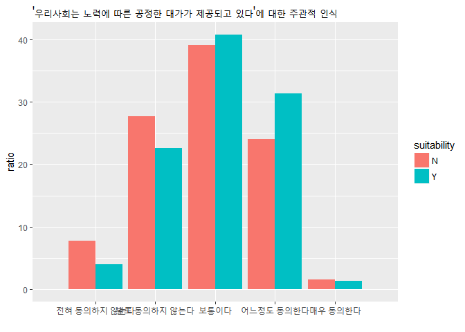

전공 적합성이 높은 응답자에게서는 '보통이다' 다음으로 '어느정도 동의한다' 라는 긍정적인 응답이 많았다. 반면 적합성이 낮은 응답자는 '보통이다' 다음으로 '별로 동의하지 않는다'라는응답을 27.7%가 하였다.

#### 우리사회는 한 번 실패해도 다시 일어설 수 있는 기회가 있다.

##### 전공 적합성 높은 응답자

``` r
table(peo_major$a199709)
```

    ## 
    ##   1   2   3   4   5 
    ##  20 125 244 217  17

``` r
peo_major %>%
  select(a199709)%>%
  summarise(n=n())
```

    ##     n
    ## 1 623

``` r
major_socialperception_2<-peo_major %>%
  select(a199709) %>%
  group_by(a199709) %>%
  summarise(ratio=n()/623*100) %>%
  arrange(desc(ratio))

major_socialperception_2
```

    ## # A tibble: 5 x 2
    ##   a199709 ratio
    ##     <dbl> <dbl>
    ## 1      3. 39.2 
    ## 2      4. 34.8 
    ## 3      2. 20.1 
    ## 4      1.  3.21
    ## 5      5.  2.73

##### 전공 적합성 낮은 응답자

``` r
table(peo_major_not$a199709)
```

    ## 
    ##   1   2   3   4   5 
    ##  23 120 190 122  11

``` r
peo_major_not %>%
  select(a199709)%>%
  summarise(n=n())
```

    ##     n
    ## 1 466

``` r
notmajor_socialperception_2<-peo_major_not %>%
  select(a199709) %>%
  group_by(a199709) %>%
  summarise(ratio=n()/466*100) %>%
  arrange(desc(ratio))

notmajor_socialperception_2
```

    ## # A tibble: 5 x 2
    ##   a199709 ratio
    ##     <dbl> <dbl>
    ## 1      3. 40.8 
    ## 2      4. 26.2 
    ## 3      2. 25.8 
    ## 4      1.  4.94
    ## 5      5.  2.36

#### 우리사회는 한 번 실패해도 다시 일어설 수 있는 기회가 있다.(그래프)

``` r
major_socialperception_2$suitability<-c("Y")
notmajor_socialperception_2$suitability<-c("N")
total_socialperception_2<-rbind(major_socialperception_2,notmajor_socialperception_2)

ggplot(data=total_socialperception_2) +
  geom_bar(mapping = aes(x=a199709,
                         y=ratio, 
                         fill=as.factor(suitability)),
           stat="identity", 
           position = "dodge") + 
  scale_fill_discrete(name="suitability")+ xlab('') + ylab('ratio')+ 
  scale_x_discrete(limits = c("전혀 동의하지 않는다","별로 동의하지 않는다","보통이다","어느정도 동의한다","매우 동의한다"))+
  ggtitle("'우리사회는 한 번 실패해도 다시 일어설 수 있는 기회가 있다'에 대한 주관적 인식")
```

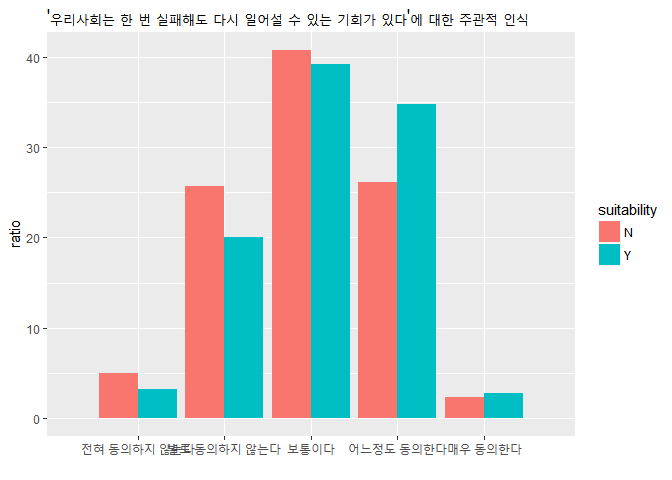

기회에 대한 질문에 긍정적인 답변을 한 비율은 전공 적합성이 높은 응답자가 37.55%, 낮은 응답자가 28.48%로 차이를 보였다.

### (자존감)전반적으로 나는 실패작인 것 같다.

#### 전공 적합성 높은 응답자

``` r
table(peo_major$a199725)
```

    ## 
    ##   1   2   3   4   5 
    ## 241 260  97  22   3

``` r
peo_major %>%
  select(a199725)%>%
  summarise(n=n())
```

    ##     n
    ## 1 623

``` r
major_self_1<-peo_major %>%
  group_by(a199725) %>%
  summarise(ratio=n()/623*100) %>%
  arrange(desc(ratio))

major_self_1
```

    ## # A tibble: 5 x 2
    ##   a199725  ratio
    ##     <dbl>  <dbl>
    ## 1      2. 41.7  
    ## 2      1. 38.7  
    ## 3      3. 15.6  
    ## 4      4.  3.53 
    ## 5      5.  0.482

#### 전공 적합성이 낮은 응답자

``` r
table(peo_major_not$a199725)
```

    ## 
    ##   1   2   3   4   5 
    ## 130 186 124  25   1

``` r
peo_major_not %>%
  select(a199725) %>%
  summarise(n=n())
```

    ##     n
    ## 1 466

``` r
notmajor_self_1<-peo_major_not %>%
  select(a199725) %>%
  group_by(a199725) %>%
  summarise(ratio=n()/466*100) %>%
  arrange(desc(ratio))

notmajor_self_1
```

    ## # A tibble: 5 x 2
    ##   a199725  ratio
    ##     <dbl>  <dbl>
    ## 1      2. 39.9  
    ## 2      1. 27.9  
    ## 3      3. 26.6  
    ## 4      4.  5.36 
    ## 5      5.  0.215

#### (자존감)전반적으로 나는 실패작인 것 같다(그래프)

``` r
major_self_1$suitability<-c("Y")
notmajor_self_1$suitability<-c("N")
total_self_1<-rbind(major_self_1,notmajor_self_1)

ggplot(data=total_self_1) +
  geom_bar(mapping = aes(x=a199725,
                         y=ratio, 
                         fill=as.factor(suitability)),
           stat="identity", 
           position = "dodge") + 
  scale_fill_discrete(name="suitability")+ xlab('') + ylab('ratio')+ 
  scale_x_discrete(limits = c("전혀 동의하지 않는다","별로 동의하지 않는다","보통이다","어느정도 동의한다","매우 동의한다"))+
  ggtitle("'(자존감)전반적으로 나는 실패작인 것 같다'에 대한 주관적 인식")
```

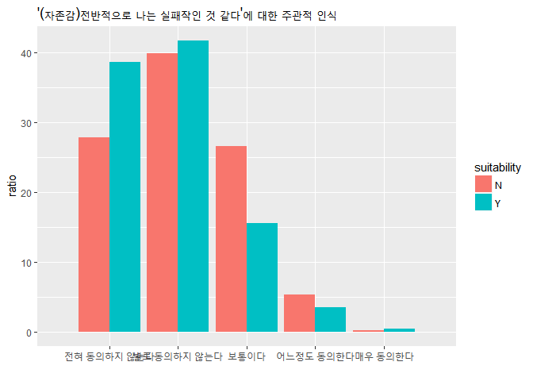

자신의 자존감 질문인 실패작 질문에 대한 부정적 응답비율은 전공 적합성이 높은 응답자가 4.01% , 낮은 응답자가 5.57% 미세한 차이지만 분명 차이가 있었다.

### (자존감)대체로 나 자신에게 만족하고 있다

#### 전공 적합성 높은 응답자

``` r
table(peo_major$a199717)
```

    ## 
    ##   1   2   3   4   5 
    ##   5  50 268 281  19

``` r
peo_major %>%
  select(a199717) %>%
  summarise(n=n())
```

    ##     n
    ## 1 623

``` r
major_self_2<-peo_major %>%
  group_by(a199717) %>%
  summarise(ratio=n()/623*100) %>%
  arrange(desc(ratio))

major_self_2
```

    ## # A tibble: 5 x 2
    ##   a199717  ratio
    ##     <dbl>  <dbl>
    ## 1      4. 45.1  
    ## 2      3. 43.0  
    ## 3      2.  8.03 
    ## 4      5.  3.05 
    ## 5      1.  0.803

#### 전공 적합성 낮은 응답자

``` r
table(peo_major$a199717)
```

    ## 
    ##   1   2   3   4   5 
    ##   5  50 268 281  19

``` r
peo_major_not %>%
  select(a199717) %>%
  summarise(n=n())
```

    ##     n
    ## 1 466

``` r
notmajor_self_2<-peo_major_not %>%
  group_by(a199717) %>%
  summarise(ratio=n()/466*100) %>%
  arrange(desc(ratio))

notmajor_self_2
```

    ## # A tibble: 5 x 2
    ##   a199717  ratio
    ##     <dbl>  <dbl>
    ## 1      3. 46.4  
    ## 2      4. 34.1  
    ## 3      2. 17.4  
    ## 4      5.  1.50 
    ## 5      1.  0.644

#### (자존감)대체로 나 자신에게 만족하고 있다(그래프)

``` r
major_self_2$suitability<-c("Y")
notmajor_self_2$suitability<-c("N")
total_self_2<-rbind(major_self_2,notmajor_self_2)

ggplot(data=total_self_2) +
  geom_bar(mapping = aes(x=a199717,
                         y=ratio, 
                         fill=as.factor(suitability)),
           stat="identity", 
           position = "dodge") + 
  scale_fill_discrete(name="suitability")+ xlab('') + ylab('ratio')+ 
  scale_x_discrete(limits = c("전혀 동의하지 않는다","별로 동의하지 않는다","보통이다","어느정도 동의한다","매우 동의한다"))+
  ggtitle("'(자존감)대체로 나 자신에게 만족하고 있다'에 대한 주관적 인식")
```

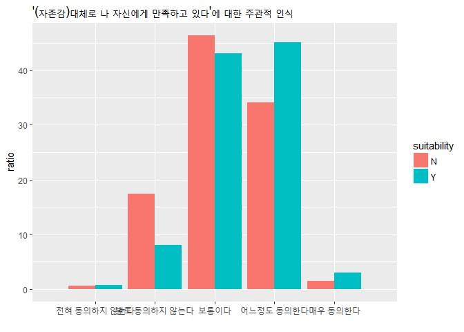

자신에게 만족하고 있는지에 대한 질문에서 긍정적인 응답을 한 비율은 전공적합성이 높은 응답자가 48.15%, 낮은 응답자가 35.62%로 차이를 보였다.

### 전공적합도/임금에따른 자존감\_대체로 나 자신에게 만족하고 있다.

#### 전공적합도 / 동집단내 평균임금에 따른 자존감

``` r
peo_major$level<-ifelse(peo_major$a199415>major_mean_wage,"high","low")
peo_major_not$level<-ifelse(peo_major_not$a199415>notmajor_mean_wage,"high","low")
```

#### 전공적합도높은응답자

``` r
peo_major %>%
  filter(level=="high") %>%
  summarise(n=n())
```

    ##     n
    ## 1 273

``` r
major_highwage_1<-peo_major %>%
  filter(level=='high') %>%
  select(a199717) %>%
  group_by(a199717) %>%
  summarise(ratio=n()/273*100) %>%
  arrange(desc(ratio))

peo_major %>%
  filter(level=="low") %>%
  summarise(n=n())
```

    ##     n
    ## 1 321

``` r
major_lowwage_1<-peo_major %>%
  filter(level=='low') %>%
  select(a199717) %>%
  group_by(a199717) %>%
  summarise(ratio=n()/321*100) %>%
  arrange(desc(ratio))

major_lowwage_1
```

    ## # A tibble: 5 x 2
    ##   a199717 ratio
    ##     <dbl> <dbl>
    ## 1      3. 47.4 
    ## 2      4. 36.8 
    ## 3      2. 12.1 
    ## 4      5.  2.49
    ## 5      1.  1.25

#### 전공적합도낮은응답자

``` r
peo_major_not %>%
  filter(level=="high") %>%
  summarise(n=n())
```

    ##     n
    ## 1 282

``` r
notmajor_highwage_1<-peo_major_not %>%
  filter(level=='high') %>%
  select(a199717) %>%
  group_by(a199717) %>%
  summarise(ratio=n()/282*100) %>%
  arrange(desc(ratio))

peo_major_not %>%
  filter(level=="low") %>%
  summarise(n=n())
```

    ##     n
    ## 1 183

``` r
notmajor_lowwage_1<-peo_major_not %>%
  filter(level=='low') %>%
  select(a199717) %>%
  group_by(a199717) %>%
  summarise(ratio=n()/183*100) %>%
  arrange(desc(ratio))

notmajor_lowwage_1
```

    ## # A tibble: 5 x 2
    ##   a199717  ratio
    ##     <dbl>  <dbl>
    ## 1      3. 41.5  
    ## 2      4. 34.4  
    ## 3      2. 21.9  
    ## 4      5.  1.64 
    ## 5      1.  0.546

#### 높은임금을 받는 두 집단 비교

``` r
major_highwage_1$suitability<-c("Y")
notmajor_highwage_1$suitability<-c("N")
total_highwage_1<-rbind(major_highwage_1,notmajor_highwage_1)

ggplot(data=total_highwage_1) +
  geom_bar(mapping = aes(x=a199717,
                         y=ratio, 
                         fill=as.factor(suitability)),
           stat="identity", 
           position = "dodge") + 
  scale_fill_discrete(name="suitability")+ xlab('') + ylab('ratio')+ 
  scale_x_discrete(limits = c("전혀 동의하지 않는다","별로 동의하지 않는다","보통이다","어느정도 동의한다","매우 동의한다"))+
  ggtitle("'(자존감)대체로 나 자신에게 만족하고 있다'에 대한 주관적 인식_높은임금")
```

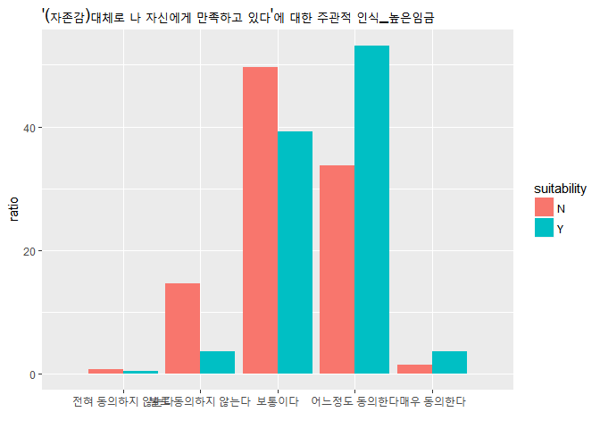 높은 임금을 받는 집단은 39.25%가 자신에게 만족한다는 응답을 보였다.

#### 낮은임금을 받는 두 집단 비교

``` r
major_lowwage_1$suitability<-c("Y")
notmajor_lowwage_1$suitability<-c("N")
total_lowwage_1<-rbind(major_lowwage_1,notmajor_lowwage_1)

ggplot(data=total_lowwage_1) +
  geom_bar(mapping = aes(x=a199717,
                         y=ratio, 
                         fill=as.factor(suitability)),
           stat="identity", 
           position = "dodge") + 
  scale_fill_discrete(name="suitability")+ xlab('') + ylab('ratio')+ 
  scale_x_discrete(limits = c("전혀 동의하지 않는다","별로 동의하지 않는다","보통이다","어느정도 동의한다","매우 동의한다"))+
  ggtitle("'(자존감)대체로 나 자신에게 만족하고 있다'에 대한 주관적 인식_낮은임금")
```

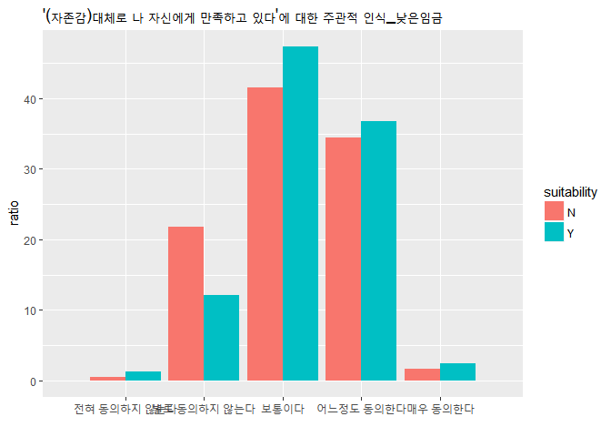 낮은 임금을 받는 집단은 36.06%가 자신에게 만족한다는 응답을 보였다. 두 집단의 차이는 3.19%이다.

### 전공적합도/임금에따른 자존감\_때때로 내가 무능하다는 생각이 든다.

#### 전공적합도높은응답자

``` r
major_highwage_2<-peo_major %>%
  filter(level=='high') %>%
  select(a199718) %>%
  group_by(a199718) %>%
  summarise(ratio=n()/273*100) %>%
  arrange(desc(ratio))

major_lowwage_2<-peo_major %>%
  filter(level=='low') %>%
  select(a199718) %>%
  group_by(a199718) %>%
  summarise(ratio=n()/321*100) %>%
  arrange(desc(ratio))
```

#### 전공적합도낮은응답자

``` r
notmajor_highwage_2<-peo_major_not %>%
  filter(level=='high') %>%
  select(a199718) %>%
  group_by(a199718) %>%
  summarise(ratio=n()/282*100) %>%
  arrange(desc(ratio))


notmajor_lowwage_2<-peo_major_not %>%
  filter(level=='low') %>%
  select(a199718) %>%
  group_by(a199718) %>%
  summarise(ratio=n()/183*100) %>%
  arrange(desc(ratio))
```

#### 높은임금을 받는 두 집단 비교

``` r
major_highwage_2$suitability<-c("Y")
notmajor_highwage_2$suitability<-c("N")
total_highwage_2<-rbind(major_highwage_2,notmajor_highwage_2)

ggplot(data=total_highwage_2) +
  geom_bar(mapping = aes(x=a199718,
                         y=ratio, 
                         fill=as.factor(suitability)),
           stat="identity", 
           position = "dodge") + 
  scale_fill_discrete(name="suitability")+ xlab('') + ylab('ratio')+ 
  scale_x_discrete(limits = c("전혀 동의하지 않는다","별로 동의하지 않는다","보통이다","어느정도 동의한다","매우 동의한다"))+
  ggtitle("'(자존감)때때로 내가 무능하다는 생각이 든다'에 대한 주관적 인식_높은임금")
```

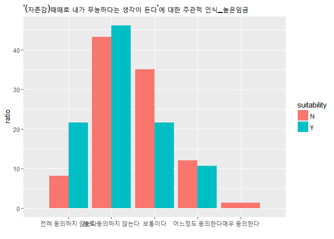

#### 낮은임금을 받는 두 집단 비교

``` r
major_lowwage_2$suitability<-c("Y")
notmajor_lowwage_2$suitability<-c("N")
total_lowwage_2<-rbind(major_lowwage_2,notmajor_lowwage_2)

ggplot(data=total_lowwage_2) +
  geom_bar(mapping = aes(x=a199718,
                         y=ratio, 
                         fill=as.factor(suitability)),
           stat="identity", 
           position = "dodge") + 
  scale_fill_discrete(name="suitability")+ xlab('') + ylab('ratio')+ 
  scale_x_discrete(limits = c("전혀 동의하지 않는다","별로 동의하지 않는다","보통이다","어느정도 동의한다","매우 동의한다"))+
  ggtitle("'(자존감)대체로 나 자신에게 만족하고 있다'에 대한 주관적 인식_낮은임금")
```

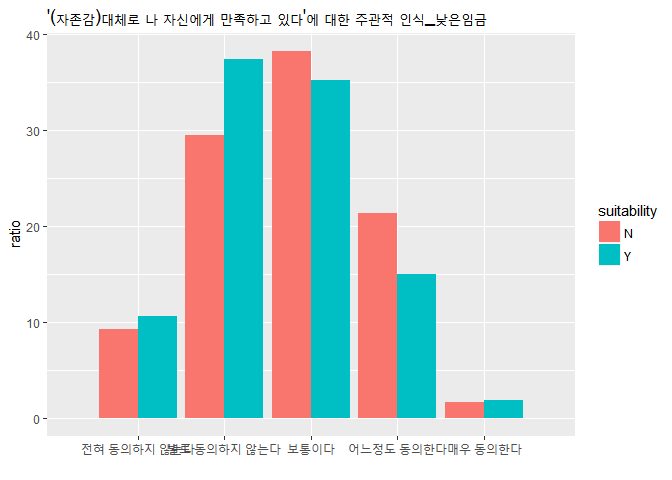

### 전공적합도 / 전체평균임금에 따른 자존감

``` r
boxplot(data$a199415) #극단치 확인 
boxplot(data$a199415)$stat 
```

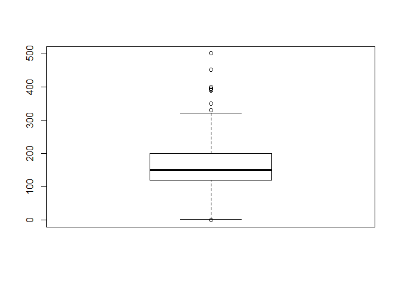

    ##      [,1]
    ## [1,]    1
    ## [2,]  120
    ## [3,]  150
    ## [4,]  200
    ## [5,]  320

``` r
data$a199415<-ifelse(data$a199415>320 | data$a199415<1,NA,data$a199415) #결측제거 

data<-data%>%
  filter(!is.na(a199415))
total_mean<-mean(data$a199415)

peo_major$totallevel<-ifelse(peo_major$a199415>total_mean,"high","low")
peo_major_not$totallevel<-ifelse(peo_major_not$a199415>total_mean,"high","low")
```

### 전공적합도/임금에따른 자존감\_대체로 나 자신에게 만족하고 있다.

#### 전공적합도높은응답자

``` r
peo_major %>%
  filter(totallevel=="high") %>%
  summarise(n=n())
```

    ##     n
    ## 1 296

``` r
major_highwage_2<-peo_major %>%
  filter(totallevel=='high') %>%
  select(a199717) %>%
  group_by(a199717) %>%
  summarise(ratio=n()/296*100) %>%
  arrange(desc(ratio))

peo_major %>%
  filter(totallevel=="low") %>%
  summarise(n=n())
```

    ##     n
    ## 1 298

``` r
major_lowwage_2<-peo_major %>%
  filter(totallevel=='low') %>%
  select(a199717) %>%
  group_by(a199717) %>%
  summarise(ratio=n()/298*100) %>%
  arrange(desc(ratio))
```

#### 전공적합도낮은응답자

``` r
peo_major_not %>%
  filter(totallevel=="high") %>%
  summarise(n=n())
```

    ##     n
    ## 1 159

``` r
notmajor_highwage_2<-peo_major_not %>%
  filter(totallevel=='high') %>%
  select(a199717) %>%
  group_by(a199717) %>%
  summarise(ratio=n()/159*100) %>%
  arrange(desc(ratio))

peo_major_not %>%
  filter(totallevel=="low") %>%
  summarise(n=n())
```

    ##     n
    ## 1 306

``` r
notmajor_lowwage_2<-peo_major_not %>%
  filter(totallevel=='low') %>%
  select(a199717) %>%
  group_by(a199717) %>%
  summarise(ratio=n()/306*100) %>%
  arrange(desc(ratio))
```

##### 높은임금을 받는 두 집단 비교

``` r
major_highwage_2$suitability<-c("Y")
notmajor_highwage_2$suitability<-c("N")
total_highwage_2<-rbind(major_highwage_2,notmajor_highwage_2)

ggplot(data=total_highwage_2) +
  geom_bar(mapping = aes(x=a199717,
                         y=ratio, 
                         fill=as.factor(suitability)),
           stat="identity", 
           position = "dodge") + 
  scale_fill_discrete(name="suitability")+ xlab('') + ylab('ratio')+ 
  scale_x_discrete(limits = c("전혀 동의하지 않는다","별로 동의하지 않는다","보통이다","어느정도 동의한다","매우 동의한다"))+
  ggtitle("'(자존감)대체로 나 자신에게 만족하고 있다'에 대한 주관적 인식_높은임금")
```

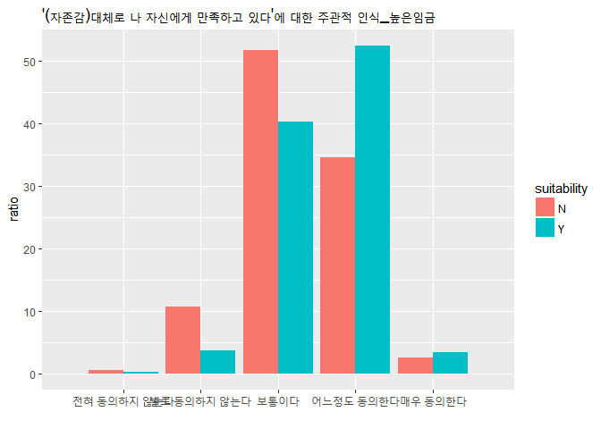

낮은임금을 받는 두 집단 비교
============================

``` r
major_lowwage_2$suitability<-c("Y")
notmajor_lowwage_2$suitability<-c("N")
total_lowwage_2<-rbind(major_lowwage_2,notmajor_lowwage_2)

ggplot(data=total_lowwage_2) +
  geom_bar(mapping = aes(x=a199717,
                         y=ratio, 
                         fill=as.factor(suitability)),
           stat="identity", 
           position = "dodge") + 
  scale_fill_discrete(name="suitability")+ xlab('') + ylab('ratio')+ 
  scale_x_discrete(limits = c("전혀 동의하지 않는다","별로 동의하지 않는다","보통이다","어느정도 동의한다","매우 동의한다"))+
  ggtitle("'(자존감)대체로 나 자신에게 만족하고 있다'에 대한 주관적 인식_낮은임금")
```

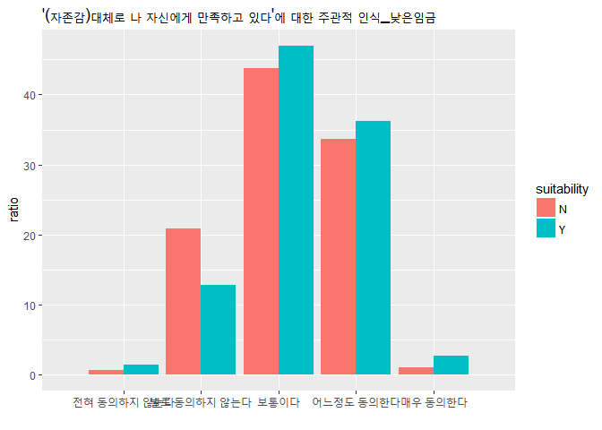

### 전공적합도/임금에따른 자존감\_때때로 내가 무능하다는 생각이 든다

#### 전공적합도높은응답자

``` r
major_highwage_3<-peo_major %>%
  filter(totallevel=='high') %>%
  select(a199718) %>%
  group_by(a199718) %>%
  summarise(ratio=n()/296*100) %>%
  arrange(desc(ratio))

major_lowwage_3<-peo_major %>%
  filter(totallevel=='low') %>%
  select(a199718) %>%
  group_by(a199718) %>%
  summarise(ratio=n()/298*100) %>%
  arrange(desc(ratio))
```

#### 전공적합도낮은응답자

``` r
notmajor_highwage_3<-peo_major_not %>%
  filter(totallevel=='high') %>%
  select(a199718) %>%
  group_by(a199718) %>%
  summarise(ratio=n()/159*100) %>%
  arrange(desc(ratio))


notmajor_lowwage_3<-peo_major_not %>%
  filter(totallevel=='low') %>%
  select(a199718) %>%
  group_by(a199718) %>%
  summarise(ratio=n()/306*100) %>%
  arrange(desc(ratio))
```

#### 높은임금을 받는 두 집단 비교

``` r
major_highwage_3$suitability<-c("Y")
notmajor_highwage_3$suitability<-c("N")
total_highwage_3<-rbind(major_highwage_3,notmajor_highwage_3)

ggplot(data=total_highwage_3) +
  geom_bar(mapping = aes(x=a199718,
                         y=ratio, 
                         fill=as.factor(suitability)),
           stat="identity", 
           position = "dodge") + 
  scale_fill_discrete(name="suitability")+ xlab('') + ylab('ratio')+ 
  scale_x_discrete(limits = c("전혀 동의하지 않는다","별로 동의하지 않는다","보통이다","어느정도 동의한다","매우 동의한다"))+
  ggtitle("'(자존감)때때로 내가 무능하다는 생각이 든다'에 대한 주관적 인식_높은임금")
```

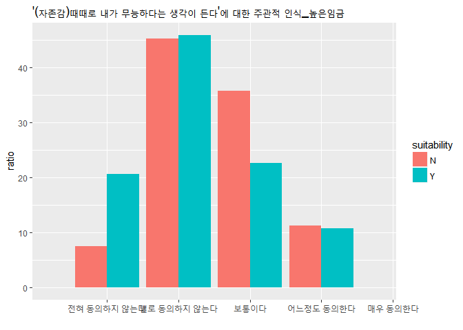

#### 낮은임금을 받는 두 집단 비교

``` r
major_lowwage_3$suitability<-c("Y")
notmajor_lowwage_3$suitability<-c("N")
total_lowwage_3<-rbind(major_lowwage_3,notmajor_lowwage_3)

ggplot(data=total_lowwage_3) +
  geom_bar(mapping = aes(x=a199718,
                         y=ratio, 
                         fill=as.factor(suitability)),
           stat="identity", 
           position = "dodge") + 
  scale_fill_discrete(name="suitability")+ xlab('') + ylab('ratio')+ 
  scale_x_discrete(limits = c("전혀 동의하지 않는다","별로 동의하지 않는다","보통이다","어느정도 동의한다","매우 동의한다"))+
  ggtitle("'(자존감)대체로 나 자신에게 만족하고 있다'에 대한 주관적 인식_낮은임금")
```

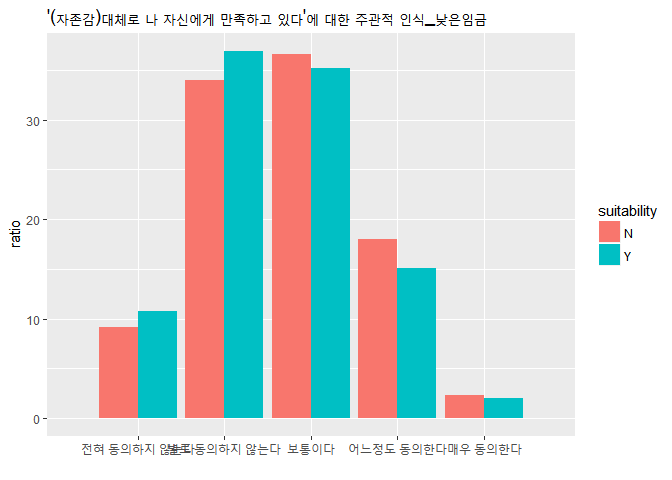 가나다라
