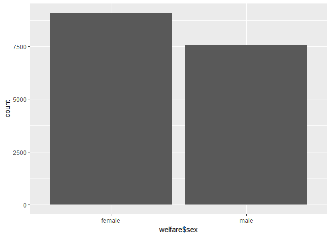
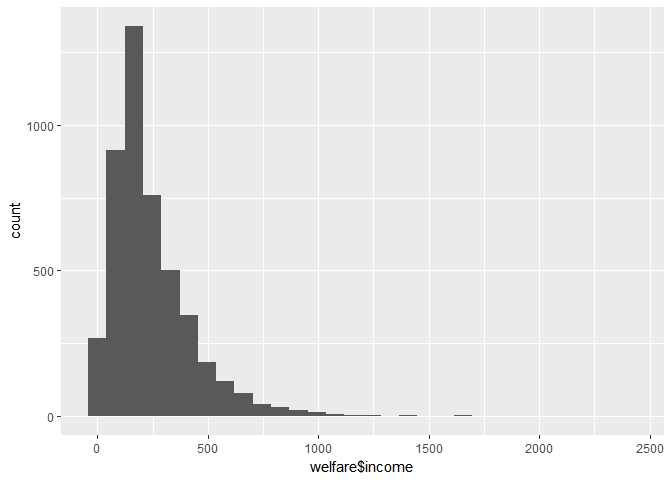
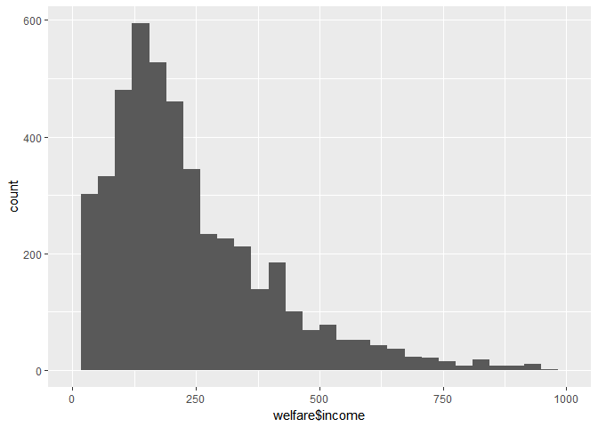

Untitled
================

복지패널데이터 분석
===================

``` r
#### 09-1 ####

## -------------------------------------------------------------------- ##

library(foreign)             # SPSS 파일 로드
```

    ## Warning: package 'foreign' was built under R version 3.4.4

``` r
library(dplyr)               # 전처리
```

    ## 
    ## Attaching package: 'dplyr'

    ## The following objects are masked from 'package:stats':
    ## 
    ##     filter, lag

    ## The following objects are masked from 'package:base':
    ## 
    ##     intersect, setdiff, setequal, union

``` r
library(ggplot2)             # 시각화
```

    ## Warning: package 'ggplot2' was built under R version 3.4.4

``` r
library(readxl)              # 엑셀 파일 불러오기
```

    ## Warning: package 'readxl' was built under R version 3.4.4

``` r
# 데이터 불러오기
raw_welfare <- read.spss(file = "Koweps_hpc10_2015_beta1.sav",
                         to.data.frame = T)
```

    ## Warning in read.spss(file = "Koweps_hpc10_2015_beta1.sav", to.data.frame
    ## = T): Koweps_hpc10_2015_beta1.sav: Compression bias (0) is not the usual
    ## value of 100

``` r
# 복사본 만들기
welfare <- raw_welfare

head(welfare)
```

    ##   h10_id h10_ind h10_sn h10_merkey h_new h10_cobf h10_reg5 h10_reg7
    ## 1      1       1      1      10101     0       NA        1        1
    ## 2      2       1      1      20101     0       NA        1        1
    ## 3      3       1      1      30101     0       NA        1        1
    ## 4      4       1      1      40101     0       NA        1        1
    ## 5      4       1      1      40101     0       NA        1        1
    ## 6      6       1      1      60101     0       NA        1        1
    ##   h10_din h10_cin h10_flag   p10_wgl   p10_wsl   p10_wgc   p10_wsc h10_hc
    ## 1     864     864        0  776.9947 0.2567795  763.7189 0.2523922      2
    ## 2     600     600        0  959.6458 0.3171417  949.2291 0.3136992      2
    ## 3    1571    1619        0 1059.1559 0.3500276 1047.6591 0.3462281      1
    ## 4    3579    3687        0 1012.1599 0.3344964  991.5721 0.3276926      1
    ## 5    3579    3687        0 1075.4212 0.3554029 1057.0466 0.3493305      1
    ## 6    3030    3486        0 2243.9456 0.7415743 2211.1575 0.7307386      1
    ##   nh1001_1 nh1001_2 h1001_1 h10_pind h10_pid h10_g1 h10_g2 h10_g3 h10_g4
    ## 1       NA       NA       1        1     101      1     10      2   1936
    ## 2       NA       NA       1        1     201      1     10      2   1945
    ## 3       NA       NA       1        1     301      1     10      1   1948
    ## 4       NA       NA       2        1     401      1     10      1   1942
    ## 5       NA       NA       2        4     402      2      2      2   1923
    ## 6       NA       NA       5        1     601      1     10      1   1962
    ##   h10_g6 h10_g7 h10_g8 h10_g9 h10_g10 h10_g11 h10_g12 h1001_110 h1001_5aq1
    ## 1      2      0      0      0       2       2       1         1          0
    ## 2      4      5      0      0       2       2       1         1          0
    ## 3      3      5      0      0       2       2       1         1          0
    ## 4      7      3      0      0       3       1       1         5          0
    ## 5      2      0      0      0       2       1       1         5          0
    ## 6      6      5      0      0       1       1       1         5          0
    ##   h1001_5aq2 h1001_5aq3 h1001_5aq4 h10_med1 h10_med2 h10_med3 h10_med4
    ## 1          0          0          0        1        3       60        0
    ## 2          0          0          0        1        4       28        0
    ## 3          0          0          0        1        3       12        0
    ## 4          0          0          0        1        3        3        0
    ## 5          0          0          0        2        4        6        0
    ## 6          0          0          0        1        3        5        0
    ##   h10_med5 h10_med6 h10_med7 h10_med8 h10_g9_1 h10_med9 h10_med10 h10_eco1
    ## 1        0        0        3        0        3        8         0        1
    ## 2        0        0        2        1        3        5         0        1
    ## 3        0        0        2        0        3        7         0        1
    ## 4        0        0        1        1        3        3         0        1
    ## 5        0        0        1        1        3       15         0        2
    ## 6        0        0        2        1        3       23         1        1
    ##   h10_eco2 h10_eco3 h10_eco4 h10_eco4_1 h10_eco5_1 h10_eco6 h10_eco_7_1
    ## 1        2       NA        9         NA         NA       NA          NA
    ## 2        3       NA        9         NA         NA       NA          NA
    ## 3        1       NA        2         NA          1        2           1
    ## 4        1       NA        2         NA          1        2           1
    ## 5        3       NA        9         NA         NA       NA          NA
    ## 6        1       NA        6         NA         NA       NA          NA
    ##   h10_eco_7_2 h10_eco_7_3 h10_eco8 h10_eco9 h10_eco10 h10_eco11 h10_soc1
    ## 1          NA          NA       NA       NA        NA        10        1
    ## 2          NA          NA       NA       NA        NA        10        1
    ## 3           2           1       75      942         3        NA        1
    ## 4           2           3       42      762         2        NA        1
    ## 5          NA          NA       NA       NA        NA        10        2
    ## 6          NA          NA       46      530         1        NA        1
    ##   h10_soc_2 h10_soc_3 h10_soc_4 h10_soc_5 h10_soc_6 h10_soc_7 h10_soc_8
    ## 1         0        NA        NA        NA        NA        NA        NA
    ## 2         0        NA        NA        NA        NA        NA        NA
    ## 3         0        NA        NA        NA        NA        NA        NA
    ## 4         1        NA        NA        NA        NA        NA        NA
    ## 5         0        NA        NA        NA        NA        NA        NA
    ## 6         2         1         2         1        NA        NA        NA
    ##   h10_soc_9 h10_soc_10 h10_soc_11 h10_soc8 h10_soc9 h10_soc11 h10_soc10
    ## 1        NA         NA         NA        0        0         0         0
    ## 2        NA         NA         NA        0        0         0         0
    ## 3        NA         NA         NA        1        1         2         2
    ## 4        NA         NA         NA        2        2         2         2
    ## 5        NA         NA         NA        0        0         0         0
    ## 6         0          0         NA        0        0         0         0
    ##   h10_soc_12 h10_soc_13 h1005_1 h1005_3aq1 h1005_2 h1005_3 h1005_4 h1005_5
    ## 1          4          4       1          2      NA      NA       2      NA
    ## 2          4          4       1          2      NA      NA       2      NA
    ## 3          4          1       1          1      NA      NA       2      NA
    ## 4          4          3       1          2      NA      NA       2      NA
    ## 5          4          4       1          2      NA      NA       2      NA
    ## 6          4          3       1          2      NA      NA       2      NA
    ##   h1005_6 h1005_7 nh1005_8 nh1005_9 h1005_3aq2 h1006_aq1 h1006_1 h1006_2
    ## 1      NA       0        4        5          0         2       2       3
    ## 2      NA       0        3        4          0         2       2       3
    ## 3      NA       0        3        3          0         2       2       1
    ## 4      NA       0        3        3          0         2       1       3
    ## 5      NA       0        3        3          0         2       1       3
    ## 6      NA       1        3        4         11         2       2       3
    ##   h1006_4 h1006_5 h1006_3 h1006_6 h1006_8 h1006_9 h1006_aq2 h1006_aq3
    ## 1       2      33       2    5000       1      88         0         0
    ## 2       3     198       1   60000       1       4         0         0
    ## 3       1      23       3     200       1      88         0         0
    ## 4       3      73       1   20000       1      88         0         0
    ## 5       3      73       1   20000       1      88         0         0
    ## 6       3      82       1   50700       1      88         0         0
    ##   h1006_10 h1006_11 h1006_12 h1006_13 h1006_14 h1006_21 h1006_22 h1006_23
    ## 1        1        1        1        2        1        1        1        1
    ## 2        1        1        1        2        1        1        1        1
    ## 3        1        2        2        2        1        1        1        1
    ## 4        1        1        1        2        1        1        1        1
    ## 5        1        1        1        2        1        1        1        1
    ## 6        1        2        2        2        1        1        1        1
    ##   h1006_24 h1006_25 h1006_27 h1006_30 h1006_33 h1006_36 h1006_39
    ## 1        1        5        2        2        2        2        2
    ## 2        1        5        2        2        2        2        2
    ## 3        1        5        2        2        2        2        2
    ## 4        1        5        2        2        2        2        2
    ## 5        1        5        2        2        2        2        2
    ## 6        1        5        2        2        2        2        2
    ##   h1006_3aq1 h1007_3aq1 h1007_3aq2 h1007_5aq1 h1007_3aq3 h1007_3aq4
    ## 1          2         23          3          0          0        0.0
    ## 2          2         20          2          0          0        0.0
    ## 3          2         20         10          0         20        0.0
    ## 4          2         30         15          0          0        0.0
    ## 5          2         30         15          0          0        0.0
    ## 6          2         40          3          0          0        0.2
    ##   h1007_3aq5 h1007_6aq1 h1007_3aq6 h1007_5aq2 h1007_3aq7 h1007_3aq8
    ## 1          8        5.0        3.0          0          4         16
    ## 2          6        2.7        0.5          0          2          4
    ## 3          6        3.0        1.0          0          2          3
    ## 4         11        7.3        2.0          0          4         14
    ## 5         11        7.3        2.0          0          4         14
    ## 6         15        9.3        2.0          0          8         43
    ##   h1007_3aq9 h1007_3aq10 h1007_3aq11 h1007_5aq3 h1007_5aq4 h1007_3aq13
    ## 1          0           0           1          1          2          13
    ## 2          0           0           1          2          3           7
    ## 3          0           0           1          3          3          14
    ## 4          0           0           2          3         11          36
    ## 5          0           0           2          3         11          36
    ## 6          2          10           2         25         12          68
    ##   h1007_6aq4 h1007_6aq6 h1007_3aq14 h1007_3aq15 h1007_3aq16 h1007_3aq17
    ## 1        0.0        0.0           0           0           0           0
    ## 2        1.7        0.0           0           0           0           0
    ## 3        1.7        0.0           0           0           0           0
    ## 4       25.0        2.5           0           0           0           0
    ## 5       25.0        2.5           0           0           0           0
    ## 6        2.5       10.0           0           0           0           0
    ##   h1007_4 h1007_6aq7 h1007_6aq8 h1007_6aq9 h1007_6aq10 h1007_6aq11 h1007_5
    ## 1       0          0        0.0        0.0           0           0       0
    ## 2       0          0        0.0        0.0           0           0       0
    ## 3       0          0        0.0        0.0           0           0       4
    ## 4       1          0        1.0        0.0           0           0       8
    ## 5       1          0        1.0        0.0           0           0       8
    ## 6       6          0        4.1        1.8           0           0      32
    ##   h1007_6aq12 h1007_6aq13 h1007_6aq14 h1007_9 h1009_9 h1009_6aq4 h10_inc1
    ## 1           0         0.0         0.0      74      50        100        1
    ## 2           0         0.0         0.0      48      48         70        1
    ## 3           0         3.6         0.7      87      87        100        1
    ## 4           0         8.0         0.0     137     150        200        1
    ## 5           0         8.0         0.0     137     150        200        2
    ## 6          15        17.0         0.0     268     200        300        1
    ##   h10_inc2_1 h10_inc2_2 h10_inc3_1 h10_inc3_2 h10_inc4_1 h10_inc4_2
    ## 1          0         NA          0         NA          0         NA
    ## 2          0         NA          0         NA          0         NA
    ## 3          0         NA          1         12          0         NA
    ## 4          0         NA          1         12          0         NA
    ## 5          0         NA          0         NA          0         NA
    ## 6          0         NA          0         NA          1         12
    ##   h10_inc5_1 h10_inc5_2 h10_inc6_1 h10_inc6_2 h10_inc7_1 h10_inc7_2
    ## 1          0         NA          0         NA          1         12
    ## 2          0         NA          0         NA          1         12
    ## 3          0         NA          0         NA          0         NA
    ## 4          0         NA          0         NA          0         NA
    ## 5          0         NA          0         NA          1         12
    ## 6          0         NA          0         NA          0         NA
    ##   h1008_106 h1008_107 h1008_108 h1008_109 h1008_110 h1008_111 h10_inc2_3
    ## 1         0         0         0         0         0         1          1
    ## 2         0         0         0         0         0         1          1
    ## 3         0         1         0         0         0         0          1
    ## 4         0         1         0         0         0         1          1
    ## 5         0         1         0         0         0         1          2
    ## 6         0         0         1         0         0         3          1
    ##   h10_inc2 h10_inc3_6 h10_inc3 h10_inc4_7 h10_inc4 h10_inc4_8 h10_inc4_9
    ## 1       NA          1       NA          1       NA          1         NA
    ## 2       NA          1       NA          1       NA          1         NA
    ## 3       NA          1     1440          1       NA          1         NA
    ## 4       NA          1     2400          1       NA          1         NA
    ## 5       NA          2       NA          2       NA          2         NA
    ## 6       NA          1       NA          1     3000          1       3000
    ##   h1008_155 h1008_156 h1008_157 h1008_158 h1008_160 h1008_159 h1008_3aq3
    ## 1        NA        NA        NA        NA        NA        NA         NA
    ## 2        NA        NA        NA        NA        NA        NA         NA
    ## 3        NA        NA        NA        NA        NA        NA         NA
    ## 4        NA        NA        NA        NA        NA        NA         NA
    ## 5        NA        NA        NA        NA        NA        NA         NA
    ## 6        NA        NA        NA        NA        NA        NA         NA
    ##   h1008_161 h1008_162 h1008_163 h1008_164 h1008_166 h1008_165 h1008_3aq4
    ## 1        NA        NA        NA        NA        NA        NA         NA
    ## 2        NA        NA        NA        NA        NA        NA         NA
    ## 3        NA        NA        NA        NA        NA        NA         NA
    ## 4        NA        NA        NA        NA        NA        NA         NA
    ## 5        NA        NA        NA        NA        NA        NA         NA
    ## 6        NA        NA        NA        NA        NA        NA         NA
    ##   h1008_167 h1008_168 h1008_169 h1008_170 h10_inc7_3 h10_inc7 h1008_aq9
    ## 1        NA        NA        NA        NA          1        0         0
    ## 2        NA        NA        NA        NA          1        0         0
    ## 3        NA        NA        NA        NA          1        0         0
    ## 4        NA        NA        NA        NA          1        0         0
    ## 5        NA        NA        NA        NA          2        0         0
    ## 6        NA        NA        NA        NA          1        0         0
    ##   h1008_aq10 h1008_aq11 h1008_aq12 h1008_aq13 h1008_aq14 h1008_aq15
    ## 1          0          0          0          0          0          0
    ## 2          0          0          0          0          0          0
    ## 3          0          0          0          0          0          0
    ## 4          0          0        508          0          0          0
    ## 5          0          0        508          0          0          0
    ## 6          0          0          0          0          0          0
    ##   h1008_6aq1 h1008_aq16 h1008_aq17 h1008_10aq1 h1008_aq19 h1008_aq20
    ## 1          0          0         59         120          0          0
    ## 2          0          0          0           0          0          0
    ## 3          0          0         59         120          0          0
    ## 4          0          0         59         120          0          0
    ## 5          0          0         59         120          0          0
    ## 6          0          0         94         192          0          0
    ##   h1008_aq21 h1008_5aq3 h1008_7aq1 h1008_aq22 h1008_7aq2 h1008_aq23
    ## 1          0          0          0          0          0          0
    ## 2          0          0          0          0          0          0
    ## 3          0          0          0          0          0          0
    ## 4          0          0          0          0          0          0
    ## 5          0          0          0          0          0          0
    ## 6          0          0          0          0          0          0
    ##   h1008_aq24 h1008_4aq116 h1008_4aq117 h1008_5aq1 h1008_7aq4 h1008_7aq5
    ## 1          0            0            0          0          0          0
    ## 2          0            0            0          0          0          0
    ## 3          0            0            0          0          0          0
    ## 4          0            0            0          0          0          0
    ## 5          0            0            0          0          0          0
    ## 6          0            0            0          0          0          0
    ##   h1008_7aq6 h1008_7aq7 h1008_7aq8 h1008_7aq9 h1008_aq25 h1008_7aq10
    ## 1          0          0          0          0          0           0
    ## 2          0          0          0          0          0           0
    ## 3          0          0          0          0          0           0
    ## 4          0          0          0          0          0           0
    ## 5          0          0          0          0          0           0
    ## 6          0          0          0          0          0           0
    ##   h1008_aq26 h1008_aq27 h1008_aq28 h1008_aq29 h1008_3aq5 h1008_4aq118
    ## 1          0          0          0          0          0            0
    ## 2          0          0          0          0          0            0
    ## 3          0          0          0          0          0            0
    ## 4          0          0          0          0          0            0
    ## 5          0          0          0          0          0            0
    ## 6          0          0          0          0          0            0
    ##   h1008_aq30 h1008_6aq3 h1008_3aq6 h1008_3aq7 nh1008_3aq1 h1008_aq32
    ## 1          3          0          0        682          NA          0
    ## 2          0          0          0        600          NA          0
    ## 3          0          0          0          0          NA          0
    ## 4          3          0          0          0          NA          0
    ## 5          3          0          0          0          NA          0
    ## 6          0          0          0          0          NA          0
    ##   h1008_aq33 h1008_aq34 h1008_3aq8 h1008_195 h1008_7aq11 h1009_aq1
    ## 1          0          3          0         0           0         0
    ## 2          0          0          0         0           0      7000
    ## 3          0          0          0         0           0         0
    ## 4          0        600          0         0           0         0
    ## 5          0        600          0         0           0         0
    ## 6          0        200          0         0           0         0
    ##   h1009_aq2 h1009_aq3 h1009_aq4 h1009_aq5 h1009_aq6 h1009_aq7 h1009_aq8
    ## 1         0         0         0         0         0         0         0
    ## 2         0         0     24000         0         0         0         0
    ## 3         0         0         0         0         0         0         0
    ## 4     20000         0         0         0         0         0      1920
    ## 5     20000         0         0         0         0         0      1920
    ## 6         0         0     11000         0         0         0         0
    ##   h1010_aq1 h1010_aq2 h1010_aq3 h1010_aq4 h1010_aq5 h1010_aq6 h1010_aq7
    ## 1         0         0         0         0         0       100         0
    ## 2         0         0         0         0         0       200         0
    ## 3         0         0         0         0         0       500         0
    ## 4         0         0         0         0         0       100         0
    ## 5         0         0         0         0         0       100         0
    ## 6         0         0         0         0         0       500         0
    ##   h1010_aq8 h1010_aq9 h1010_aq10 h1010_aq11 h1010_aq12 h1010_aq13
    ## 1         0         0          0          0          0          0
    ## 2         0         0          0          0          0          0
    ## 3         0         0          0          0          0          0
    ## 4         0         0          0          0          0          0
    ## 5         0         0          0          0          0          0
    ## 6         0         0          0          0          0          0
    ##   h1010_aq14 h1010_aq15 h1010_aq16 h1010_aq17 h1010_aq18 h1010_aq19
    ## 1          0          0          0          0          0          0
    ## 2          0          0          0          0          0          0
    ## 3          0          0          0          0          0          0
    ## 4          0          0          0          0          0          0
    ## 5          0          0          0          0          0          0
    ## 6          0          0          0          0          0          0
    ##   h1010_aq20 h1010_26 h1010_27 h1010_aq23 h1010_aq24 h1010_aq25 h1010_aq26
    ## 1          0        0        0          0          0          0          0
    ## 2          0        0        0          0          0          0          0
    ## 3          0        0        0          0          0          0          0
    ## 4          0        0        0          0          0          0          0
    ## 5          0        0        0          0          0          0          0
    ## 6          0        1      500          0        400          0          0
    ##   h1011_2 h1011_3 h1011_4 h1011_5 h1011_6 h1011_7 h1011_8 h1011_3aq1
    ## 1       2       2       2       3       2       2       2          2
    ## 2       3       2       2       3       2       2       2          2
    ## 3       2       2       2       3       2       2       2          2
    ## 4       3       2       2       3       2       2       2          2
    ## 5       3       2       2       3       2       2       2          2
    ## 6       3       2       2       2       2       2       2          2
    ##   h1011_3aq2 h1011_3aq3 h1011_3aq4 h1011_3aq5 h1011_3aq6 h1011_3aq7
    ## 1          3          3          2         NA          2          2
    ## 2          3          3          2         NA          2          2
    ## 3          3          3          2         NA          2          2
    ## 4          3          2          2         NA          2          2
    ## 5          3          2          2         NA          2          2
    ## 6          3          2          2         NA          2          2
    ##   h1012_1 nh1012_1 h1012_2 h1012_3 h1012_4 h1012_5 h1012_6 h1012_7
    ## 1       2       NA      NA      NA      NA      NA      NA       1
    ## 2       2       NA      NA      NA      NA      NA      NA       1
    ## 3       2       NA      NA      NA      NA      NA      NA       1
    ## 4       2       NA      NA      NA      NA      NA      NA       1
    ## 5       2       NA      NA      NA      NA      NA      NA       1
    ## 6       2       NA      NA      NA      NA      NA      NA       1
    ##   nh1012_7 nh1012_8 h1012_9 h1012_10 h1012_11 h1012_12 h1012_13 h1012_14
    ## 1       NA       NA      NA       NA       NA       NA       NA       NA
    ## 2       NA       NA      NA       NA       NA       NA       NA       NA
    ## 3       NA       NA      NA       NA       NA       NA       NA       NA
    ## 4       NA       NA      NA       NA       NA       NA       NA       NA
    ## 5       NA       NA      NA       NA       NA       NA       NA       NA
    ## 6       NA       NA      NA       NA       NA       NA       NA       NA
    ##   h1012_15 h1012_3aq1 h1012_16 h1012_17 h1012_18 h1012_19 h1012_1_4aq1
    ## 1       NA         NA       NA       NA       NA       NA            1
    ## 2       NA         NA       NA       NA       NA       NA            1
    ## 3       NA         NA       NA       NA       NA       NA            1
    ## 4       NA         NA       NA       NA       NA       NA            1
    ## 5       NA         NA       NA       NA       NA       NA            1
    ## 6       NA         NA       NA       NA       NA       NA            2
    ##   h1012_1_5aq1 h1012_1_5aq2 h1012_1_5aq3 h1012_1_5aq4 h1012_1_5aq5
    ## 1            2           NA           NA           NA           NA
    ## 2            2           NA           NA           NA           NA
    ## 3            2           NA           NA           NA           NA
    ## 4            2           NA           NA           NA           NA
    ## 5            2           NA           NA           NA           NA
    ## 6            2           NA           NA           NA           NA
    ##   h1012_1_4aq2 h1012_1_4aq3 h1013_2 h1013_6 h1013_10 h1013_14 h1013_18
    ## 1            1            2       1       1        2        2        2
    ## 2            1            2       2       2        2        2        2
    ## 3            1            2       1       2        2        2        2
    ## 4            2            2       1       2        2        2        2
    ## 5            2            2       1       2        2        2        2
    ## 6            1            2       1       2        2        2        2
    ##   h1013_22 h1013_26 h1013_8aq1 h1013_5aq1 h1013_8aq2 h1013_4aq1 h1013_4aq2
    ## 1        2        2          2          2          2          2         NA
    ## 2        2        2          2          2          2          2         NA
    ## 3        2        2          2          2          2          2         NA
    ## 4        2        2          2          2          2          2         NA
    ## 5        2        2          2          2          2          2         NA
    ## 6        2        2          2          2          2          2         NA
    ##   h1013_4aq4 h1013_4aq6 h1013_4aq8 h1013_4aq10 h1013_5aq4 h1013_5aq6
    ## 1         NA         NA         NA          NA         NA         NA
    ## 2         NA         NA         NA          NA         NA         NA
    ## 3         NA         NA         NA          NA         NA         NA
    ## 4         NA         NA         NA          NA         NA         NA
    ## 5         NA         NA         NA          NA         NA         NA
    ## 6         NA         NA         NA          NA         NA         NA
    ##   h1013_5aq8 h1013_6aq1 h1013_4aq14
    ## 1         NA         NA          NA
    ## 2         NA         NA          NA
    ## 3         NA         NA          NA
    ## 4         NA         NA          NA
    ## 5         NA         NA          NA
    ## 6         NA         NA          NA
    ##                                                                                                                                                                                                                                                       h1013_4aq15
    ## 1 .                                                                                                                                                                                                                                                              
    ## 2 .                                                                                                                                                                                                                                                              
    ## 3 .                                                                                                                                                                                                                                                              
    ## 4 .                                                                                                                                                                                                                                                              
    ## 5 .                                                                                                                                                                                                                                                              
    ## 6 .                                                                                                                                                                                                                                                              
    ##   h1013_4aq16 h1013_4aq17 h1013_4aq18 h1013_4aq20 h1013_4aq22 h1013_4aq24
    ## 1           2          NA          NA          NA          NA          NA
    ## 2           2          NA          NA          NA          NA          NA
    ## 3           2          NA          NA          NA          NA          NA
    ## 4           2          NA          NA          NA          NA          NA
    ## 5           2          NA          NA          NA          NA          NA
    ## 6           2          NA          NA          NA          NA          NA
    ##   h1013_4aq26 h1013_4aq28 h1013_4aq30 h1013_4aq32 h1014_4 h1014_8 h1014_12
    ## 1          NA          NA          NA          NA       1       1        2
    ## 2          NA          NA          NA          NA       2       2        2
    ## 3          NA          NA          NA          NA       1       2        2
    ## 4          NA          NA          NA          NA       1       2        2
    ## 5          NA          NA          NA          NA       1       2        2
    ## 6          NA          NA          NA          NA       1       2        2
    ##   h1014_16 h1014_20 h1014_24 h1014_28 h1014_32 h1014_36 h1014_3aq1
    ## 1        2        2        2        2        2        2          2
    ## 2        2        2        2        2        2        2          2
    ## 3        2        2        2        2        2        2          2
    ## 4        2        2        2        2        2        2          2
    ## 5        2        2        2        2        2        2          2
    ## 6        2        2        2        2        2        2          2
    ##   h1014_4aq1 h1015_4 h1015_8 h1015_12 h1015_20 h1015_25 h1015_29 h1015_33
    ## 1          2      NA      NA       NA       NA       NA       NA       NA
    ## 2          2      NA      NA       NA       NA       NA       NA       NA
    ## 3          2      NA      NA       NA       NA       NA       NA       NA
    ## 4          2      NA      NA       NA       NA       NA       NA       NA
    ## 5          2      NA      NA       NA       NA       NA       NA       NA
    ## 6          2       2       2        2        2        1        2        2
    ##   h1015_37 h1015_4aq1 h1015_7aq1 h1015_aq1 h1015_40 h1015_41 h1015_42
    ## 1       NA         NA         NA        NA       NA       NA       NA
    ## 2       NA         NA         NA        NA       NA       NA       NA
    ## 3       NA         NA         NA        NA       NA       NA       NA
    ## 4       NA         NA         NA        NA       NA       NA       NA
    ## 5       NA         NA         NA        NA       NA       NA       NA
    ## 6        2          2          2         2       NA       NA       NA
    ##   h1015_43 h1015_44 h1015_45 h1015_46 h1015_47 h1015_48 h1015_49 h1015_50
    ## 1       NA       NA       NA       NA       NA       NA       NA       NA
    ## 2       NA       NA       NA       NA       NA       NA       NA       NA
    ## 3       NA       NA       NA       NA       NA       NA       NA       NA
    ## 4       NA       NA       NA       NA       NA       NA       NA       NA
    ## 5       NA       NA       NA       NA       NA       NA       NA       NA
    ## 6       NA       NA       NA       NA       NA       NA       NA       NA
    ##   h1015_51 h1015_52 h1015_53 h1015_54 h1015_55 h1015_56 h1015_57 h1015_60
    ## 1       NA       NA       NA       NA       NA       NA       NA       NA
    ## 2       NA       NA       NA       NA       NA       NA       NA       NA
    ## 3       NA       NA       NA       NA       NA       NA       NA       NA
    ## 4       NA       NA       NA       NA       NA       NA       NA       NA
    ## 5       NA       NA       NA       NA       NA       NA       NA       NA
    ## 6       NA       NA       NA       NA       NA       NA       NA        3
    ##   h1015_aq2 h1015_61 h1015_62 h1015_63 h1015_66 h1015_67 h1015_68
    ## 1        NA       NA       NA       NA       NA       NA       NA
    ## 2        NA       NA       NA       NA       NA       NA       NA
    ## 3        NA       NA       NA       NA       NA       NA       NA
    ## 4        NA       NA       NA       NA       NA       NA       NA
    ## 5        NA       NA       NA       NA       NA       NA       NA
    ## 6         1       10       NA       NA       10        0       NA
    ##   h1015_aq3 h1015_69 h1015_70 h1015_71 h1015_74 h1015_75 h1015_76
    ## 1        NA       NA       NA       NA       NA       NA       NA
    ## 2        NA       NA       NA       NA       NA       NA       NA
    ## 3        NA       NA       NA       NA       NA       NA       NA
    ## 4        NA       NA       NA       NA       NA       NA       NA
    ## 5        NA       NA       NA       NA       NA       NA       NA
    ## 6        NA       NA       NA       NA       NA       NA       NA
    ##   h1015_aq4 h1015_77 h1015_78 h1015_79 h1015_82 h1015_83 h1015_84
    ## 1        NA       NA       NA       NA       NA       NA       NA
    ## 2        NA       NA       NA       NA       NA       NA       NA
    ## 3        NA       NA       NA       NA       NA       NA       NA
    ## 4        NA       NA       NA       NA       NA       NA       NA
    ## 5        NA       NA       NA       NA       NA       NA       NA
    ## 6        NA       NA       NA       NA       NA       NA       NA
    ##   h1015_aq5 h1015_85 h1015_86 h1015_87 h1015_90 h1015_91 h1015_92
    ## 1        NA       NA       NA       NA       NA       NA       NA
    ## 2        NA       NA       NA       NA       NA       NA       NA
    ## 3        NA       NA       NA       NA       NA       NA       NA
    ## 4        NA       NA       NA       NA       NA       NA       NA
    ## 5        NA       NA       NA       NA       NA       NA       NA
    ## 6        NA       NA       NA       NA       NA       NA       NA
    ##   h1015_aq6 h1015_93 h1015_94 h1015_95 h1015_98 h1015_99 h1015_100
    ## 1        NA       NA       NA       NA       NA       NA        NA
    ## 2        NA       NA       NA       NA       NA       NA        NA
    ## 3        NA       NA       NA       NA       NA       NA        NA
    ## 4        NA       NA       NA       NA       NA       NA        NA
    ## 5        NA       NA       NA       NA       NA       NA        NA
    ## 6        NA       NA       NA       NA       NA       NA        NA
    ##   h1015_aq7 h1015_101 h1015_102 h1015_103 h1015_106 h1015_107 h1016_6aq1
    ## 1        NA        NA        NA        NA        NA        NA         NA
    ## 2        NA        NA        NA        NA        NA        NA         NA
    ## 3        NA        NA        NA        NA        NA        NA         NA
    ## 4        NA        NA        NA        NA        NA        NA         NA
    ## 5        NA        NA        NA        NA        NA        NA         NA
    ## 6        NA        NA        NA        NA        NA        NA         NA
    ##   h1016_6aq4 h1016_8 h1016_24 h1016_4aq1 h1016_4aq4 h1016_32 h1016_36
    ## 1         NA      NA       NA         NA         NA       NA       NA
    ## 2         NA      NA       NA         NA         NA       NA       NA
    ## 3         NA      NA       NA         NA         NA       NA       NA
    ## 4         NA      NA       NA         NA         NA       NA       NA
    ## 5         NA      NA       NA         NA         NA       NA       NA
    ## 6         NA      NA       NA         NA         NA       NA       NA
    ##   h1016_40 h1016_4aq7 h1016_56 h1016_60 h1016_64 h1017_1 h1017_2 h1017_3
    ## 1       NA         NA       NA       NA       NA       7       4       4
    ## 2       NA         NA       NA       NA       NA       4       0       2
    ## 3       NA         NA       NA       NA       NA       0      NA       2
    ## 4       NA         NA       NA       NA       NA       4       1       2
    ## 5       NA         NA       NA       NA       NA       4       1       2
    ## 6       NA         NA       NA       NA       NA       4       1       3
    ##   h1017_4 h1017_5 h1017_6 h1017_7 p10_fnum p10_tq p10_cp p1001_1 p1001_2
    ## 1       2       3       1       1        1      3      1       2      NA
    ## 2       2       3       2       2        1      3      1       2      NA
    ## 3       1       2       1       1        1      3      1       2      NA
    ## 4       2       3       1       1        1      3      1       1       1
    ## 5       2       3       1       1        2      3      1       2      NA
    ## 6       1       2       2       1        1      3      1       2      NA
    ##   p1001_aq1 p1001_3 p1001_4 p1001_5 p1001_6 p1001_10 p1001_11 p1001_12
    ## 1        NA      NA      NA      NA      NA       NA       NA       NA
    ## 2        NA      NA      NA      NA      NA       NA       NA       NA
    ## 3        NA      NA      NA      NA      NA       NA       NA       NA
    ## 4        NA       1       0      12     508       NA       NA       NA
    ## 5        NA      NA      NA      NA      NA       NA       NA       NA
    ## 6        NA      NA      NA      NA      NA       NA       NA       NA
    ##   p1001_13 p1001_14 p1001_7 p1001_8 p1001_9 p1001_15 p1001_16 p1001_17
    ## 1       NA       NA      NA      NA      NA        2       NA       NA
    ## 2       NA       NA      NA      NA      NA        2       NA       NA
    ## 3       NA       NA      NA      NA      NA        2       NA       NA
    ## 4       NA       NA      NA      NA      NA        2       NA       NA
    ## 5       NA       NA      NA      NA      NA        2       NA       NA
    ## 6       NA       NA      NA      NA      NA        2       NA       NA
    ##   p1001_18 p1001_19 p1001_20 p1001_21 p1001_22 p1001_23 p1001_24 p1001_25
    ## 1       NA       NA        2       NA       NA       NA       NA       NA
    ## 2       NA       NA        2       NA       NA       NA       NA       NA
    ## 3       NA       NA        2       NA       NA       NA       NA       NA
    ## 4       NA       NA        2       NA       NA       NA       NA       NA
    ## 5       NA       NA        2       NA       NA       NA       NA       NA
    ## 6       NA       NA        2       NA       NA       NA       NA       NA
    ##   p1001_27 p1001_28 p1001_29 p1001_30 p1001_31 p1001_32 p1001_33 p1001_34
    ## 1        2       NA       NA       NA        2       NA       NA       NA
    ## 2        2       NA       NA       NA        2       NA       NA       NA
    ## 3        2       NA       NA       NA        2       NA       NA       NA
    ## 4        2       NA       NA       NA        2       NA       NA       NA
    ## 5        2       NA       NA       NA        2       NA       NA       NA
    ## 6        2       NA       NA       NA        2       NA       NA       NA
    ##   p1002_1 p1002_2 p1002_3 p1002_4 p1002_5 p1002_6 p1002_7 p1002_8
    ## 1       4      NA      NA      NA      NA      NA      NA      NA
    ## 2       4      NA      NA      NA      NA      NA      NA      NA
    ## 3       1       2      NA    2013       1      12      15      84
    ## 4       1       1      16    2014      10      12      22      40
    ## 5       4      NA      NA      NA      NA      NA      NA      NA
    ## 6       2       2      NA    2000       3      12      22      35
    ##   p1002_8aq1 p1002_9 p1002_8aq2 p1002_4aq1 p1002_10 p1002_11 p1002_12
    ## 1         NA      NA         NA         NA        2       NA       NA
    ## 2         NA      NA         NA         NA        2       NA       NA
    ## 3        120      NA         NA          1       NA       NA       NA
    ## 4        200      NA         NA          1       NA       NA       NA
    ## 5         NA      NA         NA         NA        2       NA       NA
    ## 6         NA      NA         NA         NA       NA       NA       NA
    ##   p1002_8aq3 p1002_8aq4 p1002_31 p1002_4aq2 p1002_4aq3 p1002_4aq4
    ## 1         NA         NA       NA          2         NA         NA
    ## 2         NA         NA       NA          2         NA         NA
    ## 3         NA         NA       NA         NA         NA         NA
    ## 4         NA         NA       NA         NA         NA         NA
    ## 5         NA         NA       NA          2         NA         NA
    ## 6         NA         NA       NA         NA         NA         NA
    ##   p1002_8aq5 p1002_8aq6 p1002_8aq7 p1002_8aq8 p1002_8aq9 p1002_8aq10
    ## 1          0          0          0          0          0           0
    ## 2          0          0          0          0          0           0
    ## 3          0          0          0          0          0           0
    ## 4          0          0          0          0          0           0
    ## 5          0          0          0          0          0           0
    ## 6          0          0          0          0          0           0
    ##   p1002_8aq11 p1002_8aq12 p1002_8aq13 p1002_8aq14 p1002_8aq15 p1002_aq2
    ## 1           0           0           0           0           0         0
    ## 2           0           0           0           0           0         0
    ## 3           0           0           0           0           0         0
    ## 4           0           0           0           0           0         0
    ## 5           0           0           0           0           0         0
    ## 6           0           0           0           0           0         0
    ##   p1002_aq3 p1002_aq4 p1002_aq5 p1003_1 p1003_2 p1003_5 p1003_6 p1003_7
    ## 1        NA        NA        NA       2       0       2       3       3
    ## 2        NA        NA        NA       2       0       1       3       1
    ## 3        NA        NA        NA       2       2       3       2       1
    ## 4        NA        NA        NA       2       2       4       4       3
    ## 5        NA        NA        NA       2       0       4       4       3
    ## 6        NA        NA        NA       1       2       2       2       4
    ##   p1003_8 p1003_9 p1003_10 p1003_11 p1003_12 p1004_1 p1004_2 p1004_3
    ## 1       4       3        2        3        3       1       4       2
    ## 2       4       3        3        3        3       2       4       3
    ## 3       3       3        3        3        3       2       4       3
    ## 4       3       3        3        3        4       2       4       3
    ## 5       3       3        3        3        4       3       4       3
    ## 6       4       4        3        3        3       2       4       4
    ##   p1004_4 p1004_5 p1004_6 p1004_7 p1004_8 p1004_9 p1004_10 p1004_11
    ## 1       2      NA      NA       2      NA      NA       NA       NA
    ## 2       2      NA      NA       2      NA      NA       NA       NA
    ## 3       2      NA      NA       2      NA      NA       NA       NA
    ## 4       2      NA      NA       2      NA      NA       NA       NA
    ## 5       2      NA      NA       2      NA      NA       NA       NA
    ## 6       2      NA      NA       2      NA      NA       NA       NA
    ##   p1004_12 p1004_13 p1004_3aq1 p1004_3aq2 p1004_3aq3 p1004_3aq4 p1004_3aq5
    ## 1       NA       NA          4          4          5          4          2
    ## 2       NA       NA          5          2          5          1          5
    ## 3       NA       NA          2          2          4          2          4
    ## 4       NA       NA          3          2          4          2          4
    ## 5       NA       NA          4          2          4          3          4
    ## 6       NA       NA          4          3          4          2          4
    ##   p1004_3aq6 p1004_3aq7 p1004_3aq8 p1005_3aq1 p1005_3aq2 p1005_3aq3
    ## 1          1          1          1         NA         NA         NA
    ## 2          5          4          4         NA         NA         NA
    ## 3          2          2          2         NA         NA         NA
    ## 4          2          2          2         NA         NA         NA
    ## 5          2          2          2         NA         NA         NA
    ## 6          2          4          4         NA         NA         NA
    ##   p1005_3aq4 p1005_3aq5 p1005_3aq6 p1005_3aq7 p1005_3aq8 p1005_3aq9
    ## 1         NA          2         NA         NA         NA          1
    ## 2         NA          2         NA         NA         NA          1
    ## 3         NA          2         NA         NA         NA          1
    ## 4         NA          2         NA         NA         NA          1
    ## 5         NA          2         NA         NA         NA          1
    ## 6         NA          2         NA         NA         NA          1
    ##   p1005_3aq10 p1005_2 p1005_3 p1005_4aq1 p1005_4aq2 p1005_4aq3 p1005_4aq4
    ## 1          NA       5      NA         NA         NA         NA         NA
    ## 2          NA       5      NA         NA         NA         NA         NA
    ## 3          NA       5      NA         NA         NA         NA         NA
    ## 4          NA       5      NA         NA         NA         NA         NA
    ## 5          NA       5      NA         NA         NA         NA         NA
    ## 6          NA       5      NA         NA         NA         NA         NA
    ##   p1005_4aq5 p1005_4aq6 p1005_4aq7 p1005_4aq8 p1005_5 p1005_6 p1005_7
    ## 1         NA         NA         NA         NA      NA      NA      NA
    ## 2         NA         NA         NA         NA      NA      NA      NA
    ## 3         NA         NA         NA         NA      NA      NA      NA
    ## 4         NA         NA         NA         NA      NA      NA      NA
    ## 5         NA         NA         NA         NA      NA      NA      NA
    ## 6         NA         NA         NA         NA      NA      NA      NA
    ##   p1005_8 p1005_3aq11 p1005_9 p1005_10 p1005_11 p1005_12 p1005_13 p1005_14
    ## 1      NA           2       1        4        1        2        1        2
    ## 2      NA           2       2        3        1        2        2        1
    ## 3      NA           0       1        4        1        1        1        1
    ## 4      NA           0       1        4        1        1        1        1
    ## 5      NA           2       1        4        1        1        1        1
    ## 6      NA           0       2        3        2        2        2        1
    ##   p1005_15 p1005_16 p1005_17 p1005_18 p1005_19 p1005_20 p1005_21 p1005_22
    ## 1        4        1        1        1        1        2        3        3
    ## 2        3        1        1        1        2        2        2        1
    ## 3        4        1        1        1        1        2        2        2
    ## 4        4        1        1        1        1        4        3        1
    ## 5        4        1        1        1        1        2        2        1
    ## 6        2        1        2        1        2        2        2        2
    ##   p1005_23 p1005_24 p1005_25 p1005_26 p1005_27 p1005_28 p1005_29
    ## 1        1        4        2        1        2        3        2
    ## 2        2        2        2        2        2        1        1
    ## 3        2        2        2        2        2        1        1
    ## 4        4        2        3        3        2        1        1
    ## 5        2        2        2        2        2        1        1
    ## 6        2        2        2        2        2        1        1
    ##   p1005_4aq9 p1005_4aq10 p1005_4aq11 p1005_aq1 p1005_aq2 p1005_aq3
    ## 1          0           0           0         4         0         5
    ## 2          0           0           0         4         0         4
    ## 3          0           0           0         3         0         3
    ## 4          0           0           0         6         0         5
    ## 5          0           0           0         5         0         5
    ## 6          2           1           1         6         6         5
    ##   p1005_aq4 p1005_6aq1 p1005_6aq2 p1005_6aq3 p1005_6aq4 p1005_6aq5
    ## 1         1         NA         NA         NA         NA         NA
    ## 2         4         NA         NA         NA         NA         NA
    ## 3         0         NA         NA         NA         NA         NA
    ## 4         5         NA         NA         NA         NA         NA
    ## 5         5         NA         NA         NA         NA         NA
    ## 6         0         NA         NA         NA         NA         NA
    ##   p1005_6aq6 p1005_6aq7 p1005_6aq8 p1005_6aq9 p1005_7aq1 p1005_7aq2
    ## 1         NA         NA         NA         NA          2          2
    ## 2         NA         NA         NA         NA          2          2
    ## 3         NA         NA         NA         NA          2          2
    ## 4         NA         NA         NA         NA          2          2
    ## 5         NA         NA         NA         NA          2          2
    ## 6         NA         NA         NA         NA          2          2
    ##   p1005_7aq3 p1007_3aq1 p1007_3aq2 p1007_3aq3 p1007_3aq4 p1007_3aq5
    ## 1          2         NA         NA         NA         NA         NA
    ## 2          2         NA         NA         NA         NA         NA
    ## 3          2         NA         NA         NA         NA         NA
    ## 4          2         NA         NA         NA         NA         NA
    ## 5          2         NA         NA         NA         NA         NA
    ## 6          2         NA         NA         NA         NA         NA
    ##   p1007_3aq6 p1007_3aq7 np1006_1 np1006_2 np1006_3 np1006_4 np1006_5
    ## 1         NA         NA       NA       NA       NA       NA       NA
    ## 2         NA         NA       NA       NA       NA       NA       NA
    ## 3         NA         NA       NA       NA       NA       NA       NA
    ## 4         NA         NA       NA       NA       NA       NA       NA
    ## 5         NA         NA       NA       NA       NA       NA       NA
    ## 6         NA         NA       NA       NA       NA       NA       NA
    ##   np1006_6 np1006_7 np1006_8 np1006_9 np1006_10 np1006_11 np1006_12
    ## 1       NA       NA       NA       NA        NA        NA        NA
    ## 2       NA       NA       NA       NA        NA        NA        NA
    ## 3       NA       NA       NA       NA        NA        NA        NA
    ## 4       NA       NA       NA       NA        NA        NA        NA
    ## 5       NA       NA       NA       NA        NA        NA        NA
    ## 6       NA       NA       NA       NA        NA        NA        NA
    ##   np1006_13 np1006_14 np1006_15 np1006_16 np1006_17 np1006_18 np1006_19
    ## 1        NA        NA        NA        NA        NA        NA        NA
    ## 2        NA        NA        NA        NA        NA        NA        NA
    ## 3        NA        NA        NA        NA        NA        NA        NA
    ## 4        NA        NA        NA        NA        NA        NA        NA
    ## 5        NA        NA        NA        NA        NA        NA        NA
    ## 6        NA        NA        NA        NA        NA        NA        NA
    ##   np1006_20 np1006_21 np1006_22 np1006_23 np1006_24 np1006_25 np1006_26
    ## 1        NA        NA        NA        NA        NA        NA        NA
    ## 2        NA        NA        NA        NA        NA        NA        NA
    ## 3        NA        NA        NA        NA        NA        NA        NA
    ## 4        NA        NA        NA        NA        NA        NA        NA
    ## 5        NA        NA        NA        NA        NA        NA        NA
    ## 6        NA        NA        NA        NA        NA        NA        NA
    ##   np1006_27 np1006_28 np1006_29 np1006_30 np1006_31 np1006_32 np1006_33
    ## 1        NA        NA        NA        NA        NA        NA        NA
    ## 2        NA        NA        NA        NA        NA        NA        NA
    ## 3        NA        NA        NA        NA        NA        NA        NA
    ## 4        NA        NA        NA        NA        NA        NA        NA
    ## 5        NA        NA        NA        NA        NA        NA        NA
    ## 6        NA        NA        NA        NA        NA        NA        NA
    ##   np1006_34 np1006_35 np1006_36 np1006_37 np1006_38 np1006_39 np1006_40
    ## 1        NA        NA        NA        NA        NA        NA        NA
    ## 2        NA        NA        NA        NA        NA        NA        NA
    ## 3        NA        NA        NA        NA        NA        NA        NA
    ## 4        NA        NA        NA        NA        NA        NA        NA
    ## 5        NA        NA        NA        NA        NA        NA        NA
    ## 6        NA        NA        NA        NA        NA        NA        NA
    ##   np1006_41 np1006_42 np1006_43 np1006_44 p1006_3aq1 c10_fnum c10_cp
    ## 1        NA        NA        NA        NA         NA       NA     NA
    ## 2        NA        NA        NA        NA         NA       NA     NA
    ## 3        NA        NA        NA        NA         NA       NA     NA
    ## 4        NA        NA        NA        NA         NA       NA     NA
    ## 5        NA        NA        NA        NA         NA       NA     NA
    ## 6        NA        NA        NA        NA         NA       NA     NA
    ##   c10_grade c1001_1 c1001_2 c1001_3 c1001_4 c1001_5 c1001_6 c1001_7
    ## 1        NA      NA      NA      NA      NA      NA      NA      NA
    ## 2        NA      NA      NA      NA      NA      NA      NA      NA
    ## 3        NA      NA      NA      NA      NA      NA      NA      NA
    ## 4        NA      NA      NA      NA      NA      NA      NA      NA
    ## 5        NA      NA      NA      NA      NA      NA      NA      NA
    ## 6        NA      NA      NA      NA      NA      NA      NA      NA
    ##   c1001_8 c1001_9 c1001_10 c1001_11 c1001_12 c1001_13 c1001_7aq5
    ## 1      NA      NA       NA       NA       NA       NA         NA
    ## 2      NA      NA       NA       NA       NA       NA         NA
    ## 3      NA      NA       NA       NA       NA       NA         NA
    ## 4      NA      NA       NA       NA       NA       NA         NA
    ## 5      NA      NA       NA       NA       NA       NA         NA
    ## 6      NA      NA       NA       NA       NA       NA         NA
    ##   c1001_7aq6 c1001_7aq7 c1001_7aq8 c1001_4aq1 c1001_4aq2 c1001_4aq3
    ## 1         NA         NA         NA         NA         NA         NA
    ## 2         NA         NA         NA         NA         NA         NA
    ## 3         NA         NA         NA         NA         NA         NA
    ## 4         NA         NA         NA         NA         NA         NA
    ## 5         NA         NA         NA         NA         NA         NA
    ## 6         NA         NA         NA         NA         NA         NA
    ##   c1001_4aq4 c1001_4aq5 c1001_4aq6 c1002_1 c1002_2 c1002_3 c1002_4 c1002_5
    ## 1         NA         NA         NA      NA      NA      NA      NA      NA
    ## 2         NA         NA         NA      NA      NA      NA      NA      NA
    ## 3         NA         NA         NA      NA      NA      NA      NA      NA
    ## 4         NA         NA         NA      NA      NA      NA      NA      NA
    ## 5         NA         NA         NA      NA      NA      NA      NA      NA
    ## 6         NA         NA         NA      NA      NA      NA      NA      NA
    ##   c1002_6 c1002_7 c1002_8 c1002_9 c1002_10 c1002_11 c1002_12 c1002_13
    ## 1      NA      NA      NA      NA       NA       NA       NA       NA
    ## 2      NA      NA      NA      NA       NA       NA       NA       NA
    ## 3      NA      NA      NA      NA       NA       NA       NA       NA
    ## 4      NA      NA      NA      NA       NA       NA       NA       NA
    ## 5      NA      NA      NA      NA       NA       NA       NA       NA
    ## 6      NA      NA      NA      NA       NA       NA       NA       NA
    ##   c1002_14 c1002_15 c1002_16 c1002_17 c1002_18 c1002_19 c1002_20 c1002_21
    ## 1       NA       NA       NA       NA       NA       NA       NA       NA
    ## 2       NA       NA       NA       NA       NA       NA       NA       NA
    ## 3       NA       NA       NA       NA       NA       NA       NA       NA
    ## 4       NA       NA       NA       NA       NA       NA       NA       NA
    ## 5       NA       NA       NA       NA       NA       NA       NA       NA
    ## 6       NA       NA       NA       NA       NA       NA       NA       NA
    ##   c1002_22 c1002_23 c1002_24 c1002_25 c1002_26 c1002_4aq1 c1002_27
    ## 1       NA       NA       NA       NA       NA         NA       NA
    ## 2       NA       NA       NA       NA       NA         NA       NA
    ## 3       NA       NA       NA       NA       NA         NA       NA
    ## 4       NA       NA       NA       NA       NA         NA       NA
    ## 5       NA       NA       NA       NA       NA         NA       NA
    ## 6       NA       NA       NA       NA       NA         NA       NA
    ##   c1002_28 c1002_29 c1002_30 c1002_31 c1002_32 c1002_33 c1002_34 c1002_35
    ## 1       NA       NA       NA       NA       NA       NA       NA       NA
    ## 2       NA       NA       NA       NA       NA       NA       NA       NA
    ## 3       NA       NA       NA       NA       NA       NA       NA       NA
    ## 4       NA       NA       NA       NA       NA       NA       NA       NA
    ## 5       NA       NA       NA       NA       NA       NA       NA       NA
    ## 6       NA       NA       NA       NA       NA       NA       NA       NA
    ##   c1002_36 c1002_37 c1002_38 c1002_39 c1002_40 c1002_41 c1002_42 c1002_43
    ## 1       NA       NA       NA       NA       NA       NA       NA       NA
    ## 2       NA       NA       NA       NA       NA       NA       NA       NA
    ## 3       NA       NA       NA       NA       NA       NA       NA       NA
    ## 4       NA       NA       NA       NA       NA       NA       NA       NA
    ## 5       NA       NA       NA       NA       NA       NA       NA       NA
    ## 6       NA       NA       NA       NA       NA       NA       NA       NA
    ##   c1002_44 c1002_45 c1002_46 c1002_47 c1002_48 c1002_49 c1002_50 c1002_51
    ## 1       NA       NA       NA       NA       NA       NA       NA       NA
    ## 2       NA       NA       NA       NA       NA       NA       NA       NA
    ## 3       NA       NA       NA       NA       NA       NA       NA       NA
    ## 4       NA       NA       NA       NA       NA       NA       NA       NA
    ## 5       NA       NA       NA       NA       NA       NA       NA       NA
    ## 6       NA       NA       NA       NA       NA       NA       NA       NA
    ##   c1002_52 c1002_53 c1002_54 c1002_55 c1002_56 c1002_57 c1002_58
    ## 1       NA       NA       NA       NA       NA       NA       NA
    ## 2       NA       NA       NA       NA       NA       NA       NA
    ## 3       NA       NA       NA       NA       NA       NA       NA
    ## 4       NA       NA       NA       NA       NA       NA       NA
    ## 5       NA       NA       NA       NA       NA       NA       NA
    ## 6       NA       NA       NA       NA       NA       NA       NA
    ##   c1002_4aq2 c1002_59 c1002_60 c1002_61 c1002_62 c1002_63 c1002_64
    ## 1         NA       NA       NA       NA       NA       NA       NA
    ## 2         NA       NA       NA       NA       NA       NA       NA
    ## 3         NA       NA       NA       NA       NA       NA       NA
    ## 4         NA       NA       NA       NA       NA       NA       NA
    ## 5         NA       NA       NA       NA       NA       NA       NA
    ## 6         NA       NA       NA       NA       NA       NA       NA
    ##   c1002_65 c1002_66 c1002_67 c1002_68 c1002_69 c1002_70 c1002_71 c1002_72
    ## 1       NA       NA       NA       NA       NA       NA       NA       NA
    ## 2       NA       NA       NA       NA       NA       NA       NA       NA
    ## 3       NA       NA       NA       NA       NA       NA       NA       NA
    ## 4       NA       NA       NA       NA       NA       NA       NA       NA
    ## 5       NA       NA       NA       NA       NA       NA       NA       NA
    ## 6       NA       NA       NA       NA       NA       NA       NA       NA
    ##   c1002_73 c1002_74 c1002_75 c1002_76 c1002_77 c1002_7aq1 c1002_7aq2
    ## 1       NA       NA       NA       NA       NA         NA         NA
    ## 2       NA       NA       NA       NA       NA         NA         NA
    ## 3       NA       NA       NA       NA       NA         NA         NA
    ## 4       NA       NA       NA       NA       NA         NA         NA
    ## 5       NA       NA       NA       NA       NA         NA         NA
    ## 6       NA       NA       NA       NA       NA         NA         NA
    ##   c1002_7aq3 c1002_7aq4 c1002_7aq5 c1002_7aq6 c1002_7aq7 c1002_7aq8
    ## 1         NA         NA         NA         NA         NA         NA
    ## 2         NA         NA         NA         NA         NA         NA
    ## 3         NA         NA         NA         NA         NA         NA
    ## 4         NA         NA         NA         NA         NA         NA
    ## 5         NA         NA         NA         NA         NA         NA
    ## 6         NA         NA         NA         NA         NA         NA
    ##   c1002_7aq9 c1002_7aq10 c1002_7aq11 c1002_7aq12 c1002_7aq13 c1002_7aq14
    ## 1         NA          NA          NA          NA          NA          NA
    ## 2         NA          NA          NA          NA          NA          NA
    ## 3         NA          NA          NA          NA          NA          NA
    ## 4         NA          NA          NA          NA          NA          NA
    ## 5         NA          NA          NA          NA          NA          NA
    ## 6         NA          NA          NA          NA          NA          NA
    ##   c1002_78 c1002_79 c1002_80 c1002_81 c1002_82 c1002_83 c1002_84 c1002_85
    ## 1       NA       NA       NA       NA       NA       NA       NA       NA
    ## 2       NA       NA       NA       NA       NA       NA       NA       NA
    ## 3       NA       NA       NA       NA       NA       NA       NA       NA
    ## 4       NA       NA       NA       NA       NA       NA       NA       NA
    ## 5       NA       NA       NA       NA       NA       NA       NA       NA
    ## 6       NA       NA       NA       NA       NA       NA       NA       NA
    ##   c1002_86 c1002_87 c1002_88 c1002_89 c1002_90 c1002_91 c1002_92 c1002_93
    ## 1       NA       NA       NA       NA       NA       NA       NA       NA
    ## 2       NA       NA       NA       NA       NA       NA       NA       NA
    ## 3       NA       NA       NA       NA       NA       NA       NA       NA
    ## 4       NA       NA       NA       NA       NA       NA       NA       NA
    ## 5       NA       NA       NA       NA       NA       NA       NA       NA
    ## 6       NA       NA       NA       NA       NA       NA       NA       NA
    ##   c1002_94 c1002_95 c1002_96 c1002_97 c1002_98 c1002_4aq3 c1002_4aq4
    ## 1       NA       NA       NA       NA       NA         NA         NA
    ## 2       NA       NA       NA       NA       NA         NA         NA
    ## 3       NA       NA       NA       NA       NA         NA         NA
    ## 4       NA       NA       NA       NA       NA         NA         NA
    ## 5       NA       NA       NA       NA       NA         NA         NA
    ## 6       NA       NA       NA       NA       NA         NA         NA
    ##   c1002_4aq5 c1002_4aq6 c1002_4aq7 c1002_4aq8 c1002_7aq15 c1003_4aq1
    ## 1         NA         NA         NA         NA          NA         NA
    ## 2         NA         NA         NA         NA          NA         NA
    ## 3         NA         NA         NA         NA          NA         NA
    ## 4         NA         NA         NA         NA          NA         NA
    ## 5         NA         NA         NA         NA          NA         NA
    ## 6         NA         NA         NA         NA          NA         NA
    ##   c1003_4aq2 c1003_4aq3 c1003_4aq4 c1003_4aq5 c1003_4aq6 c1003_4aq7
    ## 1         NA         NA         NA         NA         NA         NA
    ## 2         NA         NA         NA         NA         NA         NA
    ## 3         NA         NA         NA         NA         NA         NA
    ## 4         NA         NA         NA         NA         NA         NA
    ## 5         NA         NA         NA         NA         NA         NA
    ## 6         NA         NA         NA         NA         NA         NA
    ##   c1003_4aq8 c1003_4aq9 c1003_6 c1003_7 c1003_8 c1003_9 c1003_13 c1003_14
    ## 1         NA         NA      NA      NA      NA      NA       NA       NA
    ## 2         NA         NA      NA      NA      NA      NA       NA       NA
    ## 3         NA         NA      NA      NA      NA      NA       NA       NA
    ## 4         NA         NA      NA      NA      NA      NA       NA       NA
    ## 5         NA         NA      NA      NA      NA      NA       NA       NA
    ## 6         NA         NA      NA      NA      NA      NA       NA       NA
    ##   c1003_15 c1004_4aq1 c1004_4aq2 c1004_4aq3 c1004_4aq4 c1004_4aq5
    ## 1       NA         NA         NA         NA         NA         NA
    ## 2       NA         NA         NA         NA         NA         NA
    ## 3       NA         NA         NA         NA         NA         NA
    ## 4       NA         NA         NA         NA         NA         NA
    ## 5       NA         NA         NA         NA         NA         NA
    ## 6       NA         NA         NA         NA         NA         NA
    ##   c1004_4aq6 c1004_1 c1004_2 c1004_3 c1004_4 c1004_5 c1004_6 c1004_7
    ## 1         NA      NA      NA      NA      NA      NA      NA      NA
    ## 2         NA      NA      NA      NA      NA      NA      NA      NA
    ## 3         NA      NA      NA      NA      NA      NA      NA      NA
    ## 4         NA      NA      NA      NA      NA      NA      NA      NA
    ## 5         NA      NA      NA      NA      NA      NA      NA      NA
    ## 6         NA      NA      NA      NA      NA      NA      NA      NA
    ##   c1004_8 c1004_9 c1004_10 c1004_4aq7 c1004_4aq8 c1005_12 c1005_13
    ## 1      NA      NA       NA         NA         NA       NA       NA
    ## 2      NA      NA       NA         NA         NA       NA       NA
    ## 3      NA      NA       NA         NA         NA       NA       NA
    ## 4      NA      NA       NA         NA         NA       NA       NA
    ## 5      NA      NA       NA         NA         NA       NA       NA
    ## 6      NA      NA       NA         NA         NA       NA       NA
    ##   c1005_14 c1005_15 c1005_16 c1005_17 c1005_4aq1 c1005_18 c1005_19
    ## 1       NA       NA       NA       NA         NA                  
    ## 2       NA       NA       NA       NA         NA                  
    ## 3       NA       NA       NA       NA         NA                  
    ## 4       NA       NA       NA       NA         NA                  
    ## 5       NA       NA       NA       NA         NA                  
    ## 6       NA       NA       NA       NA         NA                  
    ##   c1005_7aq1 c1005_7aq2 c1005_7aq3 c1005_7aq4 c1005_7aq5 c1005_7aq6
    ## 1         NA         NA         NA         NA         NA         NA
    ## 2         NA         NA         NA         NA         NA         NA
    ## 3         NA         NA         NA         NA         NA         NA
    ## 4         NA         NA         NA         NA         NA         NA
    ## 5         NA         NA         NA         NA         NA         NA
    ## 6         NA         NA         NA         NA         NA         NA
    ##   c1005_7aq7 c1005_7aq8 c1005_7aq9 c1005_7aq10 c1005_7aq11 c1005_7aq12
    ## 1         NA         NA         NA          NA          NA          NA
    ## 2         NA         NA         NA          NA          NA          NA
    ## 3         NA         NA         NA          NA          NA          NA
    ## 4         NA         NA         NA          NA          NA          NA
    ## 5         NA         NA         NA          NA          NA          NA
    ## 6         NA         NA         NA          NA          NA          NA
    ##   c1005_7aq13 c1005_7aq14 c1005_7aq15 c1005_7aq16 c1005_7aq17 c1005_7aq18
    ## 1          NA          NA          NA          NA          NA          NA
    ## 2          NA          NA          NA          NA          NA          NA
    ## 3          NA          NA          NA          NA          NA          NA
    ## 4          NA          NA          NA          NA          NA          NA
    ## 5          NA          NA          NA          NA          NA          NA
    ## 6          NA          NA          NA          NA          NA          NA
    ##   c1005_7aq19 c1005_7aq20 c1005_20 c1005_21 c1005_22 c1005_23 c1005_24
    ## 1          NA          NA       NA       NA       NA       NA       NA
    ## 2          NA          NA       NA       NA       NA       NA       NA
    ## 3          NA          NA       NA       NA       NA       NA       NA
    ## 4          NA          NA       NA       NA       NA       NA       NA
    ## 5          NA          NA       NA       NA       NA       NA       NA
    ## 6          NA          NA       NA       NA       NA       NA       NA
    ##   c1005_25 c1005_26 c1005_27 c1005_28 c1005_29 c1005_30 c1005_31 c1005_32
    ## 1       NA       NA       NA       NA       NA       NA       NA       NA
    ## 2       NA       NA       NA       NA       NA       NA       NA       NA
    ## 3       NA       NA       NA       NA       NA       NA       NA       NA
    ## 4       NA       NA       NA       NA       NA       NA       NA       NA
    ## 5       NA       NA       NA       NA       NA       NA       NA       NA
    ## 6       NA       NA       NA       NA       NA       NA       NA       NA
    ##   c1005_36 c1005_4aq2 c1005_38 c1005_4aq3 c1005_40 c1005_10aq1 c1005_42
    ## 1       NA         NA       NA         NA       NA          NA       NA
    ## 2       NA         NA       NA         NA       NA          NA       NA
    ## 3       NA         NA       NA         NA       NA          NA       NA
    ## 4       NA         NA       NA         NA       NA          NA       NA
    ## 5       NA         NA       NA         NA       NA          NA       NA
    ## 6       NA         NA       NA         NA       NA          NA       NA
    ##   c1005_4aq4 c1005_44 c1005_4aq5 c1005_46 c1005_4aq6 c1005_48 c1005_4aq7
    ## 1         NA       NA         NA       NA         NA       NA         NA
    ## 2         NA       NA         NA       NA         NA       NA         NA
    ## 3         NA       NA         NA       NA         NA       NA         NA
    ## 4         NA       NA         NA       NA         NA       NA         NA
    ## 5         NA       NA         NA       NA         NA       NA         NA
    ## 6         NA       NA         NA       NA         NA       NA         NA
    ##   c1005_4aq8 c1005_4aq9 c1005_4aq10 c1005_4aq11 c1005_4aq12 c1005_4aq13
    ## 1         NA         NA          NA          NA          NA          NA
    ## 2         NA         NA          NA          NA          NA          NA
    ## 3         NA         NA          NA          NA          NA          NA
    ## 4         NA         NA          NA          NA          NA          NA
    ## 5         NA         NA          NA          NA          NA          NA
    ## 6         NA         NA          NA          NA          NA          NA
    ##   c1005_4aq14 c1005_4aq15 c1007_4aq1 c1007_4aq2 c1007_7aq1 c1007_7aq2
    ## 1          NA          NA         NA         NA         NA         NA
    ## 2          NA          NA         NA         NA         NA         NA
    ## 3          NA          NA         NA         NA         NA         NA
    ## 4          NA          NA         NA         NA         NA         NA
    ## 5          NA          NA         NA         NA         NA         NA
    ## 6          NA          NA         NA         NA         NA         NA
    ##   c1007_7aq3 c1007_4aq3 c1007_4aq4 c1007_4aq5 c1007_4aq6 c1007_4aq7
    ## 1         NA         NA         NA         NA         NA         NA
    ## 2         NA         NA         NA         NA         NA         NA
    ## 3         NA         NA         NA         NA         NA         NA
    ## 4         NA         NA         NA         NA         NA         NA
    ## 5         NA         NA         NA         NA         NA         NA
    ## 6         NA         NA         NA         NA         NA         NA
    ##   c1007_4aq8 c1007_4aq9 c1007_4aq10 c1007_4aq11 c1007_4aq12 c1007_4aq13
    ## 1         NA         NA          NA          NA          NA          NA
    ## 2         NA         NA          NA          NA          NA          NA
    ## 3         NA         NA          NA          NA          NA          NA
    ## 4         NA         NA          NA          NA          NA          NA
    ## 5         NA         NA          NA          NA          NA          NA
    ## 6         NA         NA          NA          NA          NA          NA
    ##   c1007_4aq14 c1007_4aq15 c1007_4aq16 c1007_4aq17 c1007_4aq18 c1007_4aq19
    ## 1          NA          NA          NA          NA          NA          NA
    ## 2          NA          NA          NA          NA          NA          NA
    ## 3          NA          NA          NA          NA          NA          NA
    ## 4          NA          NA          NA          NA          NA          NA
    ## 5          NA          NA          NA          NA          NA          NA
    ## 6          NA          NA          NA          NA          NA          NA
    ##   c1007_4aq20 c1007_4aq21 c1007_4aq22 c1007_4aq23 h10_pers_income1
    ## 1          NA          NA          NA          NA               NA
    ## 2          NA          NA          NA          NA               NA
    ## 3          NA          NA          NA          NA               NA
    ## 4          NA          NA          NA          NA               NA
    ## 5          NA          NA          NA          NA               NA
    ## 6          NA          NA          NA          NA               NA
    ##   h10_pers_income2 h10_pers_income3 h10_pers_income4 h10_pers_income5
    ## 1               NA               NA                0               NA
    ## 2               NA               NA                0               NA
    ## 3             1440               NA                0               NA
    ## 4             2400               NA                0               NA
    ## 5               NA               NA                0               NA
    ## 6               NA             3000                0               NA

``` r
tail(welfare)
```

    ##       h10_id h10_ind h10_sn h10_merkey h_new h10_cobf h10_reg5 h10_reg7
    ## 16659   9800       7      1   98000701     1       NA        4        5
    ## 16660   9800       7      1   98000701     1       NA        4        5
    ## 16661   9800       7      1   98000701     1       NA        4        5
    ## 16662   9800       7      1   98000701     1       NA        4        5
    ## 16663   9800       7      1   98000701     1       NA        4        5
    ## 16664   9800       7      1   98000701     1       NA        4        5
    ##       h10_din h10_cin h10_flag   p10_wgl   p10_wsl   p10_wgc   p10_wsc
    ## 16659    9764   11600        0  560.9736 0.1853893  602.8348 0.1992235
    ## 16660    9764   11600        0  536.4383 0.1772810  525.2045 0.1735685
    ## 16661    9764   11600        0  687.1090 0.2270743  679.6506 0.2246095
    ## 16662    9764   11600        0 1262.0316 0.4170735 1248.3326 0.4125463
    ## 16663    9764   11600        0  578.4468 0.1911638  572.1679 0.1890888
    ## 16664    9764   11600        0  554.8621 0.1833696  548.8392 0.1813792
    ##       h10_hc nh1001_1 nh1001_2 h1001_1 h10_pind h10_pid h10_g1 h10_g2
    ## 16659      1       NA       NA       6        7  980001      1     10
    ## 16660      1       NA       NA       6        7  980002      2     20
    ## 16661      1       NA       NA       6        7  980003      3     11
    ## 16662      1       NA       NA       6        7  980004      4     12
    ## 16663      1       NA       NA       6        7  980005      5     13
    ## 16664      1       NA       NA       6        7  980006      6     14
    ##       h10_g3 h10_g4 h10_g6 h10_g7 h10_g8 h10_g9 h10_g10 h10_g11 h10_g12
    ## 16659      1   1967      5      5      0      0       1       1       1
    ## 16660      2   1967      5      5      0      0       1       1       1
    ## 16661      2   1992      5      5      0      0       5       1       1
    ## 16662      1   1995      5      5      0      0       5       1       1
    ## 16663      2   1998      5      1      0      0       0       1       1
    ## 16664      1   2001      4      1      0      0       0       1       1
    ##       h1001_110 h1001_5aq1 h1001_5aq2 h1001_5aq3 h1001_5aq4 h10_med1
    ## 16659         5          0          0          0          0        1
    ## 16660         5          0          0          0          0        2
    ## 16661         5          0          0          0          0        3
    ## 16662         5          0          0          0          0        4
    ## 16663         5          0          0          0          0        5
    ## 16664         5          0          0          0          0        6
    ##       h10_med2 h10_med3 h10_med4 h10_med5 h10_med6 h10_med7 h10_med8
    ## 16659        2       38        1        1        1        2        1
    ## 16660        1        0        0        0        0        0        1
    ## 16661        1        0        0        0        0        0        0
    ## 16662        1        3        0        0        0        2        0
    ## 16663        1        0        0        0        0        0        0
    ## 16664        1        4        0        0        0        2        0
    ##       h10_g9_1 h10_med9 h10_med10 h10_eco1 h10_eco2 h10_eco3 h10_eco4
    ## 16659        0       30         6        1        1       NA        6
    ## 16660        0        0         6        2        1       NA        9
    ## 16661        0        0         2        3        1       NA        1
    ## 16662        0        0         1        4        1       NA        9
    ## 16663        0        0         2        5        1       NA        9
    ## 16664        0       30         2        6        0       NA       NA
    ##       h10_eco4_1 h10_eco5_1 h10_eco6 h10_eco_7_1 h10_eco_7_2 h10_eco_7_3
    ## 16659         NA         NA       NA          NA          NA          NA
    ## 16660         NA         NA       NA          NA          NA          NA
    ## 16661         NA          1        2           2           1          NA
    ## 16662         NA         NA       NA          NA          NA          NA
    ## 16663         NA         NA       NA          NA          NA          NA
    ## 16664         NA         NA       NA          NA          NA          NA
    ##       h10_eco8 h10_eco9 h10_eco10 h10_eco11 h10_soc1 h10_soc_2 h10_soc_3
    ## 16659       49      874         1        NA        1         2         1
    ## 16660       NA       NA        NA         6        2         0        NA
    ## 16661       21      314         7        NA        3         2         1
    ## 16662       NA       NA        NA         5        4         0        NA
    ## 16663       NA       NA        NA         3        5         0        NA
    ## 16664       NA       NA        NA        NA        6         0        NA
    ##       h10_soc_4 h10_soc_5 h10_soc_6 h10_soc_7 h10_soc_8 h10_soc_9
    ## 16659         2         2         1         5         9        NA
    ## 16660        NA        NA        NA        NA        NA        NA
    ## 16661         1         1        NA        NA        NA         0
    ## 16662        NA        NA        NA        NA        NA        NA
    ## 16663        NA        NA        NA        NA        NA        NA
    ## 16664        NA        NA        NA        NA        NA        NA
    ##       h10_soc_10 h10_soc_11 h10_soc8 h10_soc9 h10_soc11 h10_soc10
    ## 16659         NA         NA        0        0         0         0
    ## 16660         NA         NA        0        0         0         0
    ## 16661          0         NA        1        1         1         2
    ## 16662         NA         NA        0        0         0         0
    ## 16663         NA         NA        0        0         0         0
    ## 16664         NA         NA        0        0         0         0
    ##       h10_soc_12 h10_soc_13 h1005_1 h1005_3aq1 h1005_2 h1005_3 h1005_4
    ## 16659          4          3       1          2      NA      NA       2
    ## 16660          4          4       1          2      NA      NA       2
    ## 16661          4          1       1          2      NA      NA       2
    ## 16662          4          4       1          2      NA      NA       2
    ## 16663          4          4       1          2      NA      NA       2
    ## 16664          4          4       1          2      NA      NA       2
    ##       h1005_5 h1005_6 h1005_7 nh1005_8 nh1005_9 h1005_3aq2 h1006_aq1
    ## 16659      NA      NA       0        4        4         82         1
    ## 16660      NA      NA       0        4        4         82         1
    ## 16661      NA      NA       0        4        4         82         1
    ## 16662      NA      NA       0        4        4         82         1
    ## 16663      NA      NA       0        4        4         82         1
    ## 16664      NA      NA       0        4        4         82         1
    ##       h1006_1 h1006_2 h1006_4 h1006_5 h1006_3 h1006_6 h1006_8 h1006_9
    ## 16659       5       3       3     112       2    6000       1      88
    ## 16660       5       3       3     112       2    6000       1      88
    ## 16661       5       3       3     112       2    6000       1      88
    ## 16662       5       3       3     112       2    6000       1      88
    ## 16663       5       3       3     112       2    6000       1      88
    ## 16664       5       3       3     112       2    6000       1      88
    ##       h1006_aq2 h1006_aq3 h1006_10 h1006_11 h1006_12 h1006_13 h1006_14
    ## 16659         0         0        1        1        1        2        1
    ## 16660         0         0        1        1        1        2        1
    ## 16661         0         0        1        1        1        2        1
    ## 16662         0         0        1        1        1        2        1
    ## 16663         0         0        1        1        1        2        1
    ## 16664         0         0        1        1        1        2        1
    ##       h1006_21 h1006_22 h1006_23 h1006_24 h1006_25 h1006_27 h1006_30
    ## 16659        1        1        1        1        5        2        2
    ## 16660        1        1        1        1        5        2        2
    ## 16661        1        1        1        1        5        2        2
    ## 16662        1        1        1        1        5        2        2
    ## 16663        1        1        1        1        5        2        2
    ## 16664        1        1        1        1        5        2        2
    ##       h1006_33 h1006_36 h1006_39 h1006_3aq1 h1007_3aq1 h1007_3aq2
    ## 16659        2        2        2          2        140         72
    ## 16660        2        2        2          2        140         72
    ## 16661        2        2        2          2        140         72
    ## 16662        2        2        2          2        140         72
    ## 16663        2        2        2          2        140         72
    ## 16664        2        2        2          2        140         72
    ##       h1007_5aq1 h1007_3aq3 h1007_3aq4 h1007_3aq5 h1007_6aq1 h1007_3aq6
    ## 16659          1          0         22         16        6.5         19
    ## 16660          1          0         22         16        6.5         19
    ## 16661          1          0         22         16        6.5         19
    ## 16662          1          0         22         16        6.5         19
    ## 16663          1          0         22         16        6.5         19
    ## 16664          1          0         22         16        6.5         19
    ##       h1007_5aq2 h1007_3aq7 h1007_3aq8 h1007_3aq9 h1007_3aq10 h1007_3aq11
    ## 16659          0         57         19          5           0          17
    ## 16660          0         57         19          5           0          17
    ## 16661          0         57         19          5           0          17
    ## 16662          0         57         19          5           0          17
    ## 16663          0         57         19          5           0          17
    ## 16664          0         57         19          5           0          17
    ##       h1007_5aq3 h1007_5aq4 h1007_3aq13 h1007_6aq4 h1007_6aq6 h1007_3aq14
    ## 16659         64         37         190         10          5           0
    ## 16660         64         37         190         10          5           0
    ## 16661         64         37         190         10          5           0
    ## 16662         64         37         190         10          5           0
    ## 16663         64         37         190         10          5           0
    ## 16664         64         37         190         10          5           0
    ##       h1007_3aq15 h1007_3aq16 h1007_3aq17 h1007_4 h1007_6aq7 h1007_6aq8
    ## 16659          13           0           0     105          3        1.2
    ## 16660          13           0           0     105          3        1.2
    ## 16661          13           0           0     105          3        1.2
    ## 16662          13           0           0     105          3        1.2
    ## 16663          13           0           0     105          3        1.2
    ## 16664          13           0           0     105          3        1.2
    ##       h1007_6aq9 h1007_6aq10 h1007_6aq11 h1007_5 h1007_6aq12 h1007_6aq13
    ## 16659          5        95.8           0      48        13.7        32.6
    ## 16660          5        95.8           0      48        13.7        32.6
    ## 16661          5        95.8           0      48        13.7        32.6
    ## 16662          5        95.8           0      48        13.7        32.6
    ## 16663          5        95.8           0      48        13.7        32.6
    ## 16664          5        95.8           0      48        13.7        32.6
    ##       h1007_6aq14 h1007_9 h1009_9 h1009_6aq4 h10_inc1 h10_inc2_1
    ## 16659         1.5     825     500        800        1          0
    ## 16660         1.5     825     500        800        2          0
    ## 16661         1.5     825     500        800        3          1
    ## 16662         1.5     825     500        800        4          0
    ## 16663         1.5     825     500        800        5          0
    ## 16664         1.5     825     500        800        6         NA
    ##       h10_inc2_2 h10_inc3_1 h10_inc3_2 h10_inc4_1 h10_inc4_2 h10_inc5_1
    ## 16659         NA          0         NA          1         12          0
    ## 16660         NA          0         NA          0         NA          0
    ## 16661         12          0         NA          0         NA          0
    ## 16662         NA          1          7          0         NA          0
    ## 16663         NA          0         NA          0         NA          0
    ## 16664         NA         NA         NA         NA         NA         NA
    ##       h10_inc5_2 h10_inc6_1 h10_inc6_2 h10_inc7_1 h10_inc7_2 h1008_106
    ## 16659         NA          0         NA          0         NA         1
    ## 16660         NA          0         NA          1         12         1
    ## 16661         NA          0         NA          0         NA         1
    ## 16662         NA          0         NA          1          5         1
    ## 16663         NA          0         NA          1         12         1
    ## 16664         NA         NA         NA         NA         NA         1
    ##       h1008_107 h1008_108 h1008_109 h1008_110 h1008_111 h10_inc2_3
    ## 16659         1         1         0         0         3          1
    ## 16660         1         1         0         0         3          2
    ## 16661         1         1         0         0         3          3
    ## 16662         1         1         0         0         3          4
    ## 16663         1         1         0         0         3          5
    ## 16664         1         1         0         0         3          6
    ##       h10_inc2 h10_inc3_6 h10_inc3 h10_inc4_7 h10_inc4 h10_inc4_8
    ## 16659       NA          1       NA          1     7163          1
    ## 16660       NA          2       NA          2       NA          2
    ## 16661     3630          3       NA          3       NA          3
    ## 16662       NA          4      700          4       NA          4
    ## 16663       NA          5       NA          5       NA          5
    ## 16664       NA          6       NA          6       NA          6
    ##       h10_inc4_9 h1008_155 h1008_156 h1008_157 h1008_158 h1008_160
    ## 16659       7163        NA        NA        NA        NA        NA
    ## 16660         NA        NA        NA        NA        NA        NA
    ## 16661         NA        NA        NA        NA        NA        NA
    ## 16662         NA        NA        NA        NA        NA        NA
    ## 16663         NA        NA        NA        NA        NA        NA
    ## 16664         NA        NA        NA        NA        NA        NA
    ##       h1008_159 h1008_3aq3 h1008_161 h1008_162 h1008_163 h1008_164
    ## 16659        NA         NA        NA        NA        NA        NA
    ## 16660        NA         NA        NA        NA        NA        NA
    ## 16661        NA         NA        NA        NA        NA        NA
    ## 16662        NA         NA        NA        NA        NA        NA
    ## 16663        NA         NA        NA        NA        NA        NA
    ## 16664        NA         NA        NA        NA        NA        NA
    ##       h1008_166 h1008_165 h1008_3aq4 h1008_167 h1008_168 h1008_169
    ## 16659        NA        NA         NA        NA        NA        NA
    ## 16660        NA        NA         NA        NA        NA        NA
    ## 16661        NA        NA         NA        NA        NA        NA
    ## 16662        NA        NA         NA        NA        NA        NA
    ## 16663        NA        NA         NA        NA        NA        NA
    ## 16664        NA        NA         NA        NA        NA        NA
    ##       h1008_170 h10_inc7_3 h10_inc7 h1008_aq9 h1008_aq10 h1008_aq11
    ## 16659        NA          1        0         0          0          0
    ## 16660        NA          2        0         0          0          0
    ## 16661        NA          3        0         0          0          0
    ## 16662        NA          4        0         0          0          0
    ## 16663        NA          5        0         0          0          0
    ## 16664        NA          6        0         0          0          0
    ##       h1008_aq12 h1008_aq13 h1008_aq14 h1008_aq15 h1008_6aq1 h1008_aq16
    ## 16659          0          0          0          0          0          0
    ## 16660          0          0          0          0          0          0
    ## 16661          0          0          0          0          0          0
    ## 16662          0          0          0          0          0          0
    ## 16663          0          0          0          0          0          0
    ## 16664          0          0          0          0          0          0
    ##       h1008_aq17 h1008_10aq1 h1008_aq19 h1008_aq20 h1008_aq21 h1008_5aq3
    ## 16659          0           0          0          0          0          0
    ## 16660          0           0          0          0          0          0
    ## 16661          0           0          0          0          0          0
    ## 16662          0           0          0          0          0          0
    ## 16663          0           0          0          0          0          0
    ## 16664          0           0          0          0          0          0
    ##       h1008_7aq1 h1008_aq22 h1008_7aq2 h1008_aq23 h1008_aq24 h1008_4aq116
    ## 16659          0          0          0          0          0            0
    ## 16660          0          0          0          0          0            0
    ## 16661          0          0          0          0          0            0
    ## 16662          0          0          0          0          0            0
    ## 16663          0          0          0          0          0            0
    ## 16664          0          0          0          0          0            0
    ##       h1008_4aq117 h1008_5aq1 h1008_7aq4 h1008_7aq5 h1008_7aq6 h1008_7aq7
    ## 16659            0          0          0          0          0          0
    ## 16660            0          0          0          0          0          0
    ## 16661            0          0          0          0          0          0
    ## 16662            0          0          0          0          0          0
    ## 16663            0          0          0          0          0          0
    ## 16664            0          0          0          0          0          0
    ##       h1008_7aq8 h1008_7aq9 h1008_aq25 h1008_7aq10 h1008_aq26 h1008_aq27
    ## 16659          0          0          0           0          0          0
    ## 16660          0          0          0           0          0          0
    ## 16661          0          0          0           0          0          0
    ## 16662          0          0          0           0          0          0
    ## 16663          0          0          0           0          0          0
    ## 16664          0          0          0           0          0          0
    ##       h1008_aq28 h1008_aq29 h1008_3aq5 h1008_4aq118 h1008_aq30 h1008_6aq3
    ## 16659          0          0          0            0          4          0
    ## 16660          0          0          0            0          4          0
    ## 16661          0          0          0            0          4          0
    ## 16662          0          0          0            0          4          0
    ## 16663          0          0          0            0          4          0
    ## 16664          0          0          0            0          4          0
    ##       h1008_3aq6 h1008_3aq7 nh1008_3aq1 h1008_aq32 h1008_aq33 h1008_aq34
    ## 16659          0          0          NA          0          0        107
    ## 16660          0          0          NA          0          0        107
    ## 16661          0          0          NA          0          0        107
    ## 16662          0          0          NA          0          0        107
    ## 16663          0          0          NA          0          0        107
    ## 16664          0          0          NA          0          0        107
    ##       h1008_3aq8 h1008_195 h1008_7aq11 h1009_aq1 h1009_aq2 h1009_aq3
    ## 16659          0         0           0      3000         0         0
    ## 16660          0         0           0      3000         0         0
    ## 16661          0         0           0      3000         0         0
    ## 16662          0         0           0      3000         0         0
    ## 16663          0         0           0      3000         0         0
    ## 16664          0         0           0      3000         0         0
    ##       h1009_aq4 h1009_aq5 h1009_aq6 h1009_aq7 h1009_aq8 h1010_aq1
    ## 16659      5000         0         0         0       300     12000
    ## 16660      5000         0         0         0       300     12000
    ## 16661      5000         0         0         0       300     12000
    ## 16662      5000         0         0         0       300     12000
    ## 16663      5000         0         0         0       300     12000
    ## 16664      5000         0         0         0       300     12000
    ##       h1010_aq2 h1010_aq3 h1010_aq4 h1010_aq5 h1010_aq6 h1010_aq7
    ## 16659         0         0         0         0       500         0
    ## 16660         0         0         0         0       500         0
    ## 16661         0         0         0         0       500         0
    ## 16662         0         0         0         0       500         0
    ## 16663         0         0         0         0       500         0
    ## 16664         0         0         0         0       500         0
    ##       h1010_aq8 h1010_aq9 h1010_aq10 h1010_aq11 h1010_aq12 h1010_aq13
    ## 16659         0         0          0          0          0          0
    ## 16660         0         0          0          0          0          0
    ## 16661         0         0          0          0          0          0
    ## 16662         0         0          0          0          0          0
    ## 16663         0         0          0          0          0          0
    ## 16664         0         0          0          0          0          0
    ##       h1010_aq14 h1010_aq15 h1010_aq16 h1010_aq17 h1010_aq18 h1010_aq19
    ## 16659          0          0          0          0          0          0
    ## 16660          0          0          0          0          0          0
    ## 16661          0          0          0          0          0          0
    ## 16662          0          0          0          0          0          0
    ## 16663          0          0          0          0          0          0
    ## 16664          0          0          0          0          0          0
    ##       h1010_aq20 h1010_26 h1010_27 h1010_aq23 h1010_aq24 h1010_aq25
    ## 16659          0        2      250          0       6000          0
    ## 16660          0        2      250          0       6000          0
    ## 16661          0        2      250          0       6000          0
    ## 16662          0        2      250          0       6000          0
    ## 16663          0        2      250          0       6000          0
    ## 16664          0        2      250          0       6000          0
    ##       h1010_aq26 h1011_2 h1011_3 h1011_4 h1011_5 h1011_6 h1011_7 h1011_8
    ## 16659          0       2       2       2       2       2       2       2
    ## 16660          0       2       2       2       2       2       2       2
    ## 16661          0       2       2       2       2       2       2       2
    ## 16662          0       2       2       2       2       2       2       2
    ## 16663          0       2       2       2       2       2       2       2
    ## 16664          0       2       2       2       2       2       2       2
    ##       h1011_3aq1 h1011_3aq2 h1011_3aq3 h1011_3aq4 h1011_3aq5 h1011_3aq6
    ## 16659          2          3          3          2         NA          2
    ## 16660          2          3          3          2         NA          2
    ## 16661          2          3          3          2         NA          2
    ## 16662          2          3          3          2         NA          2
    ## 16663          2          3          3          2         NA          2
    ## 16664          2          3          3          2         NA          2
    ##       h1011_3aq7 h1012_1 nh1012_1 h1012_2 h1012_3 h1012_4 h1012_5 h1012_6
    ## 16659          2       2       NA      NA      NA      NA      NA      NA
    ## 16660          2       2       NA      NA      NA      NA      NA      NA
    ## 16661          2       2       NA      NA      NA      NA      NA      NA
    ## 16662          2       2       NA      NA      NA      NA      NA      NA
    ## 16663          2       2       NA      NA      NA      NA      NA      NA
    ## 16664          2       2       NA      NA      NA      NA      NA      NA
    ##       h1012_7 nh1012_7 nh1012_8 h1012_9 h1012_10 h1012_11 h1012_12
    ## 16659       1       NA       NA      NA       NA       NA       NA
    ## 16660       1       NA       NA      NA       NA       NA       NA
    ## 16661       1       NA       NA      NA       NA       NA       NA
    ## 16662       1       NA       NA      NA       NA       NA       NA
    ## 16663       1       NA       NA      NA       NA       NA       NA
    ## 16664       1       NA       NA      NA       NA       NA       NA
    ##       h1012_13 h1012_14 h1012_15 h1012_3aq1 h1012_16 h1012_17 h1012_18
    ## 16659       NA       NA       NA         NA       NA       NA       NA
    ## 16660       NA       NA       NA         NA       NA       NA       NA
    ## 16661       NA       NA       NA         NA       NA       NA       NA
    ## 16662       NA       NA       NA         NA       NA       NA       NA
    ## 16663       NA       NA       NA         NA       NA       NA       NA
    ## 16664       NA       NA       NA         NA       NA       NA       NA
    ##       h1012_19 h1012_1_4aq1 h1012_1_5aq1 h1012_1_5aq2 h1012_1_5aq3
    ## 16659       NA            2            2           NA           NA
    ## 16660       NA            2            2           NA           NA
    ## 16661       NA            2            2           NA           NA
    ## 16662       NA            2            2           NA           NA
    ## 16663       NA            2            2           NA           NA
    ## 16664       NA            2            2           NA           NA
    ##       h1012_1_5aq4 h1012_1_5aq5 h1012_1_4aq2 h1012_1_4aq3 h1013_2 h1013_6
    ## 16659           NA           NA            1            2       2       2
    ## 16660           NA           NA            1            2       2       2
    ## 16661           NA           NA            1            2       2       2
    ## 16662           NA           NA            1            2       2       2
    ## 16663           NA           NA            1            2       2       2
    ## 16664           NA           NA            1            2       2       2
    ##       h1013_10 h1013_14 h1013_18 h1013_22 h1013_26 h1013_8aq1 h1013_5aq1
    ## 16659        2        2        2        2        2          2          2
    ## 16660        2        2        2        2        2          2          2
    ## 16661        2        2        2        2        2          2          2
    ## 16662        2        2        2        2        2          2          2
    ## 16663        2        2        2        2        2          2          2
    ## 16664        2        2        2        2        2          2          2
    ##       h1013_8aq2 h1013_4aq1 h1013_4aq2 h1013_4aq4 h1013_4aq6 h1013_4aq8
    ## 16659          2          2         NA         NA         NA         NA
    ## 16660          2          2         NA         NA         NA         NA
    ## 16661          2          2         NA         NA         NA         NA
    ## 16662          2          2         NA         NA         NA         NA
    ## 16663          2          2         NA         NA         NA         NA
    ## 16664          2          2         NA         NA         NA         NA
    ##       h1013_4aq10 h1013_5aq4 h1013_5aq6 h1013_5aq8 h1013_6aq1 h1013_4aq14
    ## 16659          NA         NA         NA         NA         NA          NA
    ## 16660          NA         NA         NA         NA         NA          NA
    ## 16661          NA         NA         NA         NA         NA          NA
    ## 16662          NA         NA         NA         NA         NA          NA
    ## 16663          NA         NA         NA         NA         NA          NA
    ## 16664          NA         NA         NA         NA         NA          NA
    ##                                                                                                                                                                                                                                                           h1013_4aq15
    ## 16659 .                                                                                                                                                                                                                                                              
    ## 16660 .                                                                                                                                                                                                                                                              
    ## 16661 .                                                                                                                                                                                                                                                              
    ## 16662 .                                                                                                                                                                                                                                                              
    ## 16663 .                                                                                                                                                                                                                                                              
    ## 16664 .                                                                                                                                                                                                                                                              
    ##       h1013_4aq16 h1013_4aq17 h1013_4aq18 h1013_4aq20 h1013_4aq22
    ## 16659           2          NA          NA          NA          NA
    ## 16660           2          NA          NA          NA          NA
    ## 16661           2          NA          NA          NA          NA
    ## 16662           2          NA          NA          NA          NA
    ## 16663           2          NA          NA          NA          NA
    ## 16664           2          NA          NA          NA          NA
    ##       h1013_4aq24 h1013_4aq26 h1013_4aq28 h1013_4aq30 h1013_4aq32 h1014_4
    ## 16659          NA          NA          NA          NA          NA      NA
    ## 16660          NA          NA          NA          NA          NA      NA
    ## 16661          NA          NA          NA          NA          NA      NA
    ## 16662          NA          NA          NA          NA          NA      NA
    ## 16663          NA          NA          NA          NA          NA      NA
    ## 16664          NA          NA          NA          NA          NA      NA
    ##       h1014_8 h1014_12 h1014_16 h1014_20 h1014_24 h1014_28 h1014_32
    ## 16659      NA       NA       NA       NA       NA       NA       NA
    ## 16660      NA       NA       NA       NA       NA       NA       NA
    ## 16661      NA       NA       NA       NA       NA       NA       NA
    ## 16662      NA       NA       NA       NA       NA       NA       NA
    ## 16663      NA       NA       NA       NA       NA       NA       NA
    ## 16664      NA       NA       NA       NA       NA       NA       NA
    ##       h1014_36 h1014_3aq1 h1014_4aq1 h1015_4 h1015_8 h1015_12 h1015_20
    ## 16659       NA         NA         NA       2       2        2        2
    ## 16660       NA         NA         NA       2       2        2        2
    ## 16661       NA         NA         NA       2       2        2        2
    ## 16662       NA         NA         NA       2       2        2        2
    ## 16663       NA         NA         NA       2       2        2        2
    ## 16664       NA         NA         NA       2       2        2        2
    ##       h1015_25 h1015_29 h1015_33 h1015_37 h1015_4aq1 h1015_7aq1 h1015_aq1
    ## 16659        1        1        2        2          2          2         2
    ## 16660        1        1        2        2          2          2         2
    ## 16661        1        1        2        2          2          2         2
    ## 16662        1        1        2        2          2          2         2
    ## 16663        1        1        2        2          2          2         2
    ## 16664        1        1        2        2          2          2         2
    ##       h1015_40 h1015_41 h1015_42 h1015_43 h1015_44 h1015_45 h1015_46
    ## 16659       NA       NA       NA       NA       NA       NA       NA
    ## 16660       NA       NA       NA       NA       NA       NA       NA
    ## 16661       NA       NA       NA       NA       NA       NA       NA
    ## 16662       NA       NA       NA       NA       NA       NA       NA
    ## 16663       NA       NA       NA       NA       NA       NA       NA
    ## 16664       NA       NA       NA       NA       NA       NA       NA
    ##       h1015_47 h1015_48 h1015_49 h1015_50 h1015_51 h1015_52 h1015_53
    ## 16659       NA       NA       NA       NA       NA       NA       NA
    ## 16660       NA       NA       NA       NA       NA       NA       NA
    ## 16661       NA       NA       NA       NA       NA       NA       NA
    ## 16662       NA       NA       NA       NA       NA       NA       NA
    ## 16663       NA       NA       NA       NA       NA       NA       NA
    ## 16664       NA       NA       NA       NA       NA       NA       NA
    ##       h1015_54 h1015_55 h1015_56 h1015_57 h1015_60 h1015_aq2 h1015_61
    ## 16659       NA       NA       NA       NA        5         2       NA
    ## 16660       NA       NA       NA       NA        5         2       NA
    ## 16661       NA       NA       NA       NA        5         2       NA
    ## 16662       NA       NA       NA       NA        5         2       NA
    ## 16663       NA       NA       NA       NA        5         2       NA
    ## 16664       NA       NA       NA       NA        5         2       NA
    ##       h1015_62 h1015_63 h1015_66 h1015_67 h1015_68 h1015_aq3 h1015_69
    ## 16659       NA       NA       NA       NA        6         2       NA
    ## 16660       NA       NA       NA       NA        6         2       NA
    ## 16661       NA       NA       NA       NA        6         2       NA
    ## 16662       NA       NA       NA       NA        6         2       NA
    ## 16663       NA       NA       NA       NA        6         2       NA
    ## 16664       NA       NA       NA       NA        6         2       NA
    ##       h1015_70 h1015_71 h1015_74 h1015_75 h1015_76 h1015_aq4 h1015_77
    ## 16659       NA       NA       NA       NA       NA        NA       NA
    ## 16660       NA       NA       NA       NA       NA        NA       NA
    ## 16661       NA       NA       NA       NA       NA        NA       NA
    ## 16662       NA       NA       NA       NA       NA        NA       NA
    ## 16663       NA       NA       NA       NA       NA        NA       NA
    ## 16664       NA       NA       NA       NA       NA        NA       NA
    ##       h1015_78 h1015_79 h1015_82 h1015_83 h1015_84 h1015_aq5 h1015_85
    ## 16659       NA       NA       NA       NA       NA        NA       NA
    ## 16660       NA       NA       NA       NA       NA        NA       NA
    ## 16661       NA       NA       NA       NA       NA        NA       NA
    ## 16662       NA       NA       NA       NA       NA        NA       NA
    ## 16663       NA       NA       NA       NA       NA        NA       NA
    ## 16664       NA       NA       NA       NA       NA        NA       NA
    ##       h1015_86 h1015_87 h1015_90 h1015_91 h1015_92 h1015_aq6 h1015_93
    ## 16659       NA       NA       NA       NA       NA        NA       NA
    ## 16660       NA       NA       NA       NA       NA        NA       NA
    ## 16661       NA       NA       NA       NA       NA        NA       NA
    ## 16662       NA       NA       NA       NA       NA        NA       NA
    ## 16663       NA       NA       NA       NA       NA        NA       NA
    ## 16664       NA       NA       NA       NA       NA        NA       NA
    ##       h1015_94 h1015_95 h1015_98 h1015_99 h1015_100 h1015_aq7 h1015_101
    ## 16659       NA       NA       NA       NA        NA        NA        NA
    ## 16660       NA       NA       NA       NA        NA        NA        NA
    ## 16661       NA       NA       NA       NA        NA        NA        NA
    ## 16662       NA       NA       NA       NA        NA        NA        NA
    ## 16663       NA       NA       NA       NA        NA        NA        NA
    ## 16664       NA       NA       NA       NA        NA        NA        NA
    ##       h1015_102 h1015_103 h1015_106 h1015_107 h1016_6aq1 h1016_6aq4
    ## 16659        NA        NA        NA        NA         NA         NA
    ## 16660        NA        NA        NA        NA         NA         NA
    ## 16661        NA        NA        NA        NA         NA         NA
    ## 16662        NA        NA        NA        NA         NA         NA
    ## 16663        NA        NA        NA        NA         NA         NA
    ## 16664        NA        NA        NA        NA         NA         NA
    ##       h1016_8 h1016_24 h1016_4aq1 h1016_4aq4 h1016_32 h1016_36 h1016_40
    ## 16659      NA       NA         NA         NA       NA       NA       NA
    ## 16660      NA       NA         NA         NA       NA       NA       NA
    ## 16661      NA       NA         NA         NA       NA       NA       NA
    ## 16662      NA       NA         NA         NA       NA       NA       NA
    ## 16663      NA       NA         NA         NA       NA       NA       NA
    ## 16664      NA       NA         NA         NA       NA       NA       NA
    ##       h1016_4aq7 h1016_56 h1016_60 h1016_64 h1017_1 h1017_2 h1017_3
    ## 16659         NA       NA       NA       NA       0      NA       2
    ## 16660         NA       NA       NA       NA       0      NA       2
    ## 16661         NA       NA       NA       NA       0      NA       2
    ## 16662         NA       NA       NA       NA       0      NA       2
    ## 16663         NA       NA       NA       NA       0      NA       2
    ## 16664         NA       NA       NA       NA       0      NA       2
    ##       h1017_4 h1017_5 h1017_6 h1017_7 p10_fnum p10_tq p10_cp p1001_1
    ## 16659       1       4       1       1        1      3      1       2
    ## 16660       1       4       1       1        2      3      1       2
    ## 16661       1       4       1       1        3      3      1       2
    ## 16662       1       4       1       1        4      4      1       2
    ## 16663       1       4       1       1       NA     NA     NA      NA
    ## 16664       1       4       1       1       NA     NA     NA      NA
    ##       p1001_2 p1001_aq1 p1001_3 p1001_4 p1001_5 p1001_6 p1001_10 p1001_11
    ## 16659      NA        NA      NA      NA      NA      NA       NA       NA
    ## 16660      NA        NA      NA      NA      NA      NA       NA       NA
    ## 16661      NA        NA      NA      NA      NA      NA       NA       NA
    ## 16662      NA        NA      NA      NA      NA      NA       NA       NA
    ## 16663      NA        NA      NA      NA      NA      NA       NA       NA
    ## 16664      NA        NA      NA      NA      NA      NA       NA       NA
    ##       p1001_12 p1001_13 p1001_14 p1001_7 p1001_8 p1001_9 p1001_15 p1001_16
    ## 16659       NA       NA       NA      NA      NA      NA        2       NA
    ## 16660       NA       NA       NA      NA      NA      NA        2       NA
    ## 16661       NA       NA       NA      NA      NA      NA        2       NA
    ## 16662       NA       NA       NA      NA      NA      NA        2       NA
    ## 16663       NA       NA       NA      NA      NA      NA       NA       NA
    ## 16664       NA       NA       NA      NA      NA      NA       NA       NA
    ##       p1001_17 p1001_18 p1001_19 p1001_20 p1001_21 p1001_22 p1001_23
    ## 16659       NA       NA       NA        2       NA       NA       NA
    ## 16660       NA       NA       NA        2       NA       NA       NA
    ## 16661       NA       NA       NA        2       NA       NA       NA
    ## 16662       NA       NA       NA        2       NA       NA       NA
    ## 16663       NA       NA       NA       NA       NA       NA       NA
    ## 16664       NA       NA       NA       NA       NA       NA       NA
    ##       p1001_24 p1001_25 p1001_27 p1001_28 p1001_29 p1001_30 p1001_31
    ## 16659       NA       NA        2       NA       NA       NA        2
    ## 16660       NA       NA        2       NA       NA       NA        2
    ## 16661       NA       NA        2       NA       NA       NA        2
    ## 16662       NA       NA        2       NA       NA       NA        2
    ## 16663       NA       NA       NA       NA       NA       NA       NA
    ## 16664       NA       NA       NA       NA       NA       NA       NA
    ##       p1001_32 p1001_33 p1001_34 p1002_1 p1002_2 p1002_3 p1002_4 p1002_5
    ## 16659       NA       NA       NA       2       2      NA    2003       1
    ## 16660       NA       NA       NA       4      NA      NA      NA      NA
    ## 16661       NA       NA       NA       1       2      NA    2009      11
    ## 16662       NA       NA       NA       4      NA      NA      NA      NA
    ## 16663       NA       NA       NA      NA      NA      NA      NA      NA
    ## 16664       NA       NA       NA      NA      NA      NA      NA      NA
    ##       p1002_6 p1002_7 p1002_8 p1002_8aq1 p1002_9 p1002_8aq2 p1002_4aq1
    ## 16659      12      25      NA         NA      10         NA         NA
    ## 16660      NA      NA      NA         NA      NA         NA         NA
    ## 16661      12      20      40      302.5      NA         NA          1
    ## 16662      NA      NA      NA         NA      NA         NA         NA
    ## 16663      NA      NA      NA         NA      NA         NA         NA
    ## 16664      NA      NA      NA         NA      NA         NA         NA
    ##       p1002_10 p1002_11 p1002_12 p1002_8aq3 p1002_8aq4 p1002_31 p1002_4aq2
    ## 16659       NA       NA       NA         NA         NA       NA         NA
    ## 16660        2       NA       NA         NA         NA       NA          2
    ## 16661       NA       NA       NA         NA         NA       NA         NA
    ## 16662        2       NA       NA         NA         NA       NA          1
    ## 16663       NA       NA       NA         NA         NA       NA         NA
    ## 16664       NA       NA       NA         NA         NA       NA         NA
    ##       p1002_4aq3 p1002_4aq4 p1002_8aq5 p1002_8aq6 p1002_8aq7 p1002_8aq8
    ## 16659         NA         NA          0          0          0          0
    ## 16660         NA         NA          0          0          0          0
    ## 16661         NA         NA          0          0          0          0
    ## 16662          2         NA          0          0          0          0
    ## 16663         NA         NA         NA         NA         NA         NA
    ## 16664         NA         NA         NA         NA         NA         NA
    ##       p1002_8aq9 p1002_8aq10 p1002_8aq11 p1002_8aq12 p1002_8aq13
    ## 16659          0           0           0           0           0
    ## 16660          0           0           0           0           0
    ## 16661          0           0           0           0           0
    ## 16662          0           0           0           0           0
    ## 16663         NA          NA          NA          NA          NA
    ## 16664         NA          NA          NA          NA          NA
    ##       p1002_8aq14 p1002_8aq15 p1002_aq2 p1002_aq3 p1002_aq4 p1002_aq5
    ## 16659           0           0         0        NA        NA        NA
    ## 16660           0           0         0        NA        NA        NA
    ## 16661           0           0         0        NA        NA        NA
    ## 16662           0           0        NA        NA        NA        NA
    ## 16663          NA          NA        NA        NA        NA        NA
    ## 16664          NA          NA        NA        NA        NA        NA
    ##       p1003_1 p1003_2 p1003_5 p1003_6 p1003_7 p1003_8 p1003_9 p1003_10
    ## 16659       1       2       4       3       4       4       4        4
    ## 16660       1       0       4       3       4       4       4        4
    ## 16661       1       2       4       4       4       4       3        4
    ## 16662       1       2       4       3       4       4       2        4
    ## 16663      NA      NA      NA      NA      NA      NA      NA       NA
    ## 16664      NA      NA      NA      NA      NA      NA      NA       NA
    ##       p1003_11 p1003_12 p1004_1 p1004_2 p1004_3 p1004_4 p1004_5 p1004_6
    ## 16659        4        4       1       4       2       2      NA      NA
    ## 16660        4        4       1       4       2       2      NA      NA
    ## 16661        4        4       1       4       2       2      NA      NA
    ## 16662        4        4       1       4       2       2      NA      NA
    ## 16663       NA       NA      NA      NA      NA      NA      NA      NA
    ## 16664       NA       NA      NA      NA      NA      NA      NA      NA
    ##       p1004_7 p1004_8 p1004_9 p1004_10 p1004_11 p1004_12 p1004_13
    ## 16659       1      NA       1       NA        2       NA       NA
    ## 16660       1      NA      NA        4        7       NA       NA
    ## 16661       2      NA      NA       NA       NA       NA       NA
    ## 16662       2      NA      NA       NA       NA       NA       NA
    ## 16663      NA      NA      NA       NA       NA       NA       NA
    ## 16664      NA      NA      NA       NA       NA       NA       NA
    ##       p1004_3aq1 p1004_3aq2 p1004_3aq3 p1004_3aq4 p1004_3aq5 p1004_3aq6
    ## 16659          4          4          4          4          2          3
    ## 16660          4          4          3          3          3          4
    ## 16661          4          4          2          2          4          2
    ## 16662          4          4          2          2          4          2
    ## 16663         NA         NA         NA         NA         NA         NA
    ## 16664         NA         NA         NA         NA         NA         NA
    ##       p1004_3aq7 p1004_3aq8 p1005_3aq1 p1005_3aq2 p1005_3aq3 p1005_3aq4
    ## 16659          2          2         NA         NA         NA         NA
    ## 16660          2          2         NA         NA         NA         NA
    ## 16661          2          2         NA         NA         NA         NA
    ## 16662          2          2          3         NA         NA         NA
    ## 16663         NA         NA         NA         NA         NA         NA
    ## 16664         NA         NA         NA         NA         NA         NA
    ##       p1005_3aq5 p1005_3aq6 p1005_3aq7 p1005_3aq8 p1005_3aq9 p1005_3aq10
    ## 16659          2         NA         NA         NA          1          NA
    ## 16660          2         NA         NA         NA          1          NA
    ## 16661          2         NA         NA         NA          1          NA
    ## 16662          2         NA         NA         NA          1          NA
    ## 16663         NA         NA         NA         NA         NA          NA
    ## 16664         NA         NA         NA         NA         NA          NA
    ##       p1005_2 p1005_3 p1005_4aq1 p1005_4aq2 p1005_4aq3 p1005_4aq4
    ## 16659       3       5          4          1          1          1
    ## 16660       2       2          1          1          1          1
    ## 16661       2       4          3          1          1          1
    ## 16662       2       4          3          1          1          1
    ## 16663      NA      NA         NA         NA         NA         NA
    ## 16664      NA      NA         NA         NA         NA         NA
    ##       p1005_4aq5 p1005_4aq6 p1005_4aq7 p1005_4aq8 p1005_5 p1005_6 p1005_7
    ## 16659          1          1          1          1       2       2       2
    ## 16660          1          1          1          1       2       2       2
    ## 16661          1          1          1          1       2       2       2
    ## 16662          1          1          1          1       2       2       2
    ## 16663         NA         NA         NA         NA      NA      NA      NA
    ## 16664         NA         NA         NA         NA      NA      NA      NA
    ##       p1005_8 p1005_3aq11 p1005_9 p1005_10 p1005_11 p1005_12 p1005_13
    ## 16659       2           0       1        4        1        1        1
    ## 16660       2           2       1        4        1        1        1
    ## 16661       2           2       1        4        1        1        1
    ## 16662       2           0       1        4        1        1        1
    ## 16663      NA          NA      NA       NA       NA       NA       NA
    ## 16664      NA          NA      NA       NA       NA       NA       NA
    ##       p1005_14 p1005_15 p1005_16 p1005_17 p1005_18 p1005_19 p1005_20
    ## 16659        1        4        1        1        1        1        3
    ## 16660        1        4        1        1        1        1        3
    ## 16661        1        4        1        1        1        1        3
    ## 16662        1        4        1        1        1        1        3
    ## 16663       NA       NA       NA       NA       NA       NA       NA
    ## 16664       NA       NA       NA       NA       NA       NA       NA
    ##       p1005_21 p1005_22 p1005_23 p1005_24 p1005_25 p1005_26 p1005_27
    ## 16659        3        1        4        1        3        3        1
    ## 16660        3        1        4        1        4        4        1
    ## 16661        3        1        3        1        4        4        1
    ## 16662        3        1        3        1        3        3        1
    ## 16663       NA       NA       NA       NA       NA       NA       NA
    ## 16664       NA       NA       NA       NA       NA       NA       NA
    ##       p1005_28 p1005_29 p1005_4aq9 p1005_4aq10 p1005_4aq11 p1005_aq1
    ## 16659        1        1          1           1           1         6
    ## 16660        1        1          1           1           1         6
    ## 16661        1        1          0           0           0         6
    ## 16662        1        1          0           0           0         6
    ## 16663       NA       NA         NA          NA          NA        NA
    ## 16664       NA       NA         NA          NA          NA        NA
    ##       p1005_aq2 p1005_aq3 p1005_aq4 p1005_6aq1 p1005_6aq2 p1005_6aq3
    ## 16659         6         6         6         NA         NA         NA
    ## 16660         6         6         6         NA         NA         NA
    ## 16661         0         0         0         NA         NA         NA
    ## 16662         0         0         0          2         NA         NA
    ## 16663        NA        NA        NA         NA         NA         NA
    ## 16664        NA        NA        NA         NA         NA         NA
    ##       p1005_6aq4 p1005_6aq5 p1005_6aq6 p1005_6aq7 p1005_6aq8 p1005_6aq9
    ## 16659         NA         NA         NA         NA         NA         NA
    ## 16660         NA         NA         NA         NA         NA         NA
    ## 16661         NA         NA         NA         NA         NA         NA
    ## 16662          2         NA         NA          2         NA         NA
    ## 16663         NA         NA         NA         NA         NA         NA
    ## 16664         NA         NA         NA         NA         NA         NA
    ##       p1005_7aq1 p1005_7aq2 p1005_7aq3 p1007_3aq1 p1007_3aq2 p1007_3aq3
    ## 16659          2          2          2         NA         NA         NA
    ## 16660          2          2          2         NA         NA         NA
    ## 16661          2          2          2         NA         NA         NA
    ## 16662         NA         NA         NA          2         12         33
    ## 16663         NA         NA         NA         NA         NA         NA
    ## 16664         NA         NA         NA         NA         NA         NA
    ##       p1007_3aq4 p1007_3aq5 p1007_3aq6 p1007_3aq7 np1006_1 np1006_2
    ## 16659         NA         NA         NA         NA       NA       NA
    ## 16660         NA         NA         NA         NA       NA       NA
    ## 16661         NA         NA         NA         NA       NA       NA
    ## 16662      33310         NA         NA         NA        2        3
    ## 16663         NA         NA         NA         NA       NA       NA
    ## 16664         NA         NA         NA         NA       NA       NA
    ##       np1006_3 np1006_4 np1006_5 np1006_6 np1006_7 np1006_8 np1006_9
    ## 16659       NA       NA       NA       NA       NA       NA       NA
    ## 16660       NA       NA       NA       NA       NA       NA       NA
    ## 16661       NA       NA       NA       NA       NA       NA       NA
    ## 16662        1     2014     2014        1     2014     2014        1
    ## 16663       NA       NA       NA       NA       NA       NA       NA
    ## 16664       NA       NA       NA       NA       NA       NA       NA
    ##       np1006_10 np1006_11 np1006_12 np1006_13 np1006_14 np1006_15
    ## 16659        NA        NA        NA        NA        NA        NA
    ## 16660        NA        NA        NA        NA        NA        NA
    ## 16661        NA        NA        NA        NA        NA        NA
    ## 16662        88        88        88        88        88        88
    ## 16663        NA        NA        NA        NA        NA        NA
    ## 16664        NA        NA        NA        NA        NA        NA
    ##       np1006_16 np1006_17 np1006_18 np1006_19 np1006_20 np1006_21
    ## 16659        NA        NA        NA        NA        NA        NA
    ## 16660        NA        NA        NA        NA        NA        NA
    ## 16661        NA        NA        NA        NA        NA        NA
    ## 16662        88        88        88        88        88        88
    ## 16663        NA        NA        NA        NA        NA        NA
    ## 16664        NA        NA        NA        NA        NA        NA
    ##       np1006_22 np1006_23 np1006_24 np1006_25 np1006_26 np1006_27
    ## 16659        NA        NA        NA        NA        NA        NA
    ## 16660        NA        NA        NA        NA        NA        NA
    ## 16661        NA        NA        NA        NA        NA        NA
    ## 16662        88        88        88         0        NA        NA
    ## 16663        NA        NA        NA        NA        NA        NA
    ## 16664        NA        NA        NA        NA        NA        NA
    ##       np1006_28 np1006_29 np1006_30 np1006_31 np1006_32 np1006_33
    ## 16659        NA        NA        NA        NA        NA        NA
    ## 16660        NA        NA        NA        NA        NA        NA
    ## 16661        NA        NA        NA        NA        NA        NA
    ## 16662        NA        NA        NA         1        NA         1
    ## 16663        NA        NA        NA        NA        NA        NA
    ## 16664        NA        NA        NA        NA        NA        NA
    ##       np1006_34 np1006_35 np1006_36 np1006_37 np1006_38 np1006_39
    ## 16659        NA        NA        NA        NA        NA        NA
    ## 16660        NA        NA        NA        NA        NA        NA
    ## 16661        NA        NA        NA        NA        NA        NA
    ## 16662        NA         1        NA         1        NA         5
    ## 16663        NA        NA        NA        NA        NA        NA
    ## 16664        NA        NA        NA        NA        NA        NA
    ##       np1006_40 np1006_41 np1006_42 np1006_43 np1006_44 p1006_3aq1
    ## 16659        NA        NA        NA        NA        NA         NA
    ## 16660        NA        NA        NA        NA        NA         NA
    ## 16661        NA        NA        NA        NA        NA         NA
    ## 16662         5        10        13         2        NA          2
    ## 16663        NA        NA        NA        NA        NA         NA
    ## 16664        NA        NA        NA        NA        NA         NA
    ##       c10_fnum c10_cp c10_grade c1001_1 c1001_2 c1001_3 c1001_4 c1001_5
    ## 16659       NA     NA        NA      NA      NA      NA      NA      NA
    ## 16660       NA     NA        NA      NA      NA      NA      NA      NA
    ## 16661       NA     NA        NA      NA      NA      NA      NA      NA
    ## 16662       NA     NA        NA      NA      NA      NA      NA      NA
    ## 16663       NA     NA        NA      NA      NA      NA      NA      NA
    ## 16664       NA     NA        NA      NA      NA      NA      NA      NA
    ##       c1001_6 c1001_7 c1001_8 c1001_9 c1001_10 c1001_11 c1001_12 c1001_13
    ## 16659      NA      NA      NA      NA       NA       NA       NA       NA
    ## 16660      NA      NA      NA      NA       NA       NA       NA       NA
    ## 16661      NA      NA      NA      NA       NA       NA       NA       NA
    ## 16662      NA      NA      NA      NA       NA       NA       NA       NA
    ## 16663      NA      NA      NA      NA       NA       NA       NA       NA
    ## 16664      NA      NA      NA      NA       NA       NA       NA       NA
    ##       c1001_7aq5 c1001_7aq6 c1001_7aq7 c1001_7aq8 c1001_4aq1 c1001_4aq2
    ## 16659         NA         NA         NA         NA         NA         NA
    ## 16660         NA         NA         NA         NA         NA         NA
    ## 16661         NA         NA         NA         NA         NA         NA
    ## 16662         NA         NA         NA         NA         NA         NA
    ## 16663         NA         NA         NA         NA         NA         NA
    ## 16664         NA         NA         NA         NA         NA         NA
    ##       c1001_4aq3 c1001_4aq4 c1001_4aq5 c1001_4aq6 c1002_1 c1002_2 c1002_3
    ## 16659         NA         NA         NA         NA      NA      NA      NA
    ## 16660         NA         NA         NA         NA      NA      NA      NA
    ## 16661         NA         NA         NA         NA      NA      NA      NA
    ## 16662         NA         NA         NA         NA      NA      NA      NA
    ## 16663         NA         NA         NA         NA      NA      NA      NA
    ## 16664         NA         NA         NA         NA      NA      NA      NA
    ##       c1002_4 c1002_5 c1002_6 c1002_7 c1002_8 c1002_9 c1002_10 c1002_11
    ## 16659      NA      NA      NA      NA      NA      NA       NA       NA
    ## 16660      NA      NA      NA      NA      NA      NA       NA       NA
    ## 16661      NA      NA      NA      NA      NA      NA       NA       NA
    ## 16662      NA      NA      NA      NA      NA      NA       NA       NA
    ## 16663      NA      NA      NA      NA      NA      NA       NA       NA
    ## 16664      NA      NA      NA      NA      NA      NA       NA       NA
    ##       c1002_12 c1002_13 c1002_14 c1002_15 c1002_16 c1002_17 c1002_18
    ## 16659       NA       NA       NA       NA       NA       NA       NA
    ## 16660       NA       NA       NA       NA       NA       NA       NA
    ## 16661       NA       NA       NA       NA       NA       NA       NA
    ## 16662       NA       NA       NA       NA       NA       NA       NA
    ## 16663       NA       NA       NA       NA       NA       NA       NA
    ## 16664       NA       NA       NA       NA       NA       NA       NA
    ##       c1002_19 c1002_20 c1002_21 c1002_22 c1002_23 c1002_24 c1002_25
    ## 16659       NA       NA       NA       NA       NA       NA       NA
    ## 16660       NA       NA       NA       NA       NA       NA       NA
    ## 16661       NA       NA       NA       NA       NA       NA       NA
    ## 16662       NA       NA       NA       NA       NA       NA       NA
    ## 16663       NA       NA       NA       NA       NA       NA       NA
    ## 16664       NA       NA       NA       NA       NA       NA       NA
    ##       c1002_26 c1002_4aq1 c1002_27 c1002_28 c1002_29 c1002_30 c1002_31
    ## 16659       NA         NA       NA       NA       NA       NA       NA
    ## 16660       NA         NA       NA       NA       NA       NA       NA
    ## 16661       NA         NA       NA       NA       NA       NA       NA
    ## 16662       NA         NA       NA       NA       NA       NA       NA
    ## 16663       NA         NA       NA       NA       NA       NA       NA
    ## 16664       NA         NA       NA       NA       NA       NA       NA
    ##       c1002_32 c1002_33 c1002_34 c1002_35 c1002_36 c1002_37 c1002_38
    ## 16659       NA       NA       NA       NA       NA       NA       NA
    ## 16660       NA       NA       NA       NA       NA       NA       NA
    ## 16661       NA       NA       NA       NA       NA       NA       NA
    ## 16662       NA       NA       NA       NA       NA       NA       NA
    ## 16663       NA       NA       NA       NA       NA       NA       NA
    ## 16664       NA       NA       NA       NA       NA       NA       NA
    ##       c1002_39 c1002_40 c1002_41 c1002_42 c1002_43 c1002_44 c1002_45
    ## 16659       NA       NA       NA       NA       NA       NA       NA
    ## 16660       NA       NA       NA       NA       NA       NA       NA
    ## 16661       NA       NA       NA       NA       NA       NA       NA
    ## 16662       NA       NA       NA       NA       NA       NA       NA
    ## 16663       NA       NA       NA       NA       NA       NA       NA
    ## 16664       NA       NA       NA       NA       NA       NA       NA
    ##       c1002_46 c1002_47 c1002_48 c1002_49 c1002_50 c1002_51 c1002_52
    ## 16659       NA       NA       NA       NA       NA       NA       NA
    ## 16660       NA       NA       NA       NA       NA       NA       NA
    ## 16661       NA       NA       NA       NA       NA       NA       NA
    ## 16662       NA       NA       NA       NA       NA       NA       NA
    ## 16663       NA       NA       NA       NA       NA       NA       NA
    ## 16664       NA       NA       NA       NA       NA       NA       NA
    ##       c1002_53 c1002_54 c1002_55 c1002_56 c1002_57 c1002_58 c1002_4aq2
    ## 16659       NA       NA       NA       NA       NA       NA         NA
    ## 16660       NA       NA       NA       NA       NA       NA         NA
    ## 16661       NA       NA       NA       NA       NA       NA         NA
    ## 16662       NA       NA       NA       NA       NA       NA         NA
    ## 16663       NA       NA       NA       NA       NA       NA         NA
    ## 16664       NA       NA       NA       NA       NA       NA         NA
    ##       c1002_59 c1002_60 c1002_61 c1002_62 c1002_63 c1002_64 c1002_65
    ## 16659       NA       NA       NA       NA       NA       NA       NA
    ## 16660       NA       NA       NA       NA       NA       NA       NA
    ## 16661       NA       NA       NA       NA       NA       NA       NA
    ## 16662       NA       NA       NA       NA       NA       NA       NA
    ## 16663       NA       NA       NA       NA       NA       NA       NA
    ## 16664       NA       NA       NA       NA       NA       NA       NA
    ##       c1002_66 c1002_67 c1002_68 c1002_69 c1002_70 c1002_71 c1002_72
    ## 16659       NA       NA       NA       NA       NA       NA       NA
    ## 16660       NA       NA       NA       NA       NA       NA       NA
    ## 16661       NA       NA       NA       NA       NA       NA       NA
    ## 16662       NA       NA       NA       NA       NA       NA       NA
    ## 16663       NA       NA       NA       NA       NA       NA       NA
    ## 16664       NA       NA       NA       NA       NA       NA       NA
    ##       c1002_73 c1002_74 c1002_75 c1002_76 c1002_77 c1002_7aq1 c1002_7aq2
    ## 16659       NA       NA       NA       NA       NA         NA         NA
    ## 16660       NA       NA       NA       NA       NA         NA         NA
    ## 16661       NA       NA       NA       NA       NA         NA         NA
    ## 16662       NA       NA       NA       NA       NA         NA         NA
    ## 16663       NA       NA       NA       NA       NA         NA         NA
    ## 16664       NA       NA       NA       NA       NA         NA         NA
    ##       c1002_7aq3 c1002_7aq4 c1002_7aq5 c1002_7aq6 c1002_7aq7 c1002_7aq8
    ## 16659         NA         NA         NA         NA         NA         NA
    ## 16660         NA         NA         NA         NA         NA         NA
    ## 16661         NA         NA         NA         NA         NA         NA
    ## 16662         NA         NA         NA         NA         NA         NA
    ## 16663         NA         NA         NA         NA         NA         NA
    ## 16664         NA         NA         NA         NA         NA         NA
    ##       c1002_7aq9 c1002_7aq10 c1002_7aq11 c1002_7aq12 c1002_7aq13
    ## 16659         NA          NA          NA          NA          NA
    ## 16660         NA          NA          NA          NA          NA
    ## 16661         NA          NA          NA          NA          NA
    ## 16662         NA          NA          NA          NA          NA
    ## 16663         NA          NA          NA          NA          NA
    ## 16664         NA          NA          NA          NA          NA
    ##       c1002_7aq14 c1002_78 c1002_79 c1002_80 c1002_81 c1002_82 c1002_83
    ## 16659          NA       NA       NA       NA       NA       NA       NA
    ## 16660          NA       NA       NA       NA       NA       NA       NA
    ## 16661          NA       NA       NA       NA       NA       NA       NA
    ## 16662          NA       NA       NA       NA       NA       NA       NA
    ## 16663          NA       NA       NA       NA       NA       NA       NA
    ## 16664          NA       NA       NA       NA       NA       NA       NA
    ##       c1002_84 c1002_85 c1002_86 c1002_87 c1002_88 c1002_89 c1002_90
    ## 16659       NA       NA       NA       NA       NA       NA       NA
    ## 16660       NA       NA       NA       NA       NA       NA       NA
    ## 16661       NA       NA       NA       NA       NA       NA       NA
    ## 16662       NA       NA       NA       NA       NA       NA       NA
    ## 16663       NA       NA       NA       NA       NA       NA       NA
    ## 16664       NA       NA       NA       NA       NA       NA       NA
    ##       c1002_91 c1002_92 c1002_93 c1002_94 c1002_95 c1002_96 c1002_97
    ## 16659       NA       NA       NA       NA       NA       NA       NA
    ## 16660       NA       NA       NA       NA       NA       NA       NA
    ## 16661       NA       NA       NA       NA       NA       NA       NA
    ## 16662       NA       NA       NA       NA       NA       NA       NA
    ## 16663       NA       NA       NA       NA       NA       NA       NA
    ## 16664       NA       NA       NA       NA       NA       NA       NA
    ##       c1002_98 c1002_4aq3 c1002_4aq4 c1002_4aq5 c1002_4aq6 c1002_4aq7
    ## 16659       NA         NA         NA         NA         NA         NA
    ## 16660       NA         NA         NA         NA         NA         NA
    ## 16661       NA         NA         NA         NA         NA         NA
    ## 16662       NA         NA         NA         NA         NA         NA
    ## 16663       NA         NA         NA         NA         NA         NA
    ## 16664       NA         NA         NA         NA         NA         NA
    ##       c1002_4aq8 c1002_7aq15 c1003_4aq1 c1003_4aq2 c1003_4aq3 c1003_4aq4
    ## 16659         NA          NA         NA         NA         NA         NA
    ## 16660         NA          NA         NA         NA         NA         NA
    ## 16661         NA          NA         NA         NA         NA         NA
    ## 16662         NA          NA         NA         NA         NA         NA
    ## 16663         NA          NA         NA         NA         NA         NA
    ## 16664         NA          NA         NA         NA         NA         NA
    ##       c1003_4aq5 c1003_4aq6 c1003_4aq7 c1003_4aq8 c1003_4aq9 c1003_6
    ## 16659         NA         NA         NA         NA         NA      NA
    ## 16660         NA         NA         NA         NA         NA      NA
    ## 16661         NA         NA         NA         NA         NA      NA
    ## 16662         NA         NA         NA         NA         NA      NA
    ## 16663         NA         NA         NA         NA         NA      NA
    ## 16664         NA         NA         NA         NA         NA      NA
    ##       c1003_7 c1003_8 c1003_9 c1003_13 c1003_14 c1003_15 c1004_4aq1
    ## 16659      NA      NA      NA       NA       NA       NA         NA
    ## 16660      NA      NA      NA       NA       NA       NA         NA
    ## 16661      NA      NA      NA       NA       NA       NA         NA
    ## 16662      NA      NA      NA       NA       NA       NA         NA
    ## 16663      NA      NA      NA       NA       NA       NA         NA
    ## 16664      NA      NA      NA       NA       NA       NA         NA
    ##       c1004_4aq2 c1004_4aq3 c1004_4aq4 c1004_4aq5 c1004_4aq6 c1004_1
    ## 16659         NA         NA         NA         NA         NA      NA
    ## 16660         NA         NA         NA         NA         NA      NA
    ## 16661         NA         NA         NA         NA         NA      NA
    ## 16662         NA         NA         NA         NA         NA      NA
    ## 16663         NA         NA         NA         NA         NA      NA
    ## 16664         NA         NA         NA         NA         NA      NA
    ##       c1004_2 c1004_3 c1004_4 c1004_5 c1004_6 c1004_7 c1004_8 c1004_9
    ## 16659      NA      NA      NA      NA      NA      NA      NA      NA
    ## 16660      NA      NA      NA      NA      NA      NA      NA      NA
    ## 16661      NA      NA      NA      NA      NA      NA      NA      NA
    ## 16662      NA      NA      NA      NA      NA      NA      NA      NA
    ## 16663      NA      NA      NA      NA      NA      NA      NA      NA
    ## 16664      NA      NA      NA      NA      NA      NA      NA      NA
    ##       c1004_10 c1004_4aq7 c1004_4aq8 c1005_12 c1005_13 c1005_14 c1005_15
    ## 16659       NA         NA         NA       NA       NA       NA       NA
    ## 16660       NA         NA         NA       NA       NA       NA       NA
    ## 16661       NA         NA         NA       NA       NA       NA       NA
    ## 16662       NA         NA         NA       NA       NA       NA       NA
    ## 16663       NA         NA         NA       NA       NA       NA       NA
    ## 16664       NA         NA         NA       NA       NA       NA       NA
    ##       c1005_16 c1005_17 c1005_4aq1 c1005_18 c1005_19 c1005_7aq1 c1005_7aq2
    ## 16659       NA       NA         NA                           NA         NA
    ## 16660       NA       NA         NA                           NA         NA
    ## 16661       NA       NA         NA                           NA         NA
    ## 16662       NA       NA         NA                           NA         NA
    ## 16663       NA       NA         NA                           NA         NA
    ## 16664       NA       NA         NA                           NA         NA
    ##       c1005_7aq3 c1005_7aq4 c1005_7aq5 c1005_7aq6 c1005_7aq7 c1005_7aq8
    ## 16659         NA         NA         NA         NA         NA         NA
    ## 16660         NA         NA         NA         NA         NA         NA
    ## 16661         NA         NA         NA         NA         NA         NA
    ## 16662         NA         NA         NA         NA         NA         NA
    ## 16663         NA         NA         NA         NA         NA         NA
    ## 16664         NA         NA         NA         NA         NA         NA
    ##       c1005_7aq9 c1005_7aq10 c1005_7aq11 c1005_7aq12 c1005_7aq13
    ## 16659         NA          NA          NA          NA          NA
    ## 16660         NA          NA          NA          NA          NA
    ## 16661         NA          NA          NA          NA          NA
    ## 16662         NA          NA          NA          NA          NA
    ## 16663         NA          NA          NA          NA          NA
    ## 16664         NA          NA          NA          NA          NA
    ##       c1005_7aq14 c1005_7aq15 c1005_7aq16 c1005_7aq17 c1005_7aq18
    ## 16659          NA          NA          NA          NA          NA
    ## 16660          NA          NA          NA          NA          NA
    ## 16661          NA          NA          NA          NA          NA
    ## 16662          NA          NA          NA          NA          NA
    ## 16663          NA          NA          NA          NA          NA
    ## 16664          NA          NA          NA          NA          NA
    ##       c1005_7aq19 c1005_7aq20 c1005_20 c1005_21 c1005_22 c1005_23 c1005_24
    ## 16659          NA          NA       NA       NA       NA       NA       NA
    ## 16660          NA          NA       NA       NA       NA       NA       NA
    ## 16661          NA          NA       NA       NA       NA       NA       NA
    ## 16662          NA          NA       NA       NA       NA       NA       NA
    ## 16663          NA          NA       NA       NA       NA       NA       NA
    ## 16664          NA          NA       NA       NA       NA       NA       NA
    ##       c1005_25 c1005_26 c1005_27 c1005_28 c1005_29 c1005_30 c1005_31
    ## 16659       NA       NA       NA       NA       NA       NA       NA
    ## 16660       NA       NA       NA       NA       NA       NA       NA
    ## 16661       NA       NA       NA       NA       NA       NA       NA
    ## 16662       NA       NA       NA       NA       NA       NA       NA
    ## 16663       NA       NA       NA       NA       NA       NA       NA
    ## 16664       NA       NA       NA       NA       NA       NA       NA
    ##       c1005_32 c1005_36 c1005_4aq2 c1005_38 c1005_4aq3 c1005_40
    ## 16659       NA       NA         NA       NA         NA       NA
    ## 16660       NA       NA         NA       NA         NA       NA
    ## 16661       NA       NA         NA       NA         NA       NA
    ## 16662       NA       NA         NA       NA         NA       NA
    ## 16663       NA       NA         NA       NA         NA       NA
    ## 16664       NA       NA         NA       NA         NA       NA
    ##       c1005_10aq1 c1005_42 c1005_4aq4 c1005_44 c1005_4aq5 c1005_46
    ## 16659          NA       NA         NA       NA         NA       NA
    ## 16660          NA       NA         NA       NA         NA       NA
    ## 16661          NA       NA         NA       NA         NA       NA
    ## 16662          NA       NA         NA       NA         NA       NA
    ## 16663          NA       NA         NA       NA         NA       NA
    ## 16664          NA       NA         NA       NA         NA       NA
    ##       c1005_4aq6 c1005_48 c1005_4aq7 c1005_4aq8 c1005_4aq9 c1005_4aq10
    ## 16659         NA       NA         NA         NA         NA          NA
    ## 16660         NA       NA         NA         NA         NA          NA
    ## 16661         NA       NA         NA         NA         NA          NA
    ## 16662         NA       NA         NA         NA         NA          NA
    ## 16663         NA       NA         NA         NA         NA          NA
    ## 16664         NA       NA         NA         NA         NA          NA
    ##       c1005_4aq11 c1005_4aq12 c1005_4aq13 c1005_4aq14 c1005_4aq15
    ## 16659          NA          NA          NA          NA          NA
    ## 16660          NA          NA          NA          NA          NA
    ## 16661          NA          NA          NA          NA          NA
    ## 16662          NA          NA          NA          NA          NA
    ## 16663          NA          NA          NA          NA          NA
    ## 16664          NA          NA          NA          NA          NA
    ##       c1007_4aq1 c1007_4aq2 c1007_7aq1 c1007_7aq2 c1007_7aq3 c1007_4aq3
    ## 16659         NA         NA         NA         NA         NA         NA
    ## 16660         NA         NA         NA         NA         NA         NA
    ## 16661         NA         NA         NA         NA         NA         NA
    ## 16662         NA         NA         NA         NA         NA         NA
    ## 16663         NA         NA         NA         NA         NA         NA
    ## 16664         NA         NA         NA         NA         NA         NA
    ##       c1007_4aq4 c1007_4aq5 c1007_4aq6 c1007_4aq7 c1007_4aq8 c1007_4aq9
    ## 16659         NA         NA         NA         NA         NA         NA
    ## 16660         NA         NA         NA         NA         NA         NA
    ## 16661         NA         NA         NA         NA         NA         NA
    ## 16662         NA         NA         NA         NA         NA         NA
    ## 16663         NA         NA         NA         NA         NA         NA
    ## 16664         NA         NA         NA         NA         NA         NA
    ##       c1007_4aq10 c1007_4aq11 c1007_4aq12 c1007_4aq13 c1007_4aq14
    ## 16659          NA          NA          NA          NA          NA
    ## 16660          NA          NA          NA          NA          NA
    ## 16661          NA          NA          NA          NA          NA
    ## 16662          NA          NA          NA          NA          NA
    ## 16663          NA          NA          NA          NA          NA
    ## 16664          NA          NA          NA          NA          NA
    ##       c1007_4aq15 c1007_4aq16 c1007_4aq17 c1007_4aq18 c1007_4aq19
    ## 16659          NA          NA          NA          NA          NA
    ## 16660          NA          NA          NA          NA          NA
    ## 16661          NA          NA          NA          NA          NA
    ## 16662          NA          NA          NA          NA          NA
    ## 16663          NA          NA          NA          NA          NA
    ## 16664          NA          NA          NA          NA          NA
    ##       c1007_4aq20 c1007_4aq21 c1007_4aq22 c1007_4aq23 h10_pers_income1
    ## 16659          NA          NA          NA          NA               NA
    ## 16660          NA          NA          NA          NA               NA
    ## 16661          NA          NA          NA          NA             3630
    ## 16662          NA          NA          NA          NA               NA
    ## 16663          NA          NA          NA          NA               NA
    ## 16664          NA          NA          NA          NA               NA
    ##       h10_pers_income2 h10_pers_income3 h10_pers_income4 h10_pers_income5
    ## 16659               NA             7163                0               NA
    ## 16660               NA               NA                0               NA
    ## 16661               NA               NA                0               NA
    ## 16662              700               NA                0               NA
    ## 16663               NA               NA                0               NA
    ## 16664               NA               NA                0               NA

``` r
View(welfare)
dim(welfare)
```

    ## [1] 16664   957

``` r
str(welfare)
```

    ## 'data.frame':    16664 obs. of  957 variables:
    ##  $ h10_id          : num  1 2 3 4 4 6 6 6 6 6 ...
    ##  $ h10_ind         : num  1 1 1 1 1 1 1 1 1 1 ...
    ##  $ h10_sn          : num  1 1 1 1 1 1 1 1 1 1 ...
    ##  $ h10_merkey      : num  10101 20101 30101 40101 40101 ...
    ##  $ h_new           : num  0 0 0 0 0 0 0 0 0 0 ...
    ##  $ h10_cobf        : num  NA NA NA NA NA NA NA NA NA NA ...
    ##  $ h10_reg5        : num  1 1 1 1 1 1 1 1 1 1 ...
    ##  $ h10_reg7        : num  1 1 1 1 1 1 1 1 1 1 ...
    ##  $ h10_din         : num  864 600 1571 3579 3579 ...
    ##  $ h10_cin         : num  864 600 1619 3687 3687 ...
    ##  $ h10_flag        : num  0 0 0 0 0 0 0 0 0 0 ...
    ##  $ p10_wgl         : num  777 960 1059 1012 1075 ...
    ##  $ p10_wsl         : num  0.257 0.317 0.35 0.334 0.355 ...
    ##  $ p10_wgc         : num  764 949 1048 992 1057 ...
    ##  $ p10_wsc         : num  0.252 0.314 0.346 0.328 0.349 ...
    ##  $ h10_hc          : num  2 2 1 1 1 1 1 1 1 1 ...
    ##  $ nh1001_1        : num  NA NA NA NA NA NA NA NA NA NA ...
    ##  $ nh1001_2        : num  NA NA NA NA NA NA NA NA NA NA ...
    ##  $ h1001_1         : num  1 1 1 2 2 5 5 5 5 5 ...
    ##  $ h10_pind        : num  1 1 1 1 4 1 1 1 1 1 ...
    ##  $ h10_pid         : num  101 201 301 401 402 601 602 603 604 605 ...
    ##  $ h10_g1          : num  1 1 1 1 2 1 2 3 4 5 ...
    ##  $ h10_g2          : num  10 10 10 10 2 10 20 11 1 2 ...
    ##  $ h10_g3          : num  2 2 1 1 2 1 2 2 1 2 ...
    ##  $ h10_g4          : num  1936 1945 1948 1942 1923 ...
    ##  $ h10_g6          : num  2 4 3 7 2 6 5 3 4 4 ...
    ##  $ h10_g7          : num  0 5 5 3 0 5 5 1 5 5 ...
    ##  $ h10_g8          : num  0 0 0 0 0 0 0 0 0 0 ...
    ##  $ h10_g9          : num  0 0 0 0 0 0 0 0 0 0 ...
    ##  $ h10_g10         : num  2 2 2 3 2 1 1 0 1 1 ...
    ##  $ h10_g11         : num  2 2 2 1 1 1 1 1 1 1 ...
    ##  $ h10_g12         : num  1 1 1 1 1 1 1 1 1 1 ...
    ##  $ h1001_110       : num  1 1 1 5 5 5 5 5 5 5 ...
    ##  $ h1001_5aq1      : num  0 0 0 0 0 0 0 0 0 0 ...
    ##  $ h1001_5aq2      : num  0 0 0 0 0 0 0 0 0 0 ...
    ##  $ h1001_5aq3      : num  0 0 0 0 0 0 0 0 0 0 ...
    ##  $ h1001_5aq4      : num  0 0 0 0 0 0 0 0 0 0 ...
    ##  $ h10_med1        : num  1 1 1 1 2 1 2 3 4 5 ...
    ##  $ h10_med2        : num  3 4 3 3 4 3 5 2 3 3 ...
    ##  $ h10_med3        : num  60 28 12 3 6 5 0 3 0 14 ...
    ##  $ h10_med4        : num  0 0 0 0 0 0 5 0 0 0 ...
    ##  $ h10_med5        : num  0 0 0 0 0 0 23 0 0 0 ...
    ##  $ h10_med6        : num  0 0 0 0 0 0 1 0 0 0 ...
    ##  $ h10_med7        : num  3 2 2 1 1 2 1 2 0 2 ...
    ##  $ h10_med8        : num  0 1 0 1 1 1 1 0 0 1 ...
    ##  $ h10_g9_1        : num  3 3 3 3 3 3 3 0 0 3 ...
    ##  $ h10_med9        : num  8 5 7 3 15 23 1 0 0 6 ...
    ##  $ h10_med10       : num  0 0 0 0 0 1 1 1 0 0 ...
    ##  $ h10_eco1        : num  1 1 1 1 2 1 2 3 4 5 ...
    ##  $ h10_eco2        : num  2 3 1 1 3 1 1 0 3 3 ...
    ##  $ h10_eco3        : num  NA NA NA NA NA NA NA NA NA NA ...
    ##  $ h10_eco4        : num  9 9 2 2 9 6 9 NA 9 9 ...
    ##  $ h10_eco4_1      : num  NA NA NA NA NA NA NA NA NA NA ...
    ##  $ h10_eco5_1      : num  NA NA 1 1 NA NA NA NA NA NA ...
    ##  $ h10_eco6        : num  NA NA 2 2 NA NA NA NA NA NA ...
    ##  $ h10_eco_7_1     : num  NA NA 1 1 NA NA NA NA NA NA ...
    ##  $ h10_eco_7_2     : num  NA NA 2 2 NA NA NA NA NA NA ...
    ##  $ h10_eco_7_3     : num  NA NA 1 3 NA NA NA NA NA NA ...
    ##  $ h10_eco8        : num  NA NA 75 42 NA 46 NA NA NA NA ...
    ##  $ h10_eco9        : num  NA NA 942 762 NA 530 NA NA NA NA ...
    ##  $ h10_eco10       : num  NA NA 3 2 NA 1 NA NA NA NA ...
    ##  $ h10_eco11       : num  10 10 NA NA 10 NA 6 NA 10 10 ...
    ##  $ h10_soc1        : num  1 1 1 1 2 1 2 3 4 5 ...
    ##  $ h10_soc_2       : num  0 0 0 1 0 2 0 0 0 0 ...
    ##  $ h10_soc_3       : num  NA NA NA NA NA 1 NA NA NA NA ...
    ##  $ h10_soc_4       : num  NA NA NA NA NA 2 NA NA NA NA ...
    ##  $ h10_soc_5       : num  NA NA NA NA NA 1 NA NA NA NA ...
    ##  $ h10_soc_6       : num  NA NA NA NA NA NA NA NA NA NA ...
    ##  $ h10_soc_7       : num  NA NA NA NA NA NA NA NA NA NA ...
    ##  $ h10_soc_8       : num  NA NA NA NA NA NA NA NA NA NA ...
    ##  $ h10_soc_9       : num  NA NA NA NA NA 0 NA NA NA NA ...
    ##  $ h10_soc_10      : num  NA NA NA NA NA 0 NA NA NA NA ...
    ##  $ h10_soc_11      : num  NA NA NA NA NA NA NA NA NA NA ...
    ##  $ h10_soc8        : num  0 0 1 2 0 0 0 0 0 0 ...
    ##  $ h10_soc9        : num  0 0 1 2 0 0 0 0 0 0 ...
    ##  $ h10_soc11       : num  0 0 2 2 0 0 0 0 0 0 ...
    ##  $ h10_soc10       : num  0 0 2 2 0 0 0 0 0 0 ...
    ##  $ h10_soc_12      : num  4 4 4 4 4 4 4 4 4 4 ...
    ##  $ h10_soc_13      : num  4 4 1 3 4 3 4 4 4 4 ...
    ##  $ h1005_1         : num  1 1 1 1 1 1 1 1 1 1 ...
    ##  $ h1005_3aq1      : num  2 2 1 2 2 2 2 2 2 2 ...
    ##  $ h1005_2         : num  NA NA NA NA NA NA NA NA NA NA ...
    ##  $ h1005_3         : num  NA NA NA NA NA NA NA NA NA NA ...
    ##  $ h1005_4         : num  2 2 2 2 2 2 2 2 2 2 ...
    ##  $ h1005_5         : num  NA NA NA NA NA NA NA NA NA NA ...
    ##  $ h1005_6         : num  NA NA NA NA NA NA NA NA NA NA ...
    ##  $ h1005_7         : num  0 0 0 0 0 1 1 1 1 1 ...
    ##  $ nh1005_8        : num  4 3 3 3 3 3 3 3 3 3 ...
    ##  $ nh1005_9        : num  5 4 3 3 3 4 4 4 4 4 ...
    ##  $ h1005_3aq2      : num  0 0 0 0 0 11 11 11 11 11 ...
    ##  $ h1006_aq1       : num  2 2 2 2 2 2 2 2 2 2 ...
    ##  $ h1006_1         : num  2 2 2 1 1 2 2 2 2 2 ...
    ##  $ h1006_2         : num  3 3 1 3 3 3 3 3 3 3 ...
    ##  $ h1006_4         : num  2 3 1 3 3 3 3 3 3 3 ...
    ##  $ h1006_5         : num  33 198 23 73 73 82 82 82 82 82 ...
    ##  $ h1006_3         : num  2 1 3 1 1 1 1 1 1 1 ...
    ##  $ h1006_6         : num  5000 60000 200 20000 20000 50700 50700 50700 50700 50700 ...
    ##  $ h1006_8         : num  1 1 1 1 1 1 1 1 1 1 ...
    ##  $ h1006_9         : num  88 4 88 88 88 88 88 88 88 88 ...
    ##   [list output truncated]
    ##  - attr(*, "variable.labels")= Named chr  "가구 패널 ID(h10_id)" "가구생성차수(h10_ind)" "가구분리일련번호(h10_sn)" "패널간 가구머지 키변수(h10_merkey)" ...
    ##   ..- attr(*, "names")= chr  "h10_id" "h10_ind" "h10_sn" "h10_merkey" ...

``` r
summary(welfare)
```

    ##      h10_id        h10_ind           h10_sn        h10_merkey      
    ##  Min.   :   1   Min.   : 1.000   Min.   :1.000   Min.   :   10101  
    ##  1st Qu.:2361   1st Qu.: 1.000   1st Qu.:1.000   1st Qu.:23612601  
    ##  Median :4503   Median : 1.000   Median :1.000   Median :45030401  
    ##  Mean   :4669   Mean   : 2.612   Mean   :1.003   Mean   :46689252  
    ##  3rd Qu.:6613   3rd Qu.: 5.000   3rd Qu.:1.000   3rd Qu.:66130501  
    ##  Max.   :9800   Max.   :10.000   Max.   :9.000   Max.   :98000701  
    ##                                                                    
    ##      h_new           h10_cobf        h10_reg5        h10_reg7    
    ##  Min.   :0.0000   Min.   :1.000   Min.   :1.000   Min.   :1.000  
    ##  1st Qu.:0.0000   1st Qu.:1.000   1st Qu.:2.000   1st Qu.:2.000  
    ##  Median :0.0000   Median :1.000   Median :3.000   Median :3.000  
    ##  Mean   :0.2009   Mean   :2.213   Mean   :2.641   Mean   :3.705  
    ##  3rd Qu.:0.0000   3rd Qu.:2.000   3rd Qu.:3.000   3rd Qu.:6.000  
    ##  Max.   :1.0000   Max.   :7.000   Max.   :5.000   Max.   :7.000  
    ##  NA's   :13       NA's   :16523                                  
    ##     h10_din          h10_cin          h10_flag    p10_wgl       
    ##  Min.   :-28685   Min.   :-27281   Min.   :0   Min.   :    0.0  
    ##  1st Qu.:  1875   1st Qu.:  1950   1st Qu.:0   1st Qu.:  794.6  
    ##  Median :  3756   Median :  4023   Median :0   Median : 1993.8  
    ##  Mean   :  4395   Mean   :  4793   Mean   :0   Mean   : 3025.9  
    ##  3rd Qu.:  5832   3rd Qu.:  6411   3rd Qu.:0   3rd Qu.: 4306.9  
    ##  Max.   :244030   Max.   :245758   Max.   :0   Max.   :14931.0  
    ##                                                                 
    ##     p10_wsl          p10_wgc            p10_wsc            h10_hc     
    ##  Min.   :0.0000   Min.   :   50.32   Min.   :0.01663   Min.   :1.000  
    ##  1st Qu.:0.2626   1st Qu.:  897.69   1st Qu.:0.29667   1st Qu.:1.000  
    ##  Median :0.6589   Median : 2066.80   Median :0.68303   Median :1.000  
    ##  Mean   :1.0000   Mean   : 3025.92   Mean   :1.00000   Mean   :1.291  
    ##  3rd Qu.:1.4233   3rd Qu.: 4251.41   3rd Qu.:1.40500   3rd Qu.:2.000  
    ##  Max.   :4.9344   Max.   :14244.17   Max.   :4.70738   Max.   :2.000  
    ##                                                                       
    ##     nh1001_1        nh1001_2        h1001_1         h10_pind     
    ##  Min.   :2013    Min.   : 1.00   Min.   :1.000   Min.   : 1.000  
    ##  1st Qu.:2013    1st Qu.: 3.00   1st Qu.:2.000   1st Qu.: 1.000  
    ##  Median :2014    Median : 6.00   Median :3.000   Median : 1.000  
    ##  Mean   :2014    Mean   : 6.56   Mean   :3.096   Mean   : 2.886  
    ##  3rd Qu.:2014    3rd Qu.:11.00   3rd Qu.:4.000   3rd Qu.: 7.000  
    ##  Max.   :2014    Max.   :12.00   Max.   :8.000   Max.   :10.000  
    ##  NA's   :16523   NA's   :16523                                   
    ##     h10_pid           h10_g1          h10_g2           h10_g3     
    ##  Min.   :   101   Min.   :1.000   Min.   :  1.00   Min.   :1.000  
    ##  1st Qu.:236127   1st Qu.:1.000   1st Qu.: 10.00   1st Qu.:1.000  
    ##  Median :450302   Median :2.000   Median : 11.00   Median :2.000  
    ##  Mean   :466868   Mean   :2.048   Mean   : 16.41   Mean   :1.545  
    ##  3rd Qu.:661316   3rd Qu.:3.000   3rd Qu.: 20.00   3rd Qu.:2.000  
    ##  Max.   :980006   Max.   :8.000   Max.   :998.00   Max.   :2.000  
    ##                                                                   
    ##      h10_g4         h10_g6          h10_g7          h10_g8       
    ##  Min.   :1907   Min.   :1.000   Min.   :0.000   Min.   : 0.0000  
    ##  1st Qu.:1946   1st Qu.:3.000   1st Qu.:1.000   1st Qu.: 0.0000  
    ##  Median :1966   Median :5.000   Median :5.000   Median : 0.0000  
    ##  Mean   :1968   Mean   :4.421   Mean   :3.516   Mean   : 0.3278  
    ##  3rd Qu.:1988   3rd Qu.:6.000   3rd Qu.:5.000   3rd Qu.: 0.0000  
    ##  Max.   :2014   Max.   :9.000   Max.   :5.000   Max.   :16.0000  
    ##                                                                  
    ##      h10_g9          h10_g10         h10_g11         h10_g12      
    ##  Min.   :0.0000   Min.   :0.000   Min.   :1.000   Min.   : 1.000  
    ##  1st Qu.:0.0000   1st Qu.:1.000   1st Qu.:1.000   1st Qu.: 1.000  
    ##  Median :0.0000   Median :1.000   Median :2.000   Median : 1.000  
    ##  Mean   :0.3825   Mean   :1.648   Mean   :1.517   Mean   : 1.123  
    ##  3rd Qu.:0.0000   3rd Qu.:2.000   3rd Qu.:2.000   3rd Qu.: 1.000  
    ##  Max.   :7.0000   Max.   :6.000   Max.   :2.000   Max.   :11.000  
    ##                                                                   
    ##    h1001_110       h1001_5aq1        h1001_5aq2       h1001_5aq3    
    ##  Min.   :1.000   Min.   :0.00000   Min.   :0.0000   Min.   :0.0000  
    ##  1st Qu.:5.000   1st Qu.:0.00000   1st Qu.:0.0000   1st Qu.:0.0000  
    ##  Median :5.000   Median :0.00000   Median :0.0000   Median :0.0000  
    ##  Mean   :4.452   Mean   :0.08623   Mean   :0.1031   Mean   :0.1073  
    ##  3rd Qu.:5.000   3rd Qu.:0.00000   3rd Qu.:0.0000   3rd Qu.:0.0000  
    ##  Max.   :5.000   Max.   :3.00000   Max.   :2.0000   Max.   :3.0000  
    ##                                                                     
    ##    h1001_5aq4        h10_med1        h10_med2        h10_med3     
    ##  Min.   :0.0000   Min.   :1.000   Min.   :1.000   Min.   :  0.00  
    ##  1st Qu.:0.0000   1st Qu.:1.000   1st Qu.:2.000   1st Qu.:  2.00  
    ##  Median :0.0000   Median :2.000   Median :2.000   Median :  8.00  
    ##  Mean   :0.1097   Mean   :2.048   Mean   :2.425   Mean   : 15.76  
    ##  3rd Qu.:0.0000   3rd Qu.:3.000   3rd Qu.:3.000   3rd Qu.: 18.00  
    ##  Max.   :2.0000   Max.   :8.000   Max.   :5.000   Max.   :398.00  
    ##                                                                   
    ##     h10_med4          h10_med5         h10_med6         h10_med7    
    ##  Min.   : 0.0000   Min.   :  0.00   Min.   :0.0000   Min.   :0.000  
    ##  1st Qu.: 0.0000   1st Qu.:  0.00   1st Qu.:0.0000   1st Qu.:1.000  
    ##  Median : 0.0000   Median :  0.00   Median :0.0000   Median :2.000  
    ##  Mean   : 0.1638   Mean   :  2.45   Mean   :0.1594   Mean   :1.634  
    ##  3rd Qu.: 0.0000   3rd Qu.:  0.00   3rd Qu.:0.0000   3rd Qu.:2.000  
    ##  Max.   :25.0000   Max.   :365.00   Max.   :7.0000   Max.   :5.000  
    ##                                                                     
    ##     h10_med8          h10_g9_1        h10_med9        h10_med10     
    ##  Min.   : 0.0000   Min.   :0.000   Min.   : 0.000   Min.   : 0.000  
    ##  1st Qu.: 0.0000   1st Qu.:0.000   1st Qu.: 0.000   1st Qu.: 0.000  
    ##  Median : 0.0000   Median :0.000   Median : 2.000   Median : 1.000  
    ##  Mean   : 0.4921   Mean   :1.328   Mean   : 6.359   Mean   : 1.037  
    ##  3rd Qu.: 1.0000   3rd Qu.:3.000   3rd Qu.: 7.000   3rd Qu.: 2.000  
    ##  Max.   :12.0000   Max.   :3.000   Max.   :32.000   Max.   :15.000  
    ##                                                                     
    ##     h10_eco1        h10_eco2        h10_eco3        h10_eco4    
    ##  Min.   :1.000   Min.   :0.000   Min.   :1.000   Min.   :1.000  
    ##  1st Qu.:1.000   1st Qu.:1.000   1st Qu.:1.000   1st Qu.:2.000  
    ##  Median :2.000   Median :1.000   Median :2.000   Median :7.000  
    ##  Mean   :2.048   Mean   :1.124   Mean   :1.843   Mean   :5.954  
    ##  3rd Qu.:3.000   3rd Qu.:1.000   3rd Qu.:2.000   3rd Qu.:9.000  
    ##  Max.   :8.000   Max.   :4.000   Max.   :4.000   Max.   :9.000  
    ##                                  NA's   :16434   NA's   :2261   
    ##    h10_eco4_1      h10_eco5_1       h10_eco6      h10_eco_7_1   
    ##  Min.   :3.000   Min.   :1.00    Min.   :1.000   Min.   :1.000  
    ##  1st Qu.:3.000   1st Qu.:1.00    1st Qu.:2.000   1st Qu.:1.000  
    ##  Median :3.000   Median :1.00    Median :2.000   Median :2.000  
    ##  Mean   :4.118   Mean   :1.14    Mean   :1.875   Mean   :1.681  
    ##  3rd Qu.:4.000   3rd Qu.:1.00    3rd Qu.:2.000   3rd Qu.:2.000  
    ##  Max.   :9.000   Max.   :3.00    Max.   :2.000   Max.   :2.000  
    ##  NA's   :15726   NA's   :11640   NA's   :11640   NA's   :11640  
    ##   h10_eco_7_2     h10_eco_7_3       h10_eco8        h10_eco9     
    ##  Min.   :1.000   Min.   :1.000   Min.   : 1.00   Min.   : 111.0  
    ##  1st Qu.:1.000   1st Qu.:1.000   1st Qu.:22.00   1st Qu.: 314.0  
    ##  Median :1.000   Median :2.000   Median :47.00   Median : 611.0  
    ##  Mean   :1.407   Mean   :2.068   Mean   :47.31   Mean   : 591.2  
    ##  3rd Qu.:2.000   3rd Qu.:3.000   3rd Qu.:75.00   3rd Qu.: 863.0  
    ##  Max.   :2.000   Max.   :6.000   Max.   :99.00   Max.   :1012.0  
    ##  NA's   :11640   NA's   :14621   NA's   :9135    NA's   :9135    
    ##    h10_eco10        h10_eco11         h10_soc1       h10_soc_2     
    ##  Min.   : 1.000   Min.   : 1.000   Min.   :1.000   Min.   :0.0000  
    ##  1st Qu.: 1.000   1st Qu.: 5.000   1st Qu.:1.000   1st Qu.:0.0000  
    ##  Median : 2.000   Median : 9.000   Median :2.000   Median :0.0000  
    ##  Mean   : 3.324   Mean   : 7.313   Mean   :2.048   Mean   :0.7606  
    ##  3rd Qu.: 5.000   3rd Qu.:10.000   3rd Qu.:3.000   3rd Qu.:2.0000  
    ##  Max.   :11.000   Max.   :11.000   Max.   :8.000   Max.   :4.0000  
    ##  NA's   :9135     NA's   :9959                                     
    ##    h10_soc_3       h10_soc_4       h10_soc_5       h10_soc_6    
    ##  Min.   :1.000   Min.   :1.000   Min.   :1.000   Min.   :1.000  
    ##  1st Qu.:1.000   1st Qu.:1.000   1st Qu.:1.000   1st Qu.:1.000  
    ##  Median :1.000   Median :1.000   Median :1.000   Median :1.000  
    ##  Mean   :1.087   Mean   :1.488   Mean   :1.259   Mean   :1.014  
    ##  3rd Qu.:1.000   3rd Qu.:2.000   3rd Qu.:2.000   3rd Qu.:1.000  
    ##  Max.   :5.000   Max.   :4.000   Max.   :2.000   Max.   :2.000  
    ##  NA's   :11545   NA's   :11897   NA's   :11897   NA's   :15431  
    ##    h10_soc_7       h10_soc_8       h10_soc_9       h10_soc_10    
    ##  Min.   :1.000   Min.   : 1.00   Min.   :0.00    Min.   : 0.000  
    ##  1st Qu.:1.000   1st Qu.:12.00   1st Qu.:0.00    1st Qu.: 0.000  
    ##  Median :3.000   Median :12.00   Median :0.00    Median : 0.000  
    ##  Mean   :2.096   Mean   :10.93   Mean   :0.01    Mean   : 0.059  
    ##  3rd Qu.:3.000   3rd Qu.:12.00   3rd Qu.:0.00    3rd Qu.: 0.000  
    ##  Max.   :5.000   Max.   :12.00   Max.   :5.00    Max.   :12.000  
    ##  NA's   :15448   NA's   :15448   NA's   :13113   NA's   :13113   
    ##    h10_soc_11       h10_soc8         h10_soc9        h10_soc11    
    ##  Min.   :1.000   Min.   :0.0000   Min.   :0.0000   Min.   :0.000  
    ##  1st Qu.:1.000   1st Qu.:0.0000   1st Qu.:0.0000   1st Qu.:0.000  
    ##  Median :2.000   Median :0.0000   Median :0.0000   Median :0.000  
    ##  Mean   :2.907   Mean   :0.3716   Mean   :0.3367   Mean   :0.407  
    ##  3rd Qu.:6.000   3rd Qu.:1.0000   3rd Qu.:1.0000   3rd Qu.:1.000  
    ##  Max.   :6.000   Max.   :2.0000   Max.   :2.0000   Max.   :3.000  
    ##  NA's   :16556                                                    
    ##    h10_soc10        h10_soc_12      h10_soc_13       h1005_1     
    ##  Min.   :0.0000   Min.   :1.000   Min.   :1.000   Min.   :1.000  
    ##  1st Qu.:0.0000   1st Qu.:4.000   1st Qu.:2.000   1st Qu.:1.000  
    ##  Median :0.0000   Median :4.000   Median :2.000   Median :1.000  
    ##  Mean   :0.4865   Mean   :3.673   Mean   :2.435   Mean   :1.059  
    ##  3rd Qu.:1.0000   3rd Qu.:4.000   3rd Qu.:3.000   3rd Qu.:1.000  
    ##  Max.   :3.0000   Max.   :5.000   Max.   :8.000   Max.   :2.000  
    ##                                                                  
    ##    h1005_3aq1       h1005_2         h1005_3         h1005_4     
    ##  Min.   :1.000   Min.   :1.000   Min.   :0.000   Min.   :1.000  
    ##  1st Qu.:1.000   1st Qu.:1.000   1st Qu.:0.000   1st Qu.:2.000  
    ##  Median :1.000   Median :1.000   Median :0.000   Median :2.000  
    ##  Mean   :1.303   Mean   :1.284   Mean   :0.341   Mean   :1.986  
    ##  3rd Qu.:2.000   3rd Qu.:2.000   3rd Qu.:0.000   3rd Qu.:2.000  
    ##  Max.   :2.000   Max.   :4.000   Max.   :4.000   Max.   :2.000  
    ##  NA's   :977     NA's   :15687   NA's   :15698   NA's   :977    
    ##     h1005_5         h1005_6          h1005_7          nh1005_8    
    ##  Min.   :1.000   Min.   : 1.000   Min.   :0.0000   Min.   :1.000  
    ##  1st Qu.:2.000   1st Qu.: 2.000   1st Qu.:0.0000   1st Qu.:3.000  
    ##  Median :2.000   Median : 6.000   Median :0.0000   Median :4.000  
    ##  Mean   :2.326   Mean   : 7.009   Mean   :0.2842   Mean   :3.382  
    ##  3rd Qu.:2.000   3rd Qu.:12.000   3rd Qu.:0.0000   3rd Qu.:4.000  
    ##  Max.   :5.000   Max.   :12.000   Max.   :3.0000   Max.   :5.000  
    ##  NA's   :16437   NA's   :16437    NA's   :977      NA's   :977    
    ##     nh1005_9       h1005_3aq2       h1006_aq1        h1006_1      
    ##  Min.   :1.000   Min.   :  0.00   Min.   :1.000   Min.   : 1.000  
    ##  1st Qu.:3.000   1st Qu.:  0.00   1st Qu.:2.000   1st Qu.: 1.000  
    ##  Median :4.000   Median : 14.00   Median :2.000   Median : 3.000  
    ##  Mean   :3.742   Mean   : 19.64   Mean   :1.913   Mean   : 3.617  
    ##  3rd Qu.:4.000   3rd Qu.: 30.00   3rd Qu.:2.000   3rd Qu.: 5.000  
    ##  Max.   :5.000   Max.   :250.00   Max.   :2.000   Max.   :13.000  
    ##                                   NA's   :141                     
    ##     h1006_2        h1006_4         h1006_5          h1006_3     
    ##  Min.   :1.00   Min.   :1.000   Min.   :  7.00   Min.   :1.000  
    ##  1st Qu.:3.00   1st Qu.:2.000   1st Qu.: 59.00   1st Qu.:1.000  
    ##  Median :3.00   Median :3.000   Median : 79.00   Median :1.000  
    ##  Mean   :2.98   Mean   :2.743   Mean   : 81.62   Mean   :1.822  
    ##  3rd Qu.:3.00   3rd Qu.:3.000   3rd Qu.:102.00   3rd Qu.:3.000  
    ##  Max.   :4.00   Max.   :8.000   Max.   :396.00   Max.   :5.000  
    ##                                                                 
    ##     h1006_6          h1006_8         h1006_9        h1006_aq2       
    ##  Min.   :     5   Min.   :1.000   Min.   : 1.00   Min.   :    0.00  
    ##  1st Qu.:  3800   1st Qu.:1.000   1st Qu.: 4.00   1st Qu.:    0.00  
    ##  Median : 10000   Median :1.000   Median :88.00   Median :    0.00  
    ##  Mean   : 14597   Mean   :1.237   Mean   :56.88   Mean   :   83.27  
    ##  3rd Qu.: 20000   3rd Qu.:1.000   3rd Qu.:88.00   3rd Qu.:    0.00  
    ##  Max.   :200000   Max.   :5.000   Max.   :88.00   Max.   :20000.00  
    ##  NA's   :1687     NA's   :1687    NA's   :1687    NA's   :1687      
    ##    h1006_aq3        h1006_10        h1006_11        h1006_12    
    ##  Min.   :    0   Min.   :1.000   Min.   :1.000   Min.   :1.000  
    ##  1st Qu.:    0   1st Qu.:1.000   1st Qu.:1.000   1st Qu.:1.000  
    ##  Median :    0   Median :1.000   Median :1.000   Median :1.000  
    ##  Mean   : 1578   Mean   :1.004   Mean   :1.105   Mean   :1.076  
    ##  3rd Qu.:  450   3rd Qu.:1.000   3rd Qu.:1.000   3rd Qu.:1.000  
    ##  Max.   :60000   Max.   :4.000   Max.   :2.000   Max.   :2.000  
    ##  NA's   :1687    NA's   :1687                                   
    ##     h1006_13       h1006_14       h1006_21        h1006_22    
    ##  Min.   :1.00   Min.   :1.00   Min.   :1.000   Min.   :1.000  
    ##  1st Qu.:2.00   1st Qu.:1.00   1st Qu.:1.000   1st Qu.:1.000  
    ##  Median :2.00   Median :1.00   Median :1.000   Median :1.000  
    ##  Mean   :1.96   Mean   :1.02   Mean   :1.008   Mean   :1.014  
    ##  3rd Qu.:2.00   3rd Qu.:1.00   3rd Qu.:1.000   3rd Qu.:1.000  
    ##  Max.   :2.00   Max.   :2.00   Max.   :3.000   Max.   :5.000  
    ##                                                               
    ##     h1006_23        h1006_24        h1006_25        h1006_27    
    ##  Min.   :1.000   Min.   :1.000   Min.   :1.000   Min.   :1.000  
    ##  1st Qu.:1.000   1st Qu.:1.000   1st Qu.:5.000   1st Qu.:2.000  
    ##  Median :1.000   Median :1.000   Median :5.000   Median :2.000  
    ##  Mean   :1.037   Mean   :1.069   Mean   :4.977   Mean   :1.975  
    ##  3rd Qu.:1.000   3rd Qu.:1.000   3rd Qu.:5.000   3rd Qu.:2.000  
    ##  Max.   :5.000   Max.   :5.000   Max.   :9.000   Max.   :2.000  
    ##                                                                 
    ##     h1006_30        h1006_33        h1006_36    h1006_39    
    ##  Min.   :1.000   Min.   :1.000   Min.   :1   Min.   :1.000  
    ##  1st Qu.:2.000   1st Qu.:2.000   1st Qu.:2   1st Qu.:2.000  
    ##  Median :2.000   Median :2.000   Median :2   Median :2.000  
    ##  Mean   :1.972   Mean   :1.994   Mean   :2   Mean   :1.999  
    ##  3rd Qu.:2.000   3rd Qu.:2.000   3rd Qu.:2   3rd Qu.:2.000  
    ##  Max.   :2.000   Max.   :2.000   Max.   :2   Max.   :2.000  
    ##                                                             
    ##    h1006_3aq1     h1007_3aq1       h1007_3aq2       h1007_5aq1    
    ##  Min.   :1.00   Min.   :  0.00   Min.   :  0.00   Min.   : 0.000  
    ##  1st Qu.:2.00   1st Qu.: 30.00   1st Qu.:  6.00   1st Qu.: 0.000  
    ##  Median :2.00   Median : 44.00   Median : 20.00   Median : 1.000  
    ##  Mean   :1.99   Mean   : 47.03   Mean   : 23.89   Mean   : 4.049  
    ##  3rd Qu.:2.00   3rd Qu.: 60.00   3rd Qu.: 35.00   3rd Qu.: 7.000  
    ##  Max.   :2.00   Max.   :233.00   Max.   :220.00   Max.   :73.000  
    ##                                                                   
    ##    h1007_3aq3       h1007_3aq4        h1007_3aq5      h1007_6aq1    
    ##  Min.   :  0.00   Min.   :  0.000   Min.   : 0.00   Min.   : 0.000  
    ##  1st Qu.:  0.00   1st Qu.:  0.100   1st Qu.:10.00   1st Qu.: 4.500  
    ##  Median :  0.00   Median :  3.000   Median :13.00   Median : 6.500  
    ##  Mean   :  3.63   Mean   :  7.646   Mean   :14.07   Mean   : 7.063  
    ##  3rd Qu.:  0.00   3rd Qu.:  8.000   3rd Qu.:17.00   3rd Qu.: 9.000  
    ##  Max.   :187.00   Max.   :500.000   Max.   :61.00   Max.   :32.300  
    ##                                                                     
    ##    h1007_3aq6        h1007_5aq2        h1007_3aq7       h1007_3aq8    
    ##  Min.   :  0.000   Min.   :  0.000   Min.   :  0.00   Min.   :  0.00  
    ##  1st Qu.:  2.000   1st Qu.:  0.000   1st Qu.:  3.00   1st Qu.:  3.00  
    ##  Median :  4.000   Median :  0.000   Median :  8.00   Median :  9.00  
    ##  Mean   :  8.048   Mean   :  4.377   Mean   : 11.44   Mean   : 17.09  
    ##  3rd Qu.:  8.000   3rd Qu.:  0.000   3rd Qu.: 15.00   3rd Qu.: 21.00  
    ##  Max.   :590.000   Max.   :140.000   Max.   :195.00   Max.   :392.00  
    ##                                                                       
    ##    h1007_3aq9      h1007_3aq10      h1007_3aq11       h1007_5aq3    
    ##  Min.   :  0.00   Min.   :  0.00   Min.   :  0.00   Min.   :   0.0  
    ##  1st Qu.:  0.00   1st Qu.:  0.00   1st Qu.:  1.00   1st Qu.:   6.0  
    ##  Median :  0.00   Median :  0.00   Median :  4.00   Median :  22.0  
    ##  Mean   : 10.21   Mean   : 15.88   Mean   : 11.32   Mean   :  36.7  
    ##  3rd Qu.:  3.00   3rd Qu.: 16.00   3rd Qu.: 13.00   3rd Qu.:  39.0  
    ##  Max.   :480.00   Max.   :345.00   Max.   :419.00   Max.   :3424.0  
    ##                                                                     
    ##    h1007_5aq4     h1007_3aq13        h1007_6aq4        h1007_6aq6    
    ##  Min.   : 0.00   Min.   :   0.00   Min.   :  0.000   Min.   :  0.00  
    ##  1st Qu.: 6.00   1st Qu.:  22.00   1st Qu.:  1.600   1st Qu.:  0.00  
    ##  Median :14.00   Median :  53.00   Median :  4.100   Median :  0.00  
    ##  Mean   :14.72   Mean   :  65.64   Mean   :  6.063   Mean   :  4.26  
    ##  3rd Qu.:21.00   3rd Qu.:  89.00   3rd Qu.:  8.300   3rd Qu.:  3.00  
    ##  Max.   :64.00   Max.   :1293.00   Max.   :100.000   Max.   :208.30  
    ##                                                                      
    ##   h1007_3aq14      h1007_3aq15       h1007_3aq16       h1007_3aq17     
    ##  Min.   :  0.00   Min.   :  0.000   Min.   :  0.000   Min.   :  0.000  
    ##  1st Qu.:  0.00   1st Qu.:  0.000   1st Qu.:  0.000   1st Qu.:  0.000  
    ##  Median :  0.00   Median :  0.000   Median :  0.000   Median :  0.000  
    ##  Mean   :  5.04   Mean   :  7.065   Mean   :  4.113   Mean   :  1.405  
    ##  3rd Qu.:  0.00   3rd Qu.:  8.000   3rd Qu.:  0.000   3rd Qu.:  0.000  
    ##  Max.   :306.00   Max.   :225.000   Max.   :843.000   Max.   :178.000  
    ##                                                                        
    ##     h1007_4          h1007_6aq7        h1007_6aq8       h1007_6aq9   
    ##  Min.   :   0.00   Min.   :  0.000   Min.   : 0.000   Min.   : 0.00  
    ##  1st Qu.:   0.70   1st Qu.:  0.000   1st Qu.: 0.000   1st Qu.: 0.00  
    ##  Median :   4.00   Median :  0.000   Median : 0.700   Median : 1.00  
    ##  Mean   :  13.75   Mean   :  6.451   Mean   : 1.546   Mean   : 1.78  
    ##  3rd Qu.:  12.00   3rd Qu.:  2.600   3rd Qu.: 1.700   3rd Qu.: 3.00  
    ##  Max.   :1363.00   Max.   :495.500   Max.   :58.300   Max.   :42.50  
    ##                                                                      
    ##   h1007_6aq10       h1007_6aq11          h1007_5         h1007_6aq12     
    ##  Min.   :  0.000   Min.   : 0.00000   Min.   :   0.00   Min.   :  0.000  
    ##  1st Qu.:  0.000   1st Qu.: 0.00000   1st Qu.:   0.00   1st Qu.:  0.000  
    ##  Median :  0.000   Median : 0.00000   Median :  14.00   Median :  5.700  
    ##  Mean   :  1.258   Mean   : 0.05061   Mean   :  19.45   Mean   :  9.273  
    ##  3rd Qu.:  0.000   3rd Qu.: 0.00000   3rd Qu.:  30.00   3rd Qu.: 15.700  
    ##  Max.   :275.000   Max.   :66.70000   Max.   :1147.00   Max.   :109.300  
    ##  NA's   :4                                                               
    ##   h1007_6aq13       h1007_6aq14         h1007_9          h1009_9      
    ##  Min.   :  0.000   Min.   : 0.0000   Min.   :  20.0   Min.   :   0.0  
    ##  1st Qu.:  0.000   1st Qu.: 0.0000   1st Qu.: 159.0   1st Qu.: 110.0  
    ##  Median :  6.700   Median : 0.0000   Median : 306.0   Median : 200.0  
    ##  Mean   :  8.933   Mean   : 0.9421   Mean   : 346.5   Mean   : 227.7  
    ##  3rd Qu.: 13.500   3rd Qu.: 1.5000   3rd Qu.: 464.0   3rd Qu.: 300.0  
    ##  Max.   :206.700   Max.   :55.0000   Max.   :3724.0   Max.   :2000.0  
    ##                    NA's   :5                                          
    ##    h1009_6aq4        h10_inc1       h10_inc2_1       h10_inc2_2   
    ##  Min.   :   0.0   Min.   :1.000   Min.   :0.0000   Min.   : 0.0   
    ##  1st Qu.: 150.0   1st Qu.:1.000   1st Qu.:0.0000   1st Qu.:12.0   
    ##  Median : 300.0   Median :2.000   Median :0.0000   Median :12.0   
    ##  Mean   : 309.5   Mean   :2.048   Mean   :0.1915   Mean   :11.2   
    ##  3rd Qu.: 400.0   3rd Qu.:3.000   3rd Qu.:0.0000   3rd Qu.:12.0   
    ##  Max.   :2700.0   Max.   :8.000   Max.   :1.0000   Max.   :12.0   
    ##                                   NA's   :2261     NA's   :13906  
    ##    h10_inc3_1       h10_inc3_2       h10_inc4_1       h10_inc4_2   
    ##  Min.   :0.0000   Min.   : 1.000   Min.   :0.0000   Min.   : 1.00  
    ##  1st Qu.:0.0000   1st Qu.: 7.000   1st Qu.:0.0000   1st Qu.:12.00  
    ##  Median :0.0000   Median :12.000   Median :0.0000   Median :12.00  
    ##  Mean   :0.2434   Mean   : 9.267   Mean   :0.0788   Mean   :11.35  
    ##  3rd Qu.:0.0000   3rd Qu.:12.000   3rd Qu.:0.0000   3rd Qu.:12.00  
    ##  Max.   :1.0000   Max.   :12.000   Max.   :1.0000   Max.   :12.00  
    ##  NA's   :2261     NA's   :13159    NA's   :2261     NA's   :15529  
    ##    h10_inc5_1       h10_inc5_2      h10_inc6_1       h10_inc6_2   
    ##  Min.   :0.0000   Min.   : 2.00   Min.   :0.0000   Min.   : 5.00  
    ##  1st Qu.:0.0000   1st Qu.:12.00   1st Qu.:0.0000   1st Qu.:12.00  
    ##  Median :0.0000   Median :12.00   Median :0.0000   Median :12.00  
    ##  Mean   :0.0606   Mean   :11.91   Mean   :0.0013   Mean   :11.63  
    ##  3rd Qu.:0.0000   3rd Qu.:12.00   3rd Qu.:0.0000   3rd Qu.:12.00  
    ##  Max.   :9.0000   Max.   :12.00   Max.   :1.0000   Max.   :12.00  
    ##  NA's   :2261     NA's   :15800   NA's   :2261     NA's   :16645  
    ##    h10_inc7_1       h10_inc7_2      h1008_106        h1008_107    
    ##  Min.   :0.0000   Min.   : 1.00   Min.   :0.0000   Min.   :0.000  
    ##  1st Qu.:0.0000   1st Qu.:12.00   1st Qu.:0.0000   1st Qu.:0.000  
    ##  Median :1.0000   Median :12.00   Median :0.0000   Median :0.000  
    ##  Mean   :0.5848   Mean   :10.51   Mean   :0.5659   Mean   :0.624  
    ##  3rd Qu.:1.0000   3rd Qu.:12.00   3rd Qu.:1.0000   3rd Qu.:1.000  
    ##  Max.   :1.0000   Max.   :12.00   Max.   :4.0000   Max.   :4.000  
    ##  NA's   :2261     NA's   :8241                     NA's   :2      
    ##    h1008_108        h1008_109        h1008_110          h1008_111   
    ##  Min.   :0.0000   Min.   :0.0000   Min.   :0.000000   Min.   :0.00  
    ##  1st Qu.:0.0000   1st Qu.:0.0000   1st Qu.:0.000000   1st Qu.:1.00  
    ##  Median :0.0000   Median :0.0000   Median :0.000000   Median :1.00  
    ##  Mean   :0.2107   Mean   :0.1224   Mean   :0.003001   Mean   :1.41  
    ##  3rd Qu.:0.0000   3rd Qu.:0.0000   3rd Qu.:0.000000   3rd Qu.:2.00  
    ##  Max.   :3.0000   Max.   :2.0000   Max.   :1.000000   Max.   :5.00  
    ##                                                                     
    ##    h10_inc2_3       h10_inc2       h10_inc3_6       h10_inc3    
    ##  Min.   :1.000   Min.   :    0   Min.   :1.000   Min.   :   20  
    ##  1st Qu.:1.000   1st Qu.: 1997   1st Qu.:1.000   1st Qu.:  400  
    ##  Median :2.000   Median : 3084   Median :2.000   Median :  980  
    ##  Mean   :2.048   Mean   : 3653   Mean   :2.048   Mean   : 1252  
    ##  3rd Qu.:3.000   3rd Qu.: 4800   3rd Qu.:3.000   3rd Qu.: 1770  
    ##  Max.   :8.000   Max.   :23240   Max.   :8.000   Max.   :12000  
    ##                  NA's   :13905                   NA's   :13161  
    ##    h10_inc4_7       h10_inc4          h10_inc4_8      h10_inc4_9     
    ##  Min.   :1.000   Min.   :-27753.0   Min.   :1.000   Min.   :    0.0  
    ##  1st Qu.:1.000   1st Qu.:   796.5   1st Qu.:1.000   1st Qu.:  793.5  
    ##  Median :2.000   Median :  1980.0   Median :2.000   Median : 1920.0  
    ##  Mean   :2.048   Mean   :  3346.2   Mean   :2.048   Mean   : 2856.7  
    ##  3rd Qu.:3.000   3rd Qu.:  3829.0   3rd Qu.:3.000   3rd Qu.: 3752.5  
    ##  Max.   :8.000   Max.   :245755.0   Max.   :8.000   Max.   :57600.0  
    ##                  NA's   :15529                      NA's   :15529    
    ##    h1008_155        h1008_156       h1008_157         h1008_158      
    ##  Min.   :     0   Min.   :    0   Min.   :    0.0   Min.   :    0.0  
    ##  1st Qu.:     0   1st Qu.:  660   1st Qu.:    0.0   1st Qu.:    0.0  
    ##  Median :  3300   Median : 1650   Median :    0.0   Median :    0.0  
    ##  Mean   :  6644   Mean   : 3243   Mean   :  369.8   Mean   :  370.5  
    ##  3rd Qu.:  7260   3rd Qu.: 3630   3rd Qu.:    0.0   3rd Qu.:    0.0  
    ##  Max.   :198000   Max.   :52800   Max.   :79200.0   Max.   :40184.0  
    ##  NA's   :14630    NA's   :14628   NA's   :14628     NA's   :14628    
    ##    h1008_160          h1008_159       h1008_3aq3      h1008_161       
    ##  Min.   :     0.0   Min.   :  0     Min.   :  0.0   Min.   :     0.0  
    ##  1st Qu.:   172.2   1st Qu.: 56     1st Qu.: 32.0   1st Qu.:   357.5  
    ##  Median :   580.0   Median :100     Median : 88.0   Median :   849.0  
    ##  Mean   :  2152.9   Mean   :120     Mean   :111.8   Mean   :  2384.7  
    ##  3rd Qu.:  1978.0   3rd Qu.:161     3rd Qu.:157.0   3rd Qu.:  2265.8  
    ##  Max.   :100000.0   Max.   :948     Max.   :979.0   Max.   :100160.0  
    ##  NA's   :14628      NA's   :14628   NA's   :14628   NA's   :14628     
    ##    h1008_162         h1008_163       h1008_164         h1008_166    
    ##  Min.   :   0.00   Min.   :    0   Min.   :-4806.0   Min.   :  155  
    ##  1st Qu.:   0.00   1st Qu.:  110   1st Qu.:  225.8   1st Qu.: 1356  
    ##  Median :   0.00   Median :  282   Median :  529.0   Median : 4925  
    ##  Mean   :  20.47   Mean   : 1240   Mean   : 1165.2   Mean   : 5937  
    ##  3rd Qu.:   0.00   3rd Qu.:  870   3rd Qu.: 1362.0   3rd Qu.: 8500  
    ##  Max.   :2590.00   Max.   :93601   Max.   :29340.0   Max.   :22500  
    ##  NA's   :14628     NA's   :14628   NA's   :14628     NA's   :16614  
    ##    h1008_165        h1008_3aq4       h1008_167       h1008_168    
    ##  Min.   :  0.00   Min.   :  0.00   Min.   :  204   Min.   :0      
    ##  1st Qu.:  0.00   1st Qu.:  0.00   1st Qu.: 1416   1st Qu.:0      
    ##  Median : 24.00   Median : 10.00   Median : 5100   Median :0      
    ##  Mean   : 33.16   Mean   : 26.82   Mean   : 5997   Mean   :0      
    ##  3rd Qu.: 60.00   3rd Qu.: 40.00   3rd Qu.: 8500   3rd Qu.:0      
    ##  Max.   :100.00   Max.   :100.00   Max.   :22500   Max.   :0      
    ##  NA's   :16614    NA's   :16614    NA's   :16614   NA's   :16614  
    ##    h1008_169       h1008_170       h10_inc7_3       h10_inc7      
    ##  Min.   :    0   Min.   : 204    Min.   :1.000   Min.   :   0.00  
    ##  1st Qu.:  336   1st Qu.: 900    1st Qu.:1.000   1st Qu.:   0.00  
    ##  Median : 1190   Median :2540    Median :2.000   Median :   0.00  
    ##  Mean   : 3314   Mean   :2683    Mean   :2.048   Mean   :   1.61  
    ##  3rd Qu.: 4307   3rd Qu.:4314    3rd Qu.:3.000   3rd Qu.:   0.00  
    ##  Max.   :18600   Max.   :6590    Max.   :8.000   Max.   :1680.00  
    ##  NA's   :16614   NA's   :16614                                    
    ##    h1008_aq9         h1008_aq10        h1008_aq11         h1008_aq12     
    ##  Min.   :   0.00   Min.   :    0.0   Min.   :   0.000   Min.   :   0.00  
    ##  1st Qu.:   0.00   1st Qu.:    0.0   1st Qu.:   0.000   1st Qu.:   0.00  
    ##  Median :   0.00   Median :    0.0   Median :   0.000   Median :   0.00  
    ##  Mean   :  46.08   Mean   :  114.4   Mean   :   2.256   Mean   : 174.46  
    ##  3rd Qu.:  10.00   3rd Qu.:    0.0   3rd Qu.:   0.000   3rd Qu.:  63.25  
    ##  Max.   :6200.00   Max.   :12000.0   Max.   :2000.000   Max.   :8280.00  
    ##                                                                          
    ##    h1008_aq13        h1008_aq14        h1008_aq15      
    ##  Min.   :   0.00   Min.   :   0.00   Min.   :   0.000  
    ##  1st Qu.:   0.00   1st Qu.:   0.00   1st Qu.:   0.000  
    ##  Median :   0.00   Median :   0.00   Median :   0.000  
    ##  Mean   :  16.02   Mean   :   9.58   Mean   :   4.419  
    ##  3rd Qu.:   0.00   3rd Qu.:   0.00   3rd Qu.:   0.000  
    ##  Max.   :1805.00   Max.   :4800.00   Max.   :3400.000  
    ##                                                        
    ##    h1008_6aq1          h1008_aq16        h1008_aq17      h1008_10aq1    
    ##  Min.   :   0.0000   Min.   :  0.000   Min.   :  0.00   Min.   :  0.00  
    ##  1st Qu.:   0.0000   1st Qu.:  0.000   1st Qu.:  0.00   1st Qu.:  0.00  
    ##  Median :   0.0000   Median :  0.000   Median :  0.00   Median :  0.00  
    ##  Mean   :   0.5125   Mean   :  7.857   Mean   : 22.21   Mean   : 46.06  
    ##  3rd Qu.:   0.0000   3rd Qu.:  0.000   3rd Qu.: 59.00   3rd Qu.:120.00  
    ##  Max.   :2000.0000   Max.   :608.000   Max.   :153.00   Max.   :314.00  
    ##                                                                         
    ##    h1008_aq19         h1008_aq20         h1008_aq21        h1008_5aq3    
    ##  Min.   :  0.0000   Min.   :  0.0000   Min.   :  0.000   Min.   :  0.00  
    ##  1st Qu.:  0.0000   1st Qu.:  0.0000   1st Qu.:  0.000   1st Qu.:  0.00  
    ##  Median :  0.0000   Median :  0.0000   Median :  0.000   Median :  0.00  
    ##  Mean   :  0.3855   Mean   :  0.1325   Mean   :  9.326   Mean   : 47.45  
    ##  3rd Qu.:  0.0000   3rd Qu.:  0.0000   3rd Qu.:  0.000   3rd Qu.:  0.00  
    ##  Max.   :212.0000   Max.   :180.0000   Max.   :675.000   Max.   :950.00  
    ##                                                                          
    ##    h1008_7aq1       h1008_aq22        h1008_7aq2        h1008_aq23     
    ##  Min.   :  0.00   Min.   :   0.00   Min.   :   0.00   Min.   :   0.00  
    ##  1st Qu.:  0.00   1st Qu.:   0.00   1st Qu.:   0.00   1st Qu.:   0.00  
    ##  Median :  0.00   Median :   0.00   Median :   0.00   Median :   0.00  
    ##  Mean   : 47.45   Mean   :  20.11   Mean   :  20.02   Mean   :   6.03  
    ##  3rd Qu.:  0.00   3rd Qu.:   0.00   3rd Qu.:   0.00   3rd Qu.:   0.00  
    ##  Max.   :950.00   Max.   :1083.00   Max.   :1083.00   Max.   :2031.00  
    ##                                                                        
    ##    h1008_aq24        h1008_4aq116       h1008_4aq117        h1008_5aq1    
    ##  Min.   :   0.000   Min.   :  0.0000   Min.   :   0.000   Min.   :  0.00  
    ##  1st Qu.:   0.000   1st Qu.:  0.0000   1st Qu.:   0.000   1st Qu.:  0.00  
    ##  Median :   0.000   Median :  0.0000   Median :   0.000   Median :  0.00  
    ##  Mean   :   8.743   Mean   :  0.1831   Mean   :   9.162   Mean   :  2.54  
    ##  3rd Qu.:   0.000   3rd Qu.:  0.0000   3rd Qu.:   0.000   3rd Qu.:  0.00  
    ##  Max.   :1495.000   Max.   :660.0000   Max.   :2873.000   Max.   :200.00  
    ##                                                                           
    ##    h1008_7aq4        h1008_7aq5       h1008_7aq6        h1008_7aq7    
    ##  Min.   :  0.000   Min.   :  0.00   Min.   :  0.000   Min.   : 0.000  
    ##  1st Qu.:  0.000   1st Qu.:  0.00   1st Qu.:  0.000   1st Qu.: 0.000  
    ##  Median :  0.000   Median :  0.00   Median :  0.000   Median : 0.000  
    ##  Mean   :  4.485   Mean   :  4.32   Mean   :  2.783   Mean   : 2.636  
    ##  3rd Qu.:  0.000   3rd Qu.:  0.00   3rd Qu.:  0.000   3rd Qu.: 0.000  
    ##  Max.   :432.000   Max.   :432.00   Max.   :110.000   Max.   :82.000  
    ##                                                                       
    ##    h1008_7aq8        h1008_7aq9        h1008_aq25       h1008_7aq10    
    ##  Min.   :  0.000   Min.   :  0.000   Min.   :  0.000   Min.   :  0.00  
    ##  1st Qu.:  0.000   1st Qu.:  0.000   1st Qu.:  0.000   1st Qu.:  0.00  
    ##  Median :  0.000   Median :  0.000   Median :  0.000   Median :  0.00  
    ##  Mean   :  4.047   Mean   :  4.025   Mean   :  7.035   Mean   :  3.56  
    ##  3rd Qu.:  0.000   3rd Qu.:  0.000   3rd Qu.:  0.000   3rd Qu.:  0.00  
    ##  Max.   :146.000   Max.   :146.000   Max.   :546.000   Max.   :440.00  
    ##                                                                        
    ##    h1008_aq26          h1008_aq27         h1008_aq28      
    ##  Min.   :     0.00   Min.   :    0.00   Min.   :   0.000  
    ##  1st Qu.:     0.00   1st Qu.:    0.00   1st Qu.:   0.000  
    ##  Median :     0.00   Median :    0.00   Median :   0.000  
    ##  Mean   :    84.53   Mean   :   51.19   Mean   :   5.967  
    ##  3rd Qu.:     0.00   3rd Qu.:    0.00   3rd Qu.:   0.000  
    ##  Max.   :162800.00   Max.   :12000.00   Max.   :9000.000  
    ##                                                           
    ##    h1008_aq29        h1008_3aq5        h1008_4aq118      
    ##  Min.   :   0.00   Min.   :    0.00   Min.   :     0.00  
    ##  1st Qu.:   0.00   1st Qu.:    0.00   1st Qu.:     0.00  
    ##  Median :   0.00   Median :    0.00   Median :     0.00  
    ##  Mean   :  36.01   Mean   :   65.88   Mean   :    86.88  
    ##  3rd Qu.:   0.00   3rd Qu.:    0.00   3rd Qu.:     0.00  
    ##  Max.   :7000.00   Max.   :20000.00   Max.   :200000.00  
    ##                                                          
    ##    h1008_aq30         h1008_6aq3        h1008_3aq6        h1008_3aq7    
    ##  Min.   :   0.000   Min.   :-600.00   Min.   :   0.00   Min.   :   0.0  
    ##  1st Qu.:   3.000   1st Qu.:   0.00   1st Qu.:   0.00   1st Qu.:   0.0  
    ##  Median :   4.000   Median :   0.00   Median :   0.00   Median :   0.0  
    ##  Mean   :   5.995   Mean   :  12.41   Mean   :  50.13   Mean   : 160.3  
    ##  3rd Qu.:   4.000   3rd Qu.:   0.00   3rd Qu.:  20.00   3rd Qu.: 150.0  
    ##  Max.   :5054.000   Max.   :3028.00   Max.   :2520.00   Max.   :8448.0  
    ##                                                                         
    ##   nh1008_3aq1        h1008_aq32        h1008_aq33         h1008_aq34     
    ##  Min.   :   0.00   Min.   :   0.00   Min.   :   0.000   Min.   :   0.00  
    ##  1st Qu.:   0.00   1st Qu.:   0.00   1st Qu.:   0.000   1st Qu.:   3.00  
    ##  Median :   0.00   Median :   0.00   Median :   0.000   Median :  13.00  
    ##  Mean   :  47.91   Mean   :   4.65   Mean   :   3.199   Mean   :  89.72  
    ##  3rd Qu.:   0.00   3rd Qu.:   0.00   3rd Qu.:   0.000   3rd Qu.:  63.00  
    ##  Max.   :1440.00   Max.   :3800.00   Max.   :1600.000   Max.   :9723.00  
    ##  NA's   :16523     NA's   :141       NA's   :141                         
    ##    h1008_3aq8        h1008_195        h1008_7aq11        h1009_aq1      
    ##  Min.   : 0.0000   Min.   :   0.00   Min.   :  0.000   Min.   :      0  
    ##  1st Qu.: 0.0000   1st Qu.:   0.00   1st Qu.:  0.000   1st Qu.:      0  
    ##  Median : 0.0000   Median :   0.00   Median :  0.000   Median :      0  
    ##  Mean   : 0.9564   Mean   :  43.08   Mean   :  1.833   Mean   :  13249  
    ##  3rd Qu.: 0.0000   3rd Qu.:   0.00   3rd Qu.:  0.000   3rd Qu.:   2300  
    ##  Max.   :12.0000   Max.   :2157.00   Max.   :306.000   Max.   :9999999  
    ##                                                                         
    ##    h1009_aq2         h1009_aq3         h1009_aq4       h1009_aq5      
    ##  Min.   :      0   Min.   :   0.00   Min.   :    0   Min.   :   0.00  
    ##  1st Qu.:      0   1st Qu.:   0.00   1st Qu.:    0   1st Qu.:   0.00  
    ##  Median :      0   Median :   0.00   Median :    0   Median :   0.00  
    ##  Mean   :   1888   Mean   :  36.22   Mean   : 1268   Mean   :  33.88  
    ##  3rd Qu.:      0   3rd Qu.:   0.00   3rd Qu.:    0   3rd Qu.:   0.00  
    ##  Max.   :9999999   Max.   :8000.00   Max.   :82000   Max.   :6000.00  
    ##                                                                       
    ##    h1009_aq6         h1009_aq7         h1009_aq8         h1010_aq1      
    ##  Min.   :      0   Min.   :   0.00   Min.   :      0   Min.   :      0  
    ##  1st Qu.:      0   1st Qu.:   0.00   1st Qu.:      0   1st Qu.:      0  
    ##  Median :      0   Median :   0.00   Median :      0   Median :      0  
    ##  Mean   :   2513   Mean   :  53.45   Mean   :   4852   Mean   :   3051  
    ##  3rd Qu.:      0   3rd Qu.:   0.00   3rd Qu.:      0   3rd Qu.:      0  
    ##  Max.   :9999999   Max.   :2880.00   Max.   :9999999   Max.   :9999999  
    ##                                                                         
    ##    h1010_aq2        h1010_aq3         h1010_aq4         h1010_aq5      
    ##  Min.   :     0   Min.   :      0   Min.   :    0.0   Min.   :      0  
    ##  1st Qu.:     0   1st Qu.:      0   1st Qu.:    0.0   1st Qu.:      0  
    ##  Median :     0   Median :      0   Median :    0.0   Median :      0  
    ##  Mean   :  1455   Mean   :   5359   Mean   :  187.5   Mean   :   3738  
    ##  3rd Qu.:     0   3rd Qu.:      0   3rd Qu.:    0.0   3rd Qu.:      0  
    ##  Max.   :300000   Max.   :9999999   Max.   :34300.0   Max.   :9999999  
    ##                                                                        
    ##    h1010_aq6         h1010_aq7       h1010_aq8          h1010_aq9       
    ##  Min.   :      0   Min.   :    0   Min.   :     0.0   Min.   :   0.000  
    ##  1st Qu.:    150   1st Qu.:    0   1st Qu.:     0.0   1st Qu.:   0.000  
    ##  Median :    500   Median :   48   Median :     0.0   Median :   0.000  
    ##  Mean   :  11278   Mean   : 1568   Mean   :   299.9   Mean   :   5.296  
    ##  3rd Qu.:   2000   3rd Qu.: 1859   3rd Qu.:     0.0   3rd Qu.:   0.000  
    ##  Max.   :9999999   Max.   :63600   Max.   :120000.0   Max.   :2400.000  
    ##                                                                         
    ##    h1010_aq10        h1010_aq11         h1010_aq12         h1010_aq13  
    ##  Min.   :    0.0   Min.   :   0.000   Min.   :   0.000   Min.   :   0  
    ##  1st Qu.:    0.0   1st Qu.:   0.000   1st Qu.:   0.000   1st Qu.:   0  
    ##  Median :    0.0   Median :   0.000   Median :   0.000   Median :   0  
    ##  Mean   :  171.1   Mean   :   0.724   Mean   :   5.417   Mean   :  14  
    ##  3rd Qu.:    0.0   3rd Qu.:   0.000   3rd Qu.:   0.000   3rd Qu.:   0  
    ##  Max.   :62300.0   Max.   :1500.000   Max.   :1000.000   Max.   :8000  
    ##                                                                        
    ##    h1010_aq14        h1010_aq15        h1010_aq16      
    ##  Min.   :   0.00   Min.   :   0.00   Min.   :    0.00  
    ##  1st Qu.:   0.00   1st Qu.:   0.00   1st Qu.:    0.00  
    ##  Median :   0.00   Median :   0.00   Median :    0.00  
    ##  Mean   :  36.63   Mean   :  21.68   Mean   :   76.88  
    ##  3rd Qu.:   0.00   3rd Qu.:   0.00   3rd Qu.:    0.00  
    ##  Max.   :8800.00   Max.   :5710.00   Max.   :53320.00  
    ##                                                        
    ##    h1010_aq17          h1010_aq18          h1010_aq19       
    ##  Min.   :    0.000   Min.   :  0.00000   Min.   :   0.0000  
    ##  1st Qu.:    0.000   1st Qu.:  0.00000   1st Qu.:   0.0000  
    ##  Median :    0.000   Median :  0.00000   Median :   0.0000  
    ##  Mean   :    3.601   Mean   :  0.04825   Mean   :   0.8776  
    ##  3rd Qu.:    0.000   3rd Qu.:  0.00000   3rd Qu.:   0.0000  
    ##  Max.   :30000.000   Max.   :126.00000   Max.   :1000.0000  
    ##                                                             
    ##    h1010_aq20          h1010_26         h1010_27         h1010_aq23      
    ##  Min.   :    0.00   Min.   :0.0000   Min.   :    0.0   Min.   :   0.000  
    ##  1st Qu.:    0.00   1st Qu.:0.0000   1st Qu.:    0.0   1st Qu.:   0.000  
    ##  Median :    0.00   Median :1.0000   Median :  150.0   Median :   0.000  
    ##  Mean   :   37.03   Mean   :0.6903   Mean   :  604.6   Mean   :   4.845  
    ##  3rd Qu.:    0.00   3rd Qu.:1.0000   3rd Qu.:  900.0   3rd Qu.:   0.000  
    ##  Max.   :30000.00   Max.   :4.0000   Max.   :21000.0   Max.   :8000.000  
    ##                                                                          
    ##    h1010_aq24        h1010_aq25        h1010_aq26           h1011_2     
    ##  Min.   :    0.0   Min.   :   0.00   Min.   :    0.000   Min.   :1.000  
    ##  1st Qu.:    0.0   1st Qu.:   0.00   1st Qu.:    0.000   1st Qu.:2.000  
    ##  Median :    0.0   Median :   0.00   Median :    0.000   Median :3.000  
    ##  Mean   :  236.8   Mean   :  68.28   Mean   :    6.135   Mean   :2.678  
    ##  3rd Qu.:    0.0   3rd Qu.:   0.00   3rd Qu.:    0.000   3rd Qu.:3.000  
    ##  Max.   :29000.0   Max.   :7000.00   Max.   :12000.000   Max.   :3.000  
    ##                                                                         
    ##     h1011_3         h1011_4         h1011_5         h1011_6     
    ##  Min.   :1.000   Min.   :1.000   Min.   :1.000   Min.   :1.000  
    ##  1st Qu.:2.000   1st Qu.:2.000   1st Qu.:2.000   1st Qu.:2.000  
    ##  Median :2.000   Median :2.000   Median :3.000   Median :2.000  
    ##  Mean   :1.968   Mean   :1.997   Mean   :2.591   Mean   :1.988  
    ##  3rd Qu.:2.000   3rd Qu.:2.000   3rd Qu.:3.000   3rd Qu.:2.000  
    ##  Max.   :2.000   Max.   :2.000   Max.   :3.000   Max.   :2.000  
    ##                                                                 
    ##     h1011_7         h1011_8        h1011_3aq1      h1011_3aq2   
    ##  Min.   :1.000   Min.   :1.000   Min.   :1.000   Min.   :1.000  
    ##  1st Qu.:2.000   1st Qu.:2.000   1st Qu.:2.000   1st Qu.:3.000  
    ##  Median :2.000   Median :2.000   Median :2.000   Median :3.000  
    ##  Mean   :1.989   Mean   :1.965   Mean   :2.044   Mean   :2.973  
    ##  3rd Qu.:2.000   3rd Qu.:2.000   3rd Qu.:2.000   3rd Qu.:3.000  
    ##  Max.   :2.000   Max.   :2.000   Max.   :3.000   Max.   :3.000  
    ##                                                                 
    ##    h1011_3aq3      h1011_3aq4      h1011_3aq5      h1011_3aq6   
    ##  Min.   :1.000   Min.   :1.000   Min.   :1.000   Min.   :1.000  
    ##  1st Qu.:3.000   1st Qu.:2.000   1st Qu.:1.000   1st Qu.:2.000  
    ##  Median :3.000   Median :2.000   Median :1.000   Median :2.000  
    ##  Mean   :2.927   Mean   :1.998   Mean   :1.358   Mean   :1.993  
    ##  3rd Qu.:3.000   3rd Qu.:2.000   3rd Qu.:2.000   3rd Qu.:2.000  
    ##  Max.   :3.000   Max.   :3.000   Max.   :3.000   Max.   :3.000  
    ##                                  NA's   :16597                  
    ##    h1011_3aq7       h1012_1         nh1012_1        h1012_2     
    ##  Min.   :1.000   Min.   :1.000   Min.   :1.000   Min.   :1.000  
    ##  1st Qu.:2.000   1st Qu.:2.000   1st Qu.:2.000   1st Qu.:1.000  
    ##  Median :2.000   Median :2.000   Median :2.000   Median :1.000  
    ##  Mean   :1.998   Mean   :1.993   Mean   :1.965   Mean   :1.304  
    ##  3rd Qu.:2.000   3rd Qu.:2.000   3rd Qu.:2.000   3rd Qu.:1.000  
    ##  Max.   :3.000   Max.   :2.000   Max.   :2.000   Max.   :6.000  
    ##                  NA's   :141     NA's   :16523   NA's   :16539  
    ##     h1012_3         h1012_4         h1012_5         h1012_6     
    ##  Min.   :1.000   Min.   :1.000   Min.   :1.000   Min.   : 1.00  
    ##  1st Qu.:1.000   1st Qu.:3.000   1st Qu.:2.000   1st Qu.: 2.00  
    ##  Median :2.000   Median :5.000   Median :4.000   Median : 4.00  
    ##  Mean   :1.616   Mean   :4.805   Mean   :3.623   Mean   :21.07  
    ##  3rd Qu.:2.000   3rd Qu.:5.000   3rd Qu.:4.000   3rd Qu.: 7.00  
    ##  Max.   :2.000   Max.   :9.000   Max.   :9.000   Max.   :88.00  
    ##  NA's   :16539   NA's   :16587   NA's   :16587   NA's   :16587  
    ##     h1012_7         nh1012_7        nh1012_8        h1012_9      
    ##  Min.   :1.000   Min.   :1.000   Min.   :2014    Min.   : 1.000  
    ##  1st Qu.:1.000   1st Qu.:1.000   1st Qu.:2014    1st Qu.: 1.000  
    ##  Median :1.000   Median :1.000   Median :2014    Median : 1.000  
    ##  Mean   :1.087   Mean   :1.064   Mean   :2014    Mean   : 1.092  
    ##  3rd Qu.:1.000   3rd Qu.:1.000   3rd Qu.:2014    3rd Qu.: 1.000  
    ##  Max.   :4.000   Max.   :2.000   Max.   :2014    Max.   :11.000  
    ##  NA's   :141     NA's   :16523   NA's   :16655   NA's   :15308   
    ##     h1012_10        h1012_11        h1012_12        h1012_13    
    ##  Min.   : 2.00   Min.   :88      Min.   :88      Min.   :88     
    ##  1st Qu.:12.00   1st Qu.:88      1st Qu.:88      1st Qu.:88     
    ##  Median :12.00   Median :88      Median :88      Median :88     
    ##  Mean   :11.85   Mean   :88      Mean   :88      Mean   :88     
    ##  3rd Qu.:12.00   3rd Qu.:88      3rd Qu.:88      3rd Qu.:88     
    ##  Max.   :12.00   Max.   :88      Max.   :88      Max.   :88     
    ##  NA's   :15308   NA's   :15308   NA's   :15308   NA's   :15308  
    ##     h1012_14        h1012_15       h1012_3aq1       h1012_16    
    ##  Min.   :88      Min.   :1.000   Min.   :1.000   Min.   :1.000  
    ##  1st Qu.:88      1st Qu.:2.000   1st Qu.:3.000   1st Qu.:5.000  
    ##  Median :88      Median :2.000   Median :4.000   Median :5.000  
    ##  Mean   :88      Mean   :3.246   Mean   :3.587   Mean   :5.185  
    ##  3rd Qu.:88      3rd Qu.:4.000   3rd Qu.:4.000   3rd Qu.:5.000  
    ##  Max.   :88      Max.   :7.000   Max.   :5.000   Max.   :9.000  
    ##  NA's   :15308   NA's   :15308   NA's   :15308   NA's   :15343  
    ##     h1012_17        h1012_18         h1012_19      h1012_1_4aq1 
    ##  Min.   :1.000   Min.   : 1.000   Min.   :1.000   Min.   :1.00  
    ##  1st Qu.:1.000   1st Qu.: 2.000   1st Qu.:1.000   1st Qu.:1.00  
    ##  Median :1.000   Median : 5.000   Median :3.000   Median :2.00  
    ##  Mean   :1.768   Mean   : 5.714   Mean   :2.657   Mean   :1.85  
    ##  3rd Qu.:3.000   3rd Qu.: 9.000   3rd Qu.:3.500   3rd Qu.:2.00  
    ##  Max.   :4.000   Max.   :10.000   Max.   :5.000   Max.   :4.00  
    ##  NA's   :15343   NA's   :16629    NA's   :16629                 
    ##   h1012_1_5aq1    h1012_1_5aq2    h1012_1_5aq3    h1012_1_5aq4  
    ##  Min.   :1.000   Min.   :1.000   Min.   :1.000   Min.   :1.000  
    ##  1st Qu.:2.000   1st Qu.:1.000   1st Qu.:2.000   1st Qu.:4.000  
    ##  Median :2.000   Median :1.000   Median :2.000   Median :4.000  
    ##  Mean   :1.963   Mean   :1.278   Mean   :2.068   Mean   :4.178  
    ##  3rd Qu.:2.000   3rd Qu.:2.000   3rd Qu.:2.000   3rd Qu.:5.000  
    ##  Max.   :2.000   Max.   :2.000   Max.   :5.000   Max.   :5.000  
    ##                  NA's   :16049   NA's   :16220   NA's   :16220  
    ##   h1012_1_5aq5    h1012_1_4aq2    h1012_1_4aq3      h1013_2     
    ##  Min.   :3.000   Min.   :1.000   Min.   :1.000   Min.   :1.000  
    ##  1st Qu.:4.000   1st Qu.:1.000   1st Qu.:2.000   1st Qu.:1.000  
    ##  Median :4.000   Median :1.000   Median :2.000   Median :2.000  
    ##  Mean   :3.989   Mean   :1.121   Mean   :1.938   Mean   :1.618  
    ##  3rd Qu.:4.000   3rd Qu.:1.000   3rd Qu.:2.000   3rd Qu.:2.000  
    ##  Max.   :5.000   Max.   :3.000   Max.   :2.000   Max.   :2.000  
    ##  NA's   :16220                                                  
    ##     h1013_6         h1013_10        h1013_14        h1013_18    
    ##  Min.   :1.000   Min.   :1.000   Min.   :1.000   Min.   :1.000  
    ##  1st Qu.:1.000   1st Qu.:2.000   1st Qu.:2.000   1st Qu.:2.000  
    ##  Median :2.000   Median :2.000   Median :2.000   Median :2.000  
    ##  Mean   :1.566   Mean   :1.899   Mean   :1.972   Mean   :1.987  
    ##  3rd Qu.:2.000   3rd Qu.:2.000   3rd Qu.:2.000   3rd Qu.:2.000  
    ##  Max.   :2.000   Max.   :2.000   Max.   :2.000   Max.   :2.000  
    ##                                                                 
    ##     h1013_22        h1013_26       h1013_8aq1      h1013_5aq1   
    ##  Min.   :1.000   Min.   :1.000   Min.   :1.000   Min.   :1.000  
    ##  1st Qu.:2.000   1st Qu.:2.000   1st Qu.:2.000   1st Qu.:2.000  
    ##  Median :2.000   Median :2.000   Median :2.000   Median :2.000  
    ##  Mean   :1.996   Mean   :1.932   Mean   :1.993   Mean   :1.995  
    ##  3rd Qu.:2.000   3rd Qu.:2.000   3rd Qu.:2.000   3rd Qu.:2.000  
    ##  Max.   :2.000   Max.   :2.000   Max.   :2.000   Max.   :2.000  
    ##                                                                 
    ##    h1013_8aq2      h1013_4aq1     h1013_4aq2      h1013_4aq4   
    ##  Min.   :1.000   Min.   :1.00   Min.   :1.00    Min.   :1.000  
    ##  1st Qu.:2.000   1st Qu.:2.00   1st Qu.:2.00    1st Qu.:2.000  
    ##  Median :2.000   Median :2.00   Median :2.00    Median :2.000  
    ##  Mean   :1.997   Mean   :1.82   Mean   :1.98    Mean   :1.969  
    ##  3rd Qu.:2.000   3rd Qu.:2.00   3rd Qu.:2.00    3rd Qu.:2.000  
    ##  Max.   :2.000   Max.   :2.00   Max.   :2.00    Max.   :2.000  
    ##                                 NA's   :13663   NA's   :13663  
    ##    h1013_4aq6      h1013_4aq8     h1013_4aq10      h1013_5aq4   
    ##  Min.   :1.000   Min.   :1.000   Min.   :1.000   Min.   :1.000  
    ##  1st Qu.:2.000   1st Qu.:2.000   1st Qu.:2.000   1st Qu.:2.000  
    ##  Median :2.000   Median :2.000   Median :2.000   Median :2.000  
    ##  Mean   :1.982   Mean   :1.992   Mean   :1.975   Mean   :1.875  
    ##  3rd Qu.:2.000   3rd Qu.:2.000   3rd Qu.:2.000   3rd Qu.:2.000  
    ##  Max.   :2.000   Max.   :2.000   Max.   :2.000   Max.   :2.000  
    ##  NA's   :13663   NA's   :13663   NA's   :13663   NA's   :13663  
    ##    h1013_5aq6      h1013_5aq8      h1013_6aq1     h1013_4aq14   
    ##  Min.   :1.000   Min.   :1.000   Min.   :1.000   Min.   :1.000  
    ##  1st Qu.:2.000   1st Qu.:1.000   1st Qu.:2.000   1st Qu.:2.000  
    ##  Median :2.000   Median :1.000   Median :2.000   Median :2.000  
    ##  Mean   :1.976   Mean   :1.286   Mean   :1.999   Mean   :1.805  
    ##  3rd Qu.:2.000   3rd Qu.:2.000   3rd Qu.:2.000   3rd Qu.:2.000  
    ##  Max.   :2.000   Max.   :2.000   Max.   :2.000   Max.   :2.000  
    ##  NA's   :13663   NA's   :13663   NA's   :13663   NA's   :13663  
    ##                                                                                                                                                                                                                                                           h1013_4aq15   
    ##  .                                                                                                                                                                                                                                                              :16078  
    ##  문화누리카드                                                                                                                                                                                                                                                   :  491  
    ##  문화                                                                                                                                                                                                                                                           :   29  
    ##  스포츠바우처                                                                                                                                                                                                                                                   :   17  
    ##  문화누리카드, 스포츠바우처                                                                                                                                                                                                                                     :    7  
    ##  아동청소년심리지원서비스                                                                                                                                                                                                                                       :    7  
    ##  (Other)                                                                                                                                                                                                                                                        :   35  
    ##   h1013_4aq16    h1013_4aq17     h1013_4aq18     h1013_4aq20   
    ##  Min.   :1.00   Min.   :  0.0   Min.   :1.000   Min.   :1.000  
    ##  1st Qu.:2.00   1st Qu.: 54.0   1st Qu.:1.000   1st Qu.:2.000  
    ##  Median :2.00   Median :120.0   Median :1.000   Median :2.000  
    ##  Mean   :1.98   Mean   :104.2   Mean   :1.105   Mean   :1.832  
    ##  3rd Qu.:2.00   3rd Qu.:139.0   3rd Qu.:1.000   3rd Qu.:2.000  
    ##  Max.   :2.00   Max.   :807.0   Max.   :2.000   Max.   :2.000  
    ##                 NA's   :16330   NA's   :16330   NA's   :16330  
    ##   h1013_4aq22     h1013_4aq24     h1013_4aq26     h1013_4aq28   
    ##  Min.   :1.000   Min.   :1.000   Min.   :1.000   Min.   :1.000  
    ##  1st Qu.:2.000   1st Qu.:2.000   1st Qu.:2.000   1st Qu.:2.000  
    ##  Median :2.000   Median :2.000   Median :2.000   Median :2.000  
    ##  Mean   :1.838   Mean   :1.904   Mean   :1.991   Mean   :1.865  
    ##  3rd Qu.:2.000   3rd Qu.:2.000   3rd Qu.:2.000   3rd Qu.:2.000  
    ##  Max.   :2.000   Max.   :2.000   Max.   :2.000   Max.   :2.000  
    ##  NA's   :16330   NA's   :16330   NA's   :16330   NA's   :16330  
    ##   h1013_4aq30     h1013_4aq32       h1014_4         h1014_8     
    ##  Min.   :1.000   Min.   :1.000   Min.   :1.000   Min.   :1.000  
    ##  1st Qu.:2.000   1st Qu.:2.000   1st Qu.:1.000   1st Qu.:1.000  
    ##  Median :2.000   Median :2.000   Median :1.000   Median :1.000  
    ##  Mean   :1.979   Mean   :1.988   Mean   :1.232   Mean   :1.192  
    ##  3rd Qu.:2.000   3rd Qu.:2.000   3rd Qu.:1.000   3rd Qu.:1.000  
    ##  Max.   :2.000   Max.   :2.000   Max.   :2.000   Max.   :2.000  
    ##  NA's   :16330   NA's   :16330   NA's   :9713    NA's   :9713   
    ##     h1014_12        h1014_16       h1014_20        h1014_24    
    ##  Min.   :1.000   Min.   :1.00   Min.   :1.000   Min.   :1.000  
    ##  1st Qu.:2.000   1st Qu.:2.00   1st Qu.:2.000   1st Qu.:2.000  
    ##  Median :2.000   Median :2.00   Median :2.000   Median :2.000  
    ##  Mean   :1.797   Mean   :1.86   Mean   :1.946   Mean   :1.981  
    ##  3rd Qu.:2.000   3rd Qu.:2.00   3rd Qu.:2.000   3rd Qu.:2.000  
    ##  Max.   :2.000   Max.   :2.00   Max.   :2.000   Max.   :2.000  
    ##  NA's   :9713    NA's   :9713   NA's   :9713    NA's   :9713   
    ##     h1014_28       h1014_32       h1014_36       h1014_3aq1   
    ##  Min.   :1.00   Min.   :1.00   Min.   :1.000   Min.   :1.000  
    ##  1st Qu.:2.00   1st Qu.:2.00   1st Qu.:2.000   1st Qu.:2.000  
    ##  Median :2.00   Median :2.00   Median :2.000   Median :2.000  
    ##  Mean   :1.92   Mean   :1.99   Mean   :1.995   Mean   :1.943  
    ##  3rd Qu.:2.00   3rd Qu.:2.00   3rd Qu.:2.000   3rd Qu.:2.000  
    ##  Max.   :2.00   Max.   :2.00   Max.   :2.000   Max.   :2.000  
    ##  NA's   :9713   NA's   :9713   NA's   :9713    NA's   :9713   
    ##    h1014_4aq1       h1015_4        h1015_8         h1015_12    
    ##  Min.   :1.000   Min.   :1.00   Min.   :1.000   Min.   :1.000  
    ##  1st Qu.:2.000   1st Qu.:2.00   1st Qu.:1.000   1st Qu.:2.000  
    ##  Median :2.000   Median :2.00   Median :2.000   Median :2.000  
    ##  Mean   :1.937   Mean   :1.92   Mean   :1.616   Mean   :1.981  
    ##  3rd Qu.:2.000   3rd Qu.:2.00   3rd Qu.:2.000   3rd Qu.:2.000  
    ##  Max.   :2.000   Max.   :2.00   Max.   :2.000   Max.   :2.000  
    ##  NA's   :9713    NA's   :9954   NA's   :9952    NA's   :9954   
    ##     h1015_20        h1015_25        h1015_29       h1015_33    
    ##  Min.   :1.000   Min.   :1.000   Min.   :1.00   Min.   :1.000  
    ##  1st Qu.:2.000   1st Qu.:1.000   1st Qu.:1.00   1st Qu.:2.000  
    ##  Median :2.000   Median :1.000   Median :2.00   Median :2.000  
    ##  Mean   :1.963   Mean   :1.189   Mean   :1.58   Mean   :1.973  
    ##  3rd Qu.:2.000   3rd Qu.:1.000   3rd Qu.:2.00   3rd Qu.:2.000  
    ##  Max.   :2.000   Max.   :2.000   Max.   :2.00   Max.   :2.000  
    ##  NA's   :9954    NA's   :9954    NA's   :9954   NA's   :9954   
    ##     h1015_37       h1015_4aq1      h1015_7aq1      h1015_aq1    
    ##  Min.   :1.000   Min.   :1.000   Min.   :1.000   Min.   :1.000  
    ##  1st Qu.:2.000   1st Qu.:2.000   1st Qu.:2.000   1st Qu.:2.000  
    ##  Median :2.000   Median :2.000   Median :2.000   Median :2.000  
    ##  Mean   :1.945   Mean   :1.997   Mean   :1.991   Mean   :1.921  
    ##  3rd Qu.:2.000   3rd Qu.:2.000   3rd Qu.:2.000   3rd Qu.:2.000  
    ##  Max.   :2.000   Max.   :2.000   Max.   :2.000   Max.   :2.000  
    ##  NA's   :9954    NA's   :9954    NA's   :9954    NA's   :9971   
    ##     h1015_40        h1015_41        h1015_42        h1015_43    
    ##  Min.   :2.000   Min.   :1.000   Min.   :1.000   Min.   :3.000  
    ##  1st Qu.:3.000   1st Qu.:1.000   1st Qu.:2.000   1st Qu.:4.000  
    ##  Median :4.000   Median :1.000   Median :2.000   Median :5.000  
    ##  Mean   :4.154   Mean   :1.099   Mean   :1.976   Mean   :5.258  
    ##  3rd Qu.:5.000   3rd Qu.:1.000   3rd Qu.:2.000   3rd Qu.:6.000  
    ##  Max.   :7.000   Max.   :2.000   Max.   :2.000   Max.   :7.000  
    ##  NA's   :16118   NA's   :16118   NA's   :16118   NA's   :16598  
    ##     h1015_44        h1015_45        h1015_46        h1015_47    
    ##  Min.   :1.000   Min.   :2       Min.   :6.000   Min.   :1.000  
    ##  1st Qu.:1.000   1st Qu.:2       1st Qu.:6.000   1st Qu.:1.000  
    ##  Median :1.000   Median :2       Median :7.000   Median :2.000  
    ##  Mean   :1.394   Mean   :2       Mean   :6.538   Mean   :1.538  
    ##  3rd Qu.:2.000   3rd Qu.:2       3rd Qu.:7.000   3rd Qu.:2.000  
    ##  Max.   :2.000   Max.   :2       Max.   :7.000   Max.   :2.000  
    ##  NA's   :16598   NA's   :16598   NA's   :16651   NA's   :16651  
    ##     h1015_48        h1015_49        h1015_50        h1015_51    
    ##  Min.   :2       Min.   : NA     Min.   : NA     Min.   : NA    
    ##  1st Qu.:2       1st Qu.: NA     1st Qu.: NA     1st Qu.: NA    
    ##  Median :2       Median : NA     Median : NA     Median : NA    
    ##  Mean   :2       Mean   :NaN     Mean   :NaN     Mean   :NaN    
    ##  3rd Qu.:2       3rd Qu.: NA     3rd Qu.: NA     3rd Qu.: NA    
    ##  Max.   :2       Max.   : NA     Max.   : NA     Max.   : NA    
    ##  NA's   :16651   NA's   :16664   NA's   :16664   NA's   :16664  
    ##     h1015_52        h1015_53        h1015_54        h1015_55    
    ##  Min.   : NA     Min.   : NA     Min.   : NA     Min.   : NA    
    ##  1st Qu.: NA     1st Qu.: NA     1st Qu.: NA     1st Qu.: NA    
    ##  Median : NA     Median : NA     Median : NA     Median : NA    
    ##  Mean   :NaN     Mean   :NaN     Mean   :NaN     Mean   :NaN    
    ##  3rd Qu.: NA     3rd Qu.: NA     3rd Qu.: NA     3rd Qu.: NA    
    ##  Max.   : NA     Max.   : NA     Max.   : NA     Max.   : NA    
    ##  NA's   :16664   NA's   :16664   NA's   :16664   NA's   :16664  
    ##     h1015_56        h1015_57        h1015_60       h1015_aq2    
    ##  Min.   : NA     Min.   : NA     Min.   :2.000   Min.   :1.000  
    ##  1st Qu.: NA     1st Qu.: NA     1st Qu.:3.000   1st Qu.:1.000  
    ##  Median : NA     Median : NA     Median :3.000   Median :1.000  
    ##  Mean   :NaN     Mean   :NaN     Mean   :3.256   Mean   :1.164  
    ##  3rd Qu.: NA     3rd Qu.: NA     3rd Qu.:3.000   3rd Qu.:1.000  
    ##  Max.   : NA     Max.   : NA     Max.   :7.000   Max.   :2.000  
    ##  NA's   :16664   NA's   :16664   NA's   :9954    NA's   :9954   
    ##     h1015_61         h1015_62        h1015_63        h1015_66    
    ##  Min.   : 1.000   Min.   : 1.00   Min.   : 7.0    Min.   :  0.0  
    ##  1st Qu.: 8.000   1st Qu.:10.00   1st Qu.:10.0    1st Qu.:  5.0  
    ##  Median : 8.000   Median :10.00   Median :11.0    Median : 20.0  
    ##  Mean   : 7.778   Mean   :10.22   Mean   :10.9    Mean   : 25.4  
    ##  3rd Qu.: 8.000   3rd Qu.:11.00   3rd Qu.:11.0    3rd Qu.: 40.0  
    ##  Max.   :18.000   Max.   :18.00   Max.   :18.0    Max.   :224.0  
    ##  NA's   :11054    NA's   :14025   NA's   :15967   NA's   :11054  
    ##     h1015_67          h1015_68       h1015_aq3        h1015_69     
    ##  Min.   :  0.000   Min.   :3.000   Min.   :1.000   Min.   : 1.000  
    ##  1st Qu.:  0.000   1st Qu.:4.000   1st Qu.:1.000   1st Qu.: 6.000  
    ##  Median :  0.000   Median :4.000   Median :1.000   Median : 8.000  
    ##  Mean   :  3.034   Mean   :4.156   Mean   :1.144   Mean   : 7.414  
    ##  3rd Qu.:  0.000   3rd Qu.:4.000   3rd Qu.:1.000   3rd Qu.: 8.000  
    ##  Max.   :120.000   Max.   :8.000   Max.   :2.000   Max.   :18.000  
    ##  NA's   :11054     NA's   :12425   NA's   :12425   NA's   :13035   
    ##     h1015_70        h1015_71        h1015_74         h1015_75      
    ##  Min.   : 3.00   Min.   : 3      Min.   :  0.00   Min.   :  0.000  
    ##  1st Qu.:10.00   1st Qu.:10      1st Qu.:  2.00   1st Qu.:  0.000  
    ##  Median :10.00   Median :11      Median : 13.00   Median :  0.000  
    ##  Mean   :10.16   Mean   :11      Mean   : 18.35   Mean   :  3.894  
    ##  3rd Qu.:11.00   3rd Qu.:11      3rd Qu.: 30.00   3rd Qu.:  3.000  
    ##  Max.   :18.00   Max.   :18      Max.   :113.00   Max.   :125.000  
    ##  NA's   :15067   NA's   :16240   NA's   :13035    NA's   :13035    
    ##     h1015_76       h1015_aq4        h1015_77         h1015_78    
    ##  Min.   :4.000   Min.   :1.000   Min.   : 1.000   Min.   : 8.00  
    ##  1st Qu.:5.000   1st Qu.:1.000   1st Qu.: 3.000   1st Qu.:10.00  
    ##  Median :5.000   Median :1.000   Median : 8.000   Median :10.00  
    ##  Mean   :5.148   Mean   :1.169   Mean   : 6.805   Mean   :10.28  
    ##  3rd Qu.:5.000   3rd Qu.:1.000   3rd Qu.: 9.000   3rd Qu.:11.00  
    ##  Max.   :7.000   Max.   :2.000   Max.   :18.000   Max.   :18.00  
    ##  NA's   :15743   NA's   :15743   NA's   :15899    NA's   :16405  
    ##     h1015_79        h1015_82         h1015_83          h1015_84    
    ##  Min.   : 3.00   Min.   : 0.000   Min.   :  0.000   Min.   :5.000  
    ##  1st Qu.:10.00   1st Qu.: 0.000   1st Qu.:  0.000   1st Qu.:6.000  
    ##  Median :11.00   Median : 3.000   Median :  0.000   Median :6.000  
    ##  Mean   :10.98   Mean   : 9.078   Mean   :  3.591   Mean   :6.373  
    ##  3rd Qu.:11.00   3rd Qu.:15.000   3rd Qu.:  4.000   3rd Qu.:7.000  
    ##  Max.   :18.00   Max.   :60.000   Max.   :100.000   Max.   :8.000  
    ##  NA's   :16619   NA's   :15899    NA's   :15899     NA's   :16554  
    ##    h1015_aq5        h1015_85         h1015_86        h1015_87    
    ##  Min.   :1.000   Min.   : 1.000   Min.   :10.00   Min.   : NA    
    ##  1st Qu.:1.000   1st Qu.: 3.000   1st Qu.:10.00   1st Qu.: NA    
    ##  Median :1.000   Median : 4.500   Median :10.00   Median : NA    
    ##  Mean   :1.164   Mean   : 5.772   Mean   :10.86   Mean   :NaN    
    ##  3rd Qu.:1.000   3rd Qu.:10.000   3rd Qu.:12.00   3rd Qu.: NA    
    ##  Max.   :2.000   Max.   :11.000   Max.   :12.00   Max.   : NA    
    ##  NA's   :16554   NA's   :16572    NA's   :16650   NA's   :16664  
    ##     h1015_90         h1015_91         h1015_92       h1015_aq6    
    ##  Min.   : 0.000   Min.   : 0.000   Min.   :7       Min.   :2      
    ##  1st Qu.: 0.000   1st Qu.: 0.000   1st Qu.:7       1st Qu.:2      
    ##  Median : 0.000   Median : 0.000   Median :7       Median :2      
    ##  Mean   : 3.435   Mean   : 3.935   Mean   :7       Mean   :2      
    ##  3rd Qu.: 5.000   3rd Qu.: 2.000   3rd Qu.:7       3rd Qu.:2      
    ##  Max.   :17.000   Max.   :26.000   Max.   :7       Max.   :2      
    ##  NA's   :16572    NA's   :16572    NA's   :16657   NA's   :16657  
    ##     h1015_93        h1015_94        h1015_95        h1015_98    
    ##  Min.   : NA     Min.   : NA     Min.   : NA     Min.   : NA    
    ##  1st Qu.: NA     1st Qu.: NA     1st Qu.: NA     1st Qu.: NA    
    ##  Median : NA     Median : NA     Median : NA     Median : NA    
    ##  Mean   :NaN     Mean   :NaN     Mean   :NaN     Mean   :NaN    
    ##  3rd Qu.: NA     3rd Qu.: NA     3rd Qu.: NA     3rd Qu.: NA    
    ##  Max.   : NA     Max.   : NA     Max.   : NA     Max.   : NA    
    ##  NA's   :16664   NA's   :16664   NA's   :16664   NA's   :16664  
    ##     h1015_99       h1015_100       h1015_aq7       h1015_101    
    ##  Min.   : NA     Min.   : NA     Min.   : NA     Min.   : NA    
    ##  1st Qu.: NA     1st Qu.: NA     1st Qu.: NA     1st Qu.: NA    
    ##  Median : NA     Median : NA     Median : NA     Median : NA    
    ##  Mean   :NaN     Mean   :NaN     Mean   :NaN     Mean   :NaN    
    ##  3rd Qu.: NA     3rd Qu.: NA     3rd Qu.: NA     3rd Qu.: NA    
    ##  Max.   : NA     Max.   : NA     Max.   : NA     Max.   : NA    
    ##  NA's   :16664   NA's   :16664   NA's   :16664   NA's   :16664  
    ##    h1015_102       h1015_103       h1015_106       h1015_107    
    ##  Min.   : NA     Min.   : NA     Min.   : NA     Min.   : NA    
    ##  1st Qu.: NA     1st Qu.: NA     1st Qu.: NA     1st Qu.: NA    
    ##  Median : NA     Median : NA     Median : NA     Median : NA    
    ##  Mean   :NaN     Mean   :NaN     Mean   :NaN     Mean   :NaN    
    ##  3rd Qu.: NA     3rd Qu.: NA     3rd Qu.: NA     3rd Qu.: NA    
    ##  Max.   : NA     Max.   : NA     Max.   : NA     Max.   : NA    
    ##  NA's   :16664   NA's   :16664   NA's   :16664   NA's   :16664  
    ##    h1016_6aq1      h1016_6aq4       h1016_8         h1016_24    
    ##  Min.   :1.000   Min.   :1.000   Min.   :1.000   Min.   :1.000  
    ##  1st Qu.:2.000   1st Qu.:2.000   1st Qu.:2.000   1st Qu.:2.000  
    ##  Median :2.000   Median :2.000   Median :2.000   Median :2.000  
    ##  Mean   :1.861   Mean   :1.824   Mean   :1.989   Mean   :1.936  
    ##  3rd Qu.:2.000   3rd Qu.:2.000   3rd Qu.:2.000   3rd Qu.:2.000  
    ##  Max.   :2.000   Max.   :2.000   Max.   :2.000   Max.   :2.000  
    ##  NA's   :13323   NA's   :13323   NA's   :13323   NA's   :13323  
    ##    h1016_4aq1      h1016_4aq4       h1016_32        h1016_36    
    ##  Min.   :1.000   Min.   :1.000   Min.   :1.000   Min.   :1.000  
    ##  1st Qu.:2.000   1st Qu.:2.000   1st Qu.:2.000   1st Qu.:2.000  
    ##  Median :2.000   Median :2.000   Median :2.000   Median :2.000  
    ##  Mean   :1.921   Mean   :1.935   Mean   :1.959   Mean   :1.994  
    ##  3rd Qu.:2.000   3rd Qu.:2.000   3rd Qu.:2.000   3rd Qu.:2.000  
    ##  Max.   :2.000   Max.   :2.000   Max.   :2.000   Max.   :2.000  
    ##  NA's   :13323   NA's   :13323   NA's   :13323   NA's   :13323  
    ##     h1016_40       h1016_4aq7       h1016_56        h1016_60    
    ##  Min.   :1.000   Min.   :1.000   Min.   :1.000   Min.   :1.000  
    ##  1st Qu.:2.000   1st Qu.:2.000   1st Qu.:2.000   1st Qu.:2.000  
    ##  Median :2.000   Median :2.000   Median :2.000   Median :2.000  
    ##  Mean   :1.986   Mean   :1.985   Mean   :1.983   Mean   :1.978  
    ##  3rd Qu.:2.000   3rd Qu.:2.000   3rd Qu.:2.000   3rd Qu.:2.000  
    ##  Max.   :2.000   Max.   :2.000   Max.   :2.000   Max.   :2.000  
    ##  NA's   :13323   NA's   :13323   NA's   :13323   NA's   :13323  
    ##     h1016_64        h1017_1          h1017_2          h1017_3     
    ##  Min.   :1.000   Min.   : 0.000   Min.   : 0.000   Min.   :0.000  
    ##  1st Qu.:1.000   1st Qu.: 0.000   1st Qu.: 0.000   1st Qu.:1.000  
    ##  Median :2.000   Median : 1.000   Median : 0.000   Median :2.000  
    ##  Mean   :1.722   Mean   : 1.973   Mean   : 1.589   Mean   :1.689  
    ##  3rd Qu.:2.000   3rd Qu.: 4.000   3rd Qu.: 3.000   3rd Qu.:2.000  
    ##  Max.   :2.000   Max.   :11.000   Max.   :11.000   Max.   :5.000  
    ##  NA's   :13323                    NA's   :7061                    
    ##     h1017_4         h1017_5         h1017_6        h1017_7     
    ##  Min.   :0.000   Min.   :0.000   Min.   :0.00   Min.   :0.000  
    ##  1st Qu.:1.000   1st Qu.:3.000   1st Qu.:1.00   1st Qu.:1.000  
    ##  Median :1.000   Median :4.000   Median :1.00   Median :1.000  
    ##  Mean   :1.316   Mean   :3.662   Mean   :1.44   Mean   :1.157  
    ##  3rd Qu.:2.000   3rd Qu.:4.000   3rd Qu.:2.00   3rd Qu.:1.000  
    ##  Max.   :5.000   Max.   :5.000   Max.   :5.00   Max.   :9.000  
    ##                                                                
    ##     p10_fnum         p10_tq          p10_cp        p1001_1     
    ##  Min.   :1.000   Min.   :3.000   Min.   :1.00   Min.   :1.000  
    ##  1st Qu.:1.000   1st Qu.:3.000   1st Qu.:1.00   1st Qu.:2.000  
    ##  Median :1.000   Median :3.000   Median :1.00   Median :2.000  
    ##  Mean   :1.706   Mean   :3.024   Mean   :1.02   Mean   :1.847  
    ##  3rd Qu.:2.000   3rd Qu.:3.000   3rd Qu.:1.00   3rd Qu.:2.000  
    ##  Max.   :8.000   Max.   :4.000   Max.   :2.00   Max.   :2.000  
    ##  NA's   :3017    NA's   :3017    NA's   :3017   NA's   :3289   
    ##     p1001_2        p1001_aq1        p1001_3         p1001_4       
    ##  Min.   :1.000   Min.   :1.000   Min.   :1.000   Min.   :  0.000  
    ##  1st Qu.:1.000   1st Qu.:1.250   1st Qu.:1.000   1st Qu.:  0.000  
    ##  Median :1.000   Median :6.000   Median :1.000   Median :  0.000  
    ##  Mean   :1.414   Mean   :4.304   Mean   :1.252   Mean   :  1.042  
    ##  3rd Qu.:1.000   3rd Qu.:6.000   3rd Qu.:1.000   3rd Qu.:  0.000  
    ##  Max.   :7.000   Max.   :6.000   Max.   :6.000   Max.   :700.000  
    ##  NA's   :14621   NA's   :16618   NA's   :14955   NA's   :14955    
    ##     p1001_5         p1001_6          p1001_10        p1001_11    
    ##  Min.   : 0.0    Min.   :   0.0   Min.   :1.000   Min.   :4      
    ##  1st Qu.:12.0    1st Qu.: 160.0   1st Qu.:1.000   1st Qu.:4      
    ##  Median :12.0    Median : 240.0   Median :1.000   Median :4      
    ##  Mean   :11.8    Mean   : 305.9   Mean   :1.131   Mean   :4      
    ##  3rd Qu.:12.0    3rd Qu.: 360.0   3rd Qu.:1.000   3rd Qu.:4      
    ##  Max.   :12.0    Max.   :3000.0   Max.   :3.000   Max.   :4      
    ##  NA's   :14955   NA's   :14955    NA's   :16419   NA's   :16662  
    ##     p1001_12          p1001_13        p1001_14        p1001_7     
    ##  Min.   :    0.0   Min.   : 2.00   Min.   : 238    Min.   :0      
    ##  1st Qu.:    0.0   1st Qu.:12.00   1st Qu.:1740    1st Qu.:0      
    ##  Median :    0.0   Median :12.00   Median :2316    Median :0      
    ##  Mean   :  264.1   Mean   :11.79   Mean   :2394    Mean   :0      
    ##  3rd Qu.:    0.0   3rd Qu.:12.00   3rd Qu.:3000    3rd Qu.:0      
    ##  Max.   :20000.0   Max.   :12.00   Max.   :4512    Max.   :0      
    ##  NA's   :16419     NA's   :16419   NA's   :16419   NA's   :16529  
    ##     p1001_8         p1001_9          p1001_15        p1001_16    
    ##  Min.   : 1.00   Min.   :  56.0   Min.   :1.000   Min.   :1.000  
    ##  1st Qu.:12.00   1st Qu.: 582.5   1st Qu.:2.000   1st Qu.:1.000  
    ##  Median :12.00   Median :1200.0   Median :2.000   Median :1.000  
    ##  Mean   :11.84   Mean   :1111.0   Mean   :1.983   Mean   :1.333  
    ##  3rd Qu.:12.00   3rd Qu.:1500.0   3rd Qu.:2.000   3rd Qu.:2.000  
    ##  Max.   :12.00   Max.   :5400.0   Max.   :2.000   Max.   :4.000  
    ##  NA's   :16529   NA's   :16529    NA's   :3289    NA's   :16442  
    ##     p1001_17        p1001_18         p1001_19         p1001_20    
    ##  Min.   :3.000   Min.   : 1.000   Min.   :   8.0   Min.   :1.000  
    ##  1st Qu.:3.000   1st Qu.: 2.000   1st Qu.: 200.8   1st Qu.:2.000  
    ##  Median :3.000   Median : 3.500   Median : 315.0   Median :2.000  
    ##  Mean   :3.333   Mean   : 4.126   Mean   : 367.9   Mean   :1.997  
    ##  3rd Qu.:3.500   3rd Qu.: 5.000   3rd Qu.: 500.0   3rd Qu.:2.000  
    ##  Max.   :4.000   Max.   :12.000   Max.   :1374.0   Max.   :2.000  
    ##  NA's   :16661   NA's   :16442    NA's   :16442    NA's   :3289   
    ##     p1001_21        p1001_22        p1001_23          p1001_24    
    ##  Min.   :1.000   Min.   :2.00    Min.   :  0.000   Min.   : 0.00  
    ##  1st Qu.:2.000   1st Qu.:3.25    1st Qu.:  0.000   1st Qu.: 3.75  
    ##  Median :3.000   Median :4.50    Median :  0.000   Median :12.00  
    ##  Mean   :2.975   Mean   :4.50    Mean   :  8.625   Mean   : 8.65  
    ##  3rd Qu.:3.000   3rd Qu.:5.75    3rd Qu.:  0.000   3rd Qu.:12.00  
    ##  Max.   :7.000   Max.   :7.00    Max.   :250.000   Max.   :12.00  
    ##  NA's   :16624   NA's   :16662   NA's   :16624     NA's   :16624  
    ##     p1001_25         p1001_27        p1001_28         p1001_29    
    ##  Min.   :   0.0   Min.   :1.000   Min.   :  0.00   Min.   : 0.00  
    ##  1st Qu.: 597.5   1st Qu.:2.000   1st Qu.:  0.00   1st Qu.:12.00  
    ##  Median :1074.0   Median :2.000   Median :  0.00   Median :12.00  
    ##  Mean   :1393.4   Mean   :1.994   Mean   : 13.24   Mean   :10.89  
    ##  3rd Qu.:1893.0   3rd Qu.:2.000   3rd Qu.:  0.00   3rd Qu.:12.00  
    ##  Max.   :4800.0   Max.   :2.000   Max.   :220.00   Max.   :12.00  
    ##  NA's   :16624    NA's   :3289    NA's   :16590    NA's   :16590  
    ##     p1001_30         p1001_31        p1001_32          p1001_33    
    ##  Min.   :   0.0   Min.   :1.000   Min.   :   15.0   Min.   :0      
    ##  1st Qu.: 120.0   1st Qu.:2.000   1st Qu.:  150.0   1st Qu.:0      
    ##  Median : 265.0   Median :2.000   Median :  260.0   Median :0      
    ##  Mean   : 397.6   Mean   :1.978   Mean   :  728.3   Mean   :0      
    ##  3rd Qu.: 471.0   3rd Qu.:2.000   3rd Qu.:  500.0   3rd Qu.:0      
    ##  Max.   :3400.0   Max.   :2.000   Max.   :20000.0   Max.   :0      
    ##  NA's   :16590    NA's   :3289    NA's   :16371     NA's   :16371  
    ##     p1001_34        p1002_1         p1002_2         p1002_3      
    ##  Min.   :0       Min.   :1.000   Min.   :1.000   Min.   : 1.000  
    ##  1st Qu.:0       1st Qu.:1.000   1st Qu.:2.000   1st Qu.: 5.000  
    ##  Median :0       Median :2.000   Median :2.000   Median : 7.000  
    ##  Mean   :0       Mean   :2.562   Mean   :1.907   Mean   : 8.225  
    ##  3rd Qu.:0       3rd Qu.:4.000   3rd Qu.:2.000   3rd Qu.:11.000  
    ##  Max.   :0       Max.   :5.000   Max.   :2.000   Max.   :18.000  
    ##  NA's   :16371   NA's   :3289    NA's   :9174    NA's   :15971   
    ##     p1002_4        p1002_5          p1002_6         p1002_7     
    ##  Min.   :1941   Min.   : 1.000   Min.   : 0.00   Min.   : 0.00  
    ##  1st Qu.:1999   1st Qu.: 3.000   1st Qu.:12.00   1st Qu.:20.00  
    ##  Median :2009   Median : 3.000   Median :12.00   Median :20.00  
    ##  Mean   :2002   Mean   : 4.812   Mean   :11.43   Mean   :20.61  
    ##  3rd Qu.:2013   3rd Qu.: 7.000   3rd Qu.:12.00   3rd Qu.:24.00  
    ##  Max.   :2014   Max.   :12.000   Max.   :12.00   Max.   :31.00  
    ##  NA's   :9174   NA's   :9174     NA's   :9174    NA's   :9174   
    ##     p1002_8        p1002_8aq1        p1002_9         p1002_8aq2   
    ##  Min.   :  0.0   Min.   :   0.0   Min.   : 1.000   Min.   :0.060  
    ##  1st Qu.: 40.0   1st Qu.: 122.0   1st Qu.: 5.000   1st Qu.:0.600  
    ##  Median : 40.0   Median : 192.5   Median : 6.000   Median :1.000  
    ##  Mean   : 43.5   Mean   : 241.6   Mean   : 6.743   Mean   :1.081  
    ##  3rd Qu.: 50.0   3rd Qu.: 316.6   3rd Qu.: 8.000   3rd Qu.:1.300  
    ##  Max.   :120.0   Max.   :2400.0   Max.   :24.000   Max.   :8.750  
    ##  NA's   :11035   NA's   :12030    NA's   :14803    NA's   :16303  
    ##    p1002_4aq1       p1002_10        p1002_11        p1002_12     
    ##  Min.   :1.000   Min.   :1.000   Min.   :0.000   Min.   : 0.000  
    ##  1st Qu.:1.000   1st Qu.:2.000   1st Qu.:0.000   1st Qu.: 2.000  
    ##  Median :1.000   Median :2.000   Median :0.000   Median : 3.000  
    ##  Mean   :1.463   Mean   :1.971   Mean   :0.201   Mean   : 3.917  
    ##  3rd Qu.:1.000   3rd Qu.:2.000   3rd Qu.:0.000   3rd Qu.: 6.000  
    ##  Max.   :4.000   Max.   :2.000   Max.   :8.000   Max.   :12.000  
    ##  NA's   :11669   NA's   :10886   NA's   :16495   NA's   :16495   
    ##    p1002_8aq3       p1002_8aq4       p1002_31       p1002_4aq2   
    ##  Min.   : 1.000   Min.   : 1.00   Min.   : 50.0   Min.   :1.000  
    ##  1st Qu.: 1.000   1st Qu.: 6.00   1st Qu.:150.0   1st Qu.:2.000  
    ##  Median : 6.000   Median :13.00   Median :200.0   Median :2.000  
    ##  Mean   : 7.349   Mean   :16.33   Mean   :200.8   Mean   :1.923  
    ##  3rd Qu.:13.000   3rd Qu.:15.00   3rd Qu.:250.0   3rd Qu.:2.000  
    ##  Max.   :18.000   Max.   :88.00   Max.   :600.0   Max.   :2.000  
    ##  NA's   :16495    NA's   :16495   NA's   :16495   NA's   :11055  
    ##    p1002_4aq3      p1002_4aq4      p1002_8aq5      p1002_8aq6   
    ##  Min.   :1.000   Min.   :1.000   Min.   :0.000   Min.   :0.000  
    ##  1st Qu.:1.000   1st Qu.:2.000   1st Qu.:0.000   1st Qu.:0.000  
    ##  Median :2.000   Median :3.000   Median :0.000   Median :0.000  
    ##  Mean   :1.518   Mean   :3.742   Mean   :0.003   Mean   :0.018  
    ##  3rd Qu.:2.000   3rd Qu.:6.000   3rd Qu.:0.000   3rd Qu.:0.000  
    ##  Max.   :2.000   Max.   :7.000   Max.   :1.000   Max.   :1.000  
    ##  NA's   :16230   NA's   :16455   NA's   :3396    NA's   :3396   
    ##    p1002_8aq7      p1002_8aq8      p1002_8aq9    p1002_8aq10   
    ##  Min.   :0.000   Min.   :0.000   Min.   :0      Min.   :0.000  
    ##  1st Qu.:0.000   1st Qu.:0.000   1st Qu.:0      1st Qu.:0.000  
    ##  Median :0.000   Median :0.000   Median :0      Median :0.000  
    ##  Mean   :0.004   Mean   :0.001   Mean   :0      Mean   :0.005  
    ##  3rd Qu.:0.000   3rd Qu.:0.000   3rd Qu.:0      3rd Qu.:0.000  
    ##  Max.   :1.000   Max.   :1.000   Max.   :1      Max.   :1.000  
    ##  NA's   :3396    NA's   :3396    NA's   :3396   NA's   :3396   
    ##   p1002_8aq11    p1002_8aq12     p1002_8aq13     p1002_8aq14   
    ##  Min.   :0      Min.   :0.000   Min.   :0.000   Min.   :0.000  
    ##  1st Qu.:0      1st Qu.:0.000   1st Qu.:0.000   1st Qu.:0.000  
    ##  Median :0      Median :0.000   Median :0.000   Median :0.000  
    ##  Mean   :0      Mean   :0.001   Mean   :0.001   Mean   :0.001  
    ##  3rd Qu.:0      3rd Qu.:0.000   3rd Qu.:0.000   3rd Qu.:0.000  
    ##  Max.   :1      Max.   :1.000   Max.   :1.000   Max.   :1.000  
    ##  NA's   :3396   NA's   :3396    NA's   :3396    NA's   :3396   
    ##   p1002_8aq15      p1002_aq2       p1002_aq3       p1002_aq4    
    ##  Min.   :0.000   Min.   :0.000   Min.   :0.00    Min.   : 1.00  
    ##  1st Qu.:0.000   1st Qu.:0.000   1st Qu.:0.00    1st Qu.:17.00  
    ##  Median :0.000   Median :0.000   Median :0.00    Median :22.00  
    ##  Mean   :0.001   Mean   :0.033   Mean   :0.28    Mean   :19.63  
    ##  3rd Qu.:0.000   3rd Qu.:0.000   3rd Qu.:0.00    3rd Qu.:26.00  
    ##  Max.   :1.000   Max.   :7.000   Max.   :7.00    Max.   :28.00  
    ##  NA's   :3396    NA's   :3723    NA's   :16589   NA's   :16589  
    ##    p1002_aq5        p1003_1         p1003_2         p1003_5     
    ##  Min.   :14.00   Min.   :1.000   Min.   :0.000   Min.   :1.000  
    ##  1st Qu.:16.25   1st Qu.:1.000   1st Qu.:0.000   1st Qu.:3.000  
    ##  Median :19.00   Median :1.000   Median :2.000   Median :4.000  
    ##  Mean   :19.75   Mean   :1.477   Mean   :1.225   Mean   :3.282  
    ##  3rd Qu.:22.50   3rd Qu.:2.000   3rd Qu.:2.000   3rd Qu.:4.000  
    ##  Max.   :27.00   Max.   :2.000   Max.   :2.000   Max.   :5.000  
    ##  NA's   :16660   NA's   :3289    NA's   :3289    NA's   :3825   
    ##     p1003_6         p1003_7         p1003_8         p1003_9     
    ##  Min.   :1.000   Min.   :1.000   Min.   :1.000   Min.   :1.000  
    ##  1st Qu.:2.000   1st Qu.:3.000   1st Qu.:4.000   1st Qu.:3.000  
    ##  Median :3.000   Median :4.000   Median :4.000   Median :4.000  
    ##  Mean   :2.883   Mean   :3.597   Mean   :3.876   Mean   :3.436  
    ##  3rd Qu.:4.000   3rd Qu.:4.000   3rd Qu.:4.000   3rd Qu.:4.000  
    ##  Max.   :5.000   Max.   :5.000   Max.   :5.000   Max.   :5.000  
    ##  NA's   :3825    NA's   :3825    NA's   :3825    NA's   :3825   
    ##     p1003_10        p1003_11        p1003_12        p1004_1     
    ##  Min.   :1.000   Min.   :1.000   Min.   :1.000   Min.   :1.000  
    ##  1st Qu.:3.000   1st Qu.:3.000   1st Qu.:3.000   1st Qu.:1.000  
    ##  Median :4.000   Median :3.000   Median :4.000   Median :1.000  
    ##  Mean   :3.729   Mean   :3.291   Mean   :3.544   Mean   :1.553  
    ##  3rd Qu.:4.000   3rd Qu.:4.000   3rd Qu.:4.000   3rd Qu.:2.000  
    ##  Max.   :5.000   Max.   :5.000   Max.   :5.000   Max.   :3.000  
    ##  NA's   :3825    NA's   :3825    NA's   :3825    NA's   :3825   
    ##     p1004_2         p1004_3         p1004_4        p1004_5       
    ##  Min.   :1.000   Min.   :1.000   Min.   :1.00   Min.   :   0.00  
    ##  1st Qu.:3.000   1st Qu.:2.000   1st Qu.:2.00   1st Qu.:   3.00  
    ##  Median :4.000   Median :3.000   Median :2.00   Median :  12.00  
    ##  Mean   :3.476   Mean   :3.019   Mean   :1.91   Mean   :  36.06  
    ##  3rd Qu.:4.000   3rd Qu.:4.000   3rd Qu.:2.00   3rd Qu.:  36.00  
    ##  Max.   :5.000   Max.   :5.000   Max.   :2.00   Max.   :3600.00  
    ##  NA's   :3825    NA's   :3825    NA's   :3289   NA's   :15466    
    ##     p1004_6           p1004_7         p1004_8         p1004_9      
    ##  Min.   :  0.000   Min.   :1.000   Min.   :0.000   Min.   : 0.000  
    ##  1st Qu.:  0.000   1st Qu.:1.000   1st Qu.:1.000   1st Qu.: 1.000  
    ##  Median :  0.000   Median :2.000   Median :2.000   Median : 1.000  
    ##  Mean   :  7.317   Mean   :1.664   Mean   :2.588   Mean   : 1.727  
    ##  3rd Qu.:  5.000   3rd Qu.:2.000   3rd Qu.:4.000   3rd Qu.: 2.000  
    ##  Max.   :240.000   Max.   :2.000   Max.   :7.000   Max.   :15.000  
    ##  NA's   :15466     NA's   :3289    NA's   :15713   NA's   :15031   
    ##     p1004_10         p1004_11        p1004_12         p1004_13     
    ##  Min.   : 0.000   Min.   :0.000   Min.   : 0.000   Min.   : 0.000  
    ##  1st Qu.: 2.000   1st Qu.:1.000   1st Qu.: 1.000   1st Qu.: 0.000  
    ##  Median : 4.000   Median :2.000   Median : 2.000   Median : 2.000  
    ##  Mean   : 3.749   Mean   :2.432   Mean   : 1.908   Mean   : 2.575  
    ##  3rd Qu.: 5.000   3rd Qu.:3.000   3rd Qu.: 2.000   3rd Qu.: 4.250  
    ##  Max.   :30.000   Max.   :7.000   Max.   :28.000   Max.   :18.000  
    ##  NA's   :14748    NA's   :13935   NA's   :15361    NA's   :16196   
    ##    p1004_3aq1      p1004_3aq2      p1004_3aq3      p1004_3aq4   
    ##  Min.   :1.000   Min.   :1.000   Min.   :1.000   Min.   :1.000  
    ##  1st Qu.:3.000   1st Qu.:4.000   1st Qu.:4.000   1st Qu.:2.000  
    ##  Median :4.000   Median :4.000   Median :4.000   Median :2.000  
    ##  Mean   :3.562   Mean   :3.735   Mean   :3.782   Mean   :2.618  
    ##  3rd Qu.:4.000   3rd Qu.:4.000   3rd Qu.:4.000   3rd Qu.:4.000  
    ##  Max.   :5.000   Max.   :5.000   Max.   :5.000   Max.   :9.000  
    ##  NA's   :3825    NA's   :3825    NA's   :3825    NA's   :3825   
    ##    p1004_3aq5      p1004_3aq6      p1004_3aq7      p1004_3aq8   
    ##  Min.   :1.000   Min.   :1.000   Min.   :1.000   Min.   :1.000  
    ##  1st Qu.:3.000   1st Qu.:2.000   1st Qu.:2.000   1st Qu.:1.000  
    ##  Median :4.000   Median :2.000   Median :2.000   Median :2.000  
    ##  Mean   :3.677   Mean   :2.246   Mean   :2.452   Mean   :1.845  
    ##  3rd Qu.:4.000   3rd Qu.:3.000   3rd Qu.:3.000   3rd Qu.:2.000  
    ##  Max.   :5.000   Max.   :5.000   Max.   :5.000   Max.   :9.000  
    ##  NA's   :3825    NA's   :3825    NA's   :3825    NA's   :3825   
    ##    p1005_3aq1      p1005_3aq2      p1005_3aq3      p1005_3aq4    
    ##  Min.   :1.000   Min.   :10.00   Min.   : 0.00   Min.   : 0.000  
    ##  1st Qu.:2.000   1st Qu.:17.00   1st Qu.: 2.00   1st Qu.: 0.000  
    ##  Median :3.000   Median :19.00   Median : 8.50   Median : 1.000  
    ##  Mean   :2.729   Mean   :19.45   Mean   :11.49   Mean   : 3.405  
    ##  3rd Qu.:3.000   3rd Qu.:20.00   3rd Qu.:18.50   3rd Qu.: 4.000  
    ##  Max.   :3.000   Max.   :40.00   Max.   :55.00   Max.   :99.000  
    ##  NA's   :16336   NA's   :16580   NA's   :16580   NA's   :16580   
    ##    p1005_3aq5      p1005_3aq6      p1005_3aq7      p1005_3aq8   
    ##  Min.   :1.000   Min.   : 1.00   Min.   :1.000   Min.   :1.000  
    ##  1st Qu.:2.000   1st Qu.:10.00   1st Qu.:1.000   1st Qu.:3.000  
    ##  Median :2.000   Median :12.00   Median :2.000   Median :3.000  
    ##  Mean   :1.832   Mean   :14.44   Mean   :1.671   Mean   :3.319  
    ##  3rd Qu.:2.000   3rd Qu.:20.00   3rd Qu.:2.000   3rd Qu.:4.000  
    ##  Max.   :2.000   Max.   :60.00   Max.   :2.000   Max.   :4.000  
    ##  NA's   :3289    NA's   :14418   NA's   :14418   NA's   :14418  
    ##    p1005_3aq9    p1005_3aq10        p1005_2         p1005_3     
    ##  Min.   :1.00   Min.   : 1.000   Min.   :1.000   Min.   :1.000  
    ##  1st Qu.:1.00   1st Qu.: 2.000   1st Qu.:2.000   1st Qu.:2.000  
    ##  Median :1.00   Median : 2.000   Median :5.000   Median :3.000  
    ##  Mean   :1.46   Mean   : 2.804   Mean   :3.836   Mean   :2.773  
    ##  3rd Qu.:1.00   3rd Qu.: 3.000   3rd Qu.:5.000   3rd Qu.:4.000  
    ##  Max.   :9.00   Max.   :12.000   Max.   :5.000   Max.   :5.000  
    ##  NA's   :3289   NA's   :16485    NA's   :3289    NA's   :10786  
    ##    p1005_4aq1      p1005_4aq2      p1005_4aq3      p1005_4aq4   
    ##  Min.   :1.000   Min.   :1.000   Min.   :1.000   Min.   :1.000  
    ##  1st Qu.:1.000   1st Qu.:1.000   1st Qu.:1.000   1st Qu.:1.000  
    ##  Median :2.000   Median :1.000   Median :1.000   Median :1.000  
    ##  Mean   :2.415   Mean   :1.643   Mean   :1.448   Mean   :1.391  
    ##  3rd Qu.:4.000   3rd Qu.:1.000   3rd Qu.:1.000   3rd Qu.:1.000  
    ##  Max.   :5.000   Max.   :9.000   Max.   :9.000   Max.   :9.000  
    ##  NA's   :10786   NA's   :10786   NA's   :10786   NA's   :10786  
    ##    p1005_4aq5      p1005_4aq6      p1005_4aq7      p1005_4aq8   
    ##  Min.   :1.000   Min.   :1.000   Min.   :1.000   Min.   :1.000  
    ##  1st Qu.:1.000   1st Qu.:1.000   1st Qu.:1.000   1st Qu.:1.000  
    ##  Median :1.000   Median :1.000   Median :1.000   Median :1.000  
    ##  Mean   :1.521   Mean   :1.507   Mean   :1.374   Mean   :1.553  
    ##  3rd Qu.:1.000   3rd Qu.:1.000   3rd Qu.:1.000   3rd Qu.:1.000  
    ##  Max.   :9.000   Max.   :9.000   Max.   :9.000   Max.   :9.000  
    ##  NA's   :10786   NA's   :10786   NA's   :10786   NA's   :10786  
    ##     p1005_5         p1005_6         p1005_7         p1005_8     
    ##  Min.   :1.000   Min.   :1.000   Min.   :1.000   Min.   :1.00   
    ##  1st Qu.:2.000   1st Qu.:2.000   1st Qu.:2.000   1st Qu.:2.00   
    ##  Median :2.000   Median :2.000   Median :2.000   Median :2.00   
    ##  Mean   :2.091   Mean   :2.226   Mean   :2.217   Mean   :2.28   
    ##  3rd Qu.:2.000   3rd Qu.:2.000   3rd Qu.:2.000   3rd Qu.:2.00   
    ##  Max.   :9.000   Max.   :9.000   Max.   :9.000   Max.   :9.00   
    ##  NA's   :10786   NA's   :10786   NA's   :10786   NA's   :10786  
    ##   p1005_3aq11       p1005_9         p1005_10        p1005_11    
    ##  Min.   :0.000   Min.   :1.000   Min.   :1.000   Min.   :1.000  
    ##  1st Qu.:0.000   1st Qu.:1.000   1st Qu.:4.000   1st Qu.:1.000  
    ##  Median :2.000   Median :1.000   Median :4.000   Median :1.000  
    ##  Mean   :1.113   Mean   :1.654   Mean   :3.855   Mean   :1.641  
    ##  3rd Qu.:2.000   3rd Qu.:2.000   3rd Qu.:4.000   3rd Qu.:2.000  
    ##  Max.   :2.000   Max.   :9.000   Max.   :9.000   Max.   :9.000  
    ##  NA's   :3289    NA's   :3289    NA's   :3289    NA's   :3289   
    ##     p1005_12       p1005_13        p1005_14        p1005_15    
    ##  Min.   :1.00   Min.   :1.000   Min.   :1.000   Min.   :1.000  
    ##  1st Qu.:1.00   1st Qu.:1.000   1st Qu.:1.000   1st Qu.:3.000  
    ##  Median :1.00   Median :1.000   Median :1.000   Median :4.000  
    ##  Mean   :1.82   Mean   :1.817   Mean   :1.605   Mean   :3.784  
    ##  3rd Qu.:2.00   3rd Qu.:2.000   3rd Qu.:2.000   3rd Qu.:4.000  
    ##  Max.   :9.00   Max.   :9.000   Max.   :9.000   Max.   :9.000  
    ##  NA's   :3289   NA's   :3289    NA's   :3289    NA's   :3289   
    ##     p1005_16       p1005_17        p1005_18        p1005_19    
    ##  Min.   :1.0    Min.   :1.000   Min.   :1.000   Min.   :1.000  
    ##  1st Qu.:1.0    1st Qu.:1.000   1st Qu.:1.000   1st Qu.:1.000  
    ##  Median :1.0    Median :1.000   Median :1.000   Median :1.000  
    ##  Mean   :1.4    Mean   :1.565   Mean   :1.382   Mean   :1.646  
    ##  3rd Qu.:1.0    3rd Qu.:1.000   3rd Qu.:1.000   3rd Qu.:2.000  
    ##  Max.   :9.0    Max.   :9.000   Max.   :9.000   Max.   :9.000  
    ##  NA's   :3289   NA's   :3289    NA's   :3289    NA's   :3289   
    ##     p1005_20       p1005_21        p1005_22        p1005_23    
    ##  Min.   :1.00   Min.   :1.000   Min.   :1.000   Min.   :1.000  
    ##  1st Qu.:2.00   1st Qu.:2.000   1st Qu.:1.000   1st Qu.:2.000  
    ##  Median :3.00   Median :3.000   Median :1.000   Median :3.000  
    ##  Mean   :2.95   Mean   :2.993   Mean   :1.683   Mean   :3.009  
    ##  3rd Qu.:3.00   3rd Qu.:3.000   3rd Qu.:2.000   3rd Qu.:3.000  
    ##  Max.   :9.00   Max.   :9.000   Max.   :9.000   Max.   :9.000  
    ##  NA's   :3289   NA's   :3289    NA's   :3289    NA's   :3289   
    ##     p1005_24        p1005_25        p1005_26        p1005_27    
    ##  Min.   :1.000   Min.   :1.000   Min.   :1.000   Min.   :1.000  
    ##  1st Qu.:1.000   1st Qu.:2.000   1st Qu.:2.000   1st Qu.:2.000  
    ##  Median :2.000   Median :3.000   Median :3.000   Median :3.000  
    ##  Mean   :2.194   Mean   :3.061   Mean   :2.734   Mean   :2.761  
    ##  3rd Qu.:3.000   3rd Qu.:3.000   3rd Qu.:3.000   3rd Qu.:3.000  
    ##  Max.   :9.000   Max.   :9.000   Max.   :9.000   Max.   :9.000  
    ##  NA's   :3289    NA's   :3289    NA's   :3289    NA's   :3289   
    ##     p1005_28        p1005_29       p1005_4aq9     p1005_4aq10   
    ##  Min.   :1.000   Min.   :1.000   Min.   :0.000   Min.   :0.000  
    ##  1st Qu.:1.000   1st Qu.:1.000   1st Qu.:0.000   1st Qu.:0.000  
    ##  Median :1.000   Median :1.000   Median :1.000   Median :1.000  
    ##  Mean   :1.584   Mean   :1.477   Mean   :0.957   Mean   :0.802  
    ##  3rd Qu.:1.000   3rd Qu.:1.000   3rd Qu.:1.000   3rd Qu.:1.000  
    ##  Max.   :9.000   Max.   :9.000   Max.   :9.000   Max.   :9.000  
    ##  NA's   :3289    NA's   :3289    NA's   :3289    NA's   :3291   
    ##   p1005_4aq11      p1005_aq1       p1005_aq2       p1005_aq3    
    ##  Min.   :0.000   Min.   :0.000   Min.   :0.000   Min.   :0.000  
    ##  1st Qu.:0.000   1st Qu.:5.000   1st Qu.:0.000   1st Qu.:4.000  
    ##  Median :1.000   Median :6.000   Median :4.000   Median :6.000  
    ##  Mean   :0.786   Mean   :5.412   Mean   :3.584   Mean   :4.703  
    ##  3rd Qu.:1.000   3rd Qu.:6.000   3rd Qu.:6.000   3rd Qu.:6.000  
    ##  Max.   :9.000   Max.   :9.000   Max.   :9.000   Max.   :9.000  
    ##  NA's   :3289    NA's   :3289    NA's   :3289    NA's   :3289   
    ##    p1005_aq4       p1005_6aq1      p1005_6aq2      p1005_6aq3   
    ##  Min.   :0.000   Min.   :1.000   Min.   :11.00   Min.   :11.0   
    ##  1st Qu.:0.000   1st Qu.:2.000   1st Qu.:17.00   1st Qu.:18.0   
    ##  Median :6.000   Median :2.000   Median :29.00   Median :30.0   
    ##  Mean   :4.102   Mean   :3.003   Mean   :28.76   Mean   :32.7   
    ##  3rd Qu.:6.000   3rd Qu.:2.000   3rd Qu.:35.00   3rd Qu.:48.0   
    ##  Max.   :9.000   Max.   :9.000   Max.   :67.00   Max.   :80.0   
    ##  NA's   :3289    NA's   :16336   NA's   :16643   NA's   :16641  
    ##    p1005_6aq4      p1005_6aq5      p1005_6aq6      p1005_6aq7   
    ##  Min.   :1.000   Min.   :11.00   Min.   :11.00   Min.   :1.000  
    ##  1st Qu.:2.000   1st Qu.:15.75   1st Qu.:18.00   1st Qu.:2.000  
    ##  Median :2.000   Median :29.50   Median :34.50   Median :2.000  
    ##  Mean   :3.037   Mean   :28.30   Mean   :33.20   Mean   :3.055  
    ##  3rd Qu.:2.000   3rd Qu.:34.00   3rd Qu.:46.75   3rd Qu.:2.000  
    ##  Max.   :9.000   Max.   :52.00   Max.   :57.00   Max.   :9.000  
    ##  NA's   :16336   NA's   :16654   NA's   :16654   NA's   :16336  
    ##    p1005_6aq8      p1005_6aq9      p1005_7aq1      p1005_7aq2  
    ##  Min.   :14.00   Min.   :18.00   Min.   :1.000   Min.   :1.00  
    ##  1st Qu.:17.00   1st Qu.:18.00   1st Qu.:2.000   1st Qu.:2.00  
    ##  Median :23.50   Median :24.50   Median :2.000   Median :2.00  
    ##  Mean   :22.75   Mean   :29.25   Mean   :2.236   Mean   :2.26  
    ##  3rd Qu.:29.25   3rd Qu.:35.75   3rd Qu.:2.000   3rd Qu.:2.00  
    ##  Max.   :30.00   Max.   :50.00   Max.   :9.000   Max.   :9.00  
    ##  NA's   :16660   NA's   :16660   NA's   :3617    NA's   :3617  
    ##    p1005_7aq3      p1007_3aq1      p1007_3aq2       p1007_3aq3   
    ##  Min.   :1.000   Min.   :1.000   Min.   : 1.000   Min.   :11.00  
    ##  1st Qu.:2.000   1st Qu.:2.000   1st Qu.: 1.000   1st Qu.:22.00  
    ##  Median :2.000   Median :3.000   Median : 1.000   Median :31.00  
    ##  Mean   :2.264   Mean   :2.948   Mean   : 3.404   Mean   :27.03  
    ##  3rd Qu.:2.000   3rd Qu.:4.000   3rd Qu.: 8.000   3rd Qu.:34.75  
    ##  Max.   :9.000   Max.   :5.000   Max.   :15.000   Max.   :43.00  
    ##  NA's   :3617    NA's   :16336   NA's   :16362    NA's   :16362  
    ##    p1007_3aq4      p1007_3aq5       p1007_3aq6      p1007_3aq7   
    ##  Min.   :11000   Min.   : 1.000   Min.   :11.00   Min.   :11010  
    ##  1st Qu.:22020   1st Qu.: 2.000   1st Qu.:22.00   1st Qu.:22010  
    ##  Median :31041   Median : 6.000   Median :26.00   Median :26310  
    ##  Mean   :27005   Mean   : 5.503   Mean   :26.63   Mean   :26664  
    ##  3rd Qu.:34370   3rd Qu.: 7.000   3rd Qu.:33.00   3rd Qu.:33020  
    ##  Max.   :40002   Max.   :12.000   Max.   :42.00   Max.   :40002  
    ##  NA's   :16362   NA's   :16465    NA's   :16465   NA's   :16465  
    ##     np1006_1        np1006_2        np1006_3        np1006_4    
    ##  Min.   :1.000   Min.   :1.000   Min.   :1.000   Min.   :1954   
    ##  1st Qu.:1.000   1st Qu.:2.000   1st Qu.:1.000   1st Qu.:1995   
    ##  Median :2.000   Median :3.000   Median :1.000   Median :2006   
    ##  Mean   :1.814   Mean   :2.768   Mean   :1.442   Mean   :2002   
    ##  3rd Qu.:2.000   3rd Qu.:3.000   3rd Qu.:2.000   3rd Qu.:2014   
    ##  Max.   :4.000   Max.   :5.000   Max.   :2.000   Max.   :2014   
    ##  NA's   :16336   NA's   :16336   NA's   :16336   NA's   :16481  
    ##     np1006_5        np1006_6        np1006_7        np1006_8    
    ##  Min.   :1965    Min.   :1.000   Min.   :1956    Min.   :1975   
    ##  1st Qu.:2000    1st Qu.:1.000   1st Qu.:2008    1st Qu.:2014   
    ##  Median :2012    Median :1.000   Median :2013    Median :2014   
    ##  Mean   :2005    Mean   :1.568   Mean   :2009    Mean   :2012   
    ##  3rd Qu.:2014    3rd Qu.:2.000   3rd Qu.:2014    3rd Qu.:2014   
    ##  Max.   :2014    Max.   :5.000   Max.   :2014    Max.   :2014   
    ##  NA's   :16481   NA's   :16481   NA's   :16482   NA's   :16482  
    ##     np1006_9       np1006_10        np1006_11       np1006_12    
    ##  Min.   :1.000   Min.   :  88.0   Min.   :  88    Min.   : 1.0   
    ##  1st Qu.:1.000   1st Qu.:  88.0   1st Qu.:  88    1st Qu.: 2.0   
    ##  Median :1.000   Median :  88.0   Median :  88    Median :88.0   
    ##  Mean   :1.703   Mean   : 761.1   Mean   : 763    Mean   :57.2   
    ##  3rd Qu.:2.000   3rd Qu.:1998.0   3rd Qu.:2006    3rd Qu.:88.0   
    ##  Max.   :5.000   Max.   :2014.0   Max.   :2014    Max.   :88.0   
    ##  NA's   :16482   NA's   :16482    NA's   :16482   NA's   :16482  
    ##    np1006_13        np1006_14        np1006_15       np1006_16     
    ##  Min.   :  88.0   Min.   :  88.0   Min.   : 1.00   Min.   :  88.0  
    ##  1st Qu.:  88.0   1st Qu.:  88.0   1st Qu.:88.00   1st Qu.:  88.0  
    ##  Median :  88.0   Median :  88.0   Median :88.00   Median :  88.0  
    ##  Mean   : 487.3   Mean   : 488.1   Mean   :69.95   Mean   : 287.6  
    ##  3rd Qu.:  88.0   3rd Qu.:  88.0   3rd Qu.:88.00   3rd Qu.:  88.0  
    ##  Max.   :2012.0   Max.   :2014.0   Max.   :88.00   Max.   :2011.0  
    ##  NA's   :16482    NA's   :16482    NA's   :16482   NA's   :16482   
    ##    np1006_17        np1006_18       np1006_19        np1006_20     
    ##  Min.   :  88.0   Min.   : 1.00   Min.   :  88.0   Min.   :  88.0  
    ##  1st Qu.:  88.0   1st Qu.:88.00   1st Qu.:  88.0   1st Qu.:  88.0  
    ##  Median :  88.0   Median :88.00   Median :  88.0   Median :  88.0  
    ##  Mean   : 287.9   Mean   :78.98   Mean   : 161.4   Mean   : 161.5  
    ##  3rd Qu.:  88.0   3rd Qu.:88.00   3rd Qu.:  88.0   3rd Qu.:  88.0  
    ##  Max.   :2011.0   Max.   :88.00   Max.   :2009.0   Max.   :2009.0  
    ##  NA's   :16482    NA's   :16482   NA's   :16482    NA's   :16482   
    ##    np1006_21       np1006_22        np1006_23        np1006_24    
    ##  Min.   : 1.00   Min.   :  88.0   Min.   :  88.0   Min.   : 1.00  
    ##  1st Qu.:88.00   1st Qu.:  88.0   1st Qu.:  88.0   1st Qu.:88.00  
    ##  Median :88.00   Median :  88.0   Median :  88.0   Median :88.00  
    ##  Mean   :84.67   Mean   : 119.5   Mean   : 119.5   Mean   :86.58  
    ##  3rd Qu.:88.00   3rd Qu.:  88.0   3rd Qu.:  88.0   3rd Qu.:88.00  
    ##  Max.   :88.00   Max.   :2008.0   Max.   :2008.0   Max.   :88.00  
    ##  NA's   :16482   NA's   :16482    NA's   :16482    NA's   :16482  
    ##    np1006_25       np1006_26       np1006_27       np1006_28    
    ##  Min.   :0.000   Min.   :0.000   Min.   :0.000   Min.   : 1.00  
    ##  1st Qu.:0.000   1st Qu.:0.000   1st Qu.:0.000   1st Qu.:10.00  
    ##  Median :0.000   Median :0.000   Median :0.000   Median :19.00  
    ##  Mean   :1.095   Mean   :1.191   Mean   :0.733   Mean   :15.88  
    ##  3rd Qu.:0.000   3rd Qu.:0.000   3rd Qu.:0.000   3rd Qu.:22.00  
    ##  Max.   :6.000   Max.   :7.000   Max.   :6.000   Max.   :28.00  
    ##  NA's   :16336   NA's   :16596   NA's   :16649   NA's   :16596  
    ##    np1006_29       np1006_30       np1006_31       np1006_32    
    ##  Min.   : 3.00   Min.   :10.0    Min.   :1.000   Min.   : 2.00  
    ##  1st Qu.:10.00   1st Qu.:11.5    1st Qu.:1.000   1st Qu.: 7.50  
    ##  Median :13.00   Median :13.0    Median :1.000   Median :12.00  
    ##  Mean   :15.73   Mean   :13.0    Mean   :1.088   Mean   :11.44  
    ##  3rd Qu.:23.50   3rd Qu.:14.5    3rd Qu.:1.000   3rd Qu.:15.50  
    ##  Max.   :28.00   Max.   :16.0    Max.   :3.000   Max.   :17.00  
    ##  NA's   :16649   NA's   :16662   NA's   :16336   NA's   :16637  
    ##    np1006_33       np1006_34        np1006_35       np1006_36    
    ##  Min.   :1.000   Min.   : 0.000   Min.   :1.000   Min.   : 7.00  
    ##  1st Qu.:1.000   1st Qu.: 3.500   1st Qu.:1.000   1st Qu.:13.00  
    ##  Median :1.000   Median : 7.000   Median :1.000   Median :13.00  
    ##  Mean   :1.162   Mean   : 7.882   Mean   :1.037   Mean   :13.42  
    ##  3rd Qu.:1.000   3rd Qu.:12.000   3rd Qu.:1.000   3rd Qu.:14.25  
    ##  Max.   :3.000   Max.   :16.000   Max.   :2.000   Max.   :17.00  
    ##  NA's   :16336   NA's   :16613    NA's   :16336   NA's   :16652  
    ##    np1006_37       np1006_38        np1006_39       np1006_40    
    ##  Min.   :1.000   Min.   : 1.000   Min.   :1.000   Min.   :1.00   
    ##  1st Qu.:1.000   1st Qu.: 2.000   1st Qu.:4.000   1st Qu.:3.75   
    ##  Median :1.000   Median : 8.000   Median :5.000   Median :5.00   
    ##  Mean   :1.049   Mean   : 8.188   Mean   :4.811   Mean   :4.47   
    ##  3rd Qu.:1.000   3rd Qu.:12.750   3rd Qu.:6.000   3rd Qu.:5.00   
    ##  Max.   :2.000   Max.   :17.000   Max.   :9.000   Max.   :9.00   
    ##  NA's   :16336   NA's   :16648    NA's   :16336   NA's   :16336  
    ##    np1006_41        np1006_42        np1006_43       np1006_44    
    ##  Min.   : 2.000   Min.   : 1.000   Min.   :1.000   Min.   :1.00   
    ##  1st Qu.: 5.000   1st Qu.: 7.000   1st Qu.:2.000   1st Qu.:4.00   
    ##  Median : 8.000   Median :11.000   Median :2.000   Median :4.00   
    ##  Mean   : 7.607   Mean   : 9.741   Mean   :1.939   Mean   :3.95   
    ##  3rd Qu.: 9.250   3rd Qu.:13.000   3rd Qu.:2.000   3rd Qu.:5.00   
    ##  Max.   :16.000   Max.   :16.000   Max.   :2.000   Max.   :5.00   
    ##  NA's   :16336    NA's   :16336    NA's   :16336   NA's   :16644  
    ##    p1006_3aq1       c10_fnum         c10_cp        c10_grade    
    ##  Min.   :1.000   Min.   :2.000   Min.   :1.000   Min.   :1.000  
    ##  1st Qu.:2.000   1st Qu.:3.000   1st Qu.:1.000   1st Qu.:1.000  
    ##  Median :2.000   Median :3.000   Median :1.000   Median :2.000  
    ##  Mean   :1.985   Mean   :3.594   Mean   :1.028   Mean   :2.039  
    ##  3rd Qu.:2.000   3rd Qu.:4.000   3rd Qu.:1.000   3rd Qu.:3.000  
    ##  Max.   :2.000   Max.   :7.000   Max.   :2.000   Max.   :3.000  
    ##  NA's   :16336   NA's   :16193   NA's   :16193   NA's   :16206  
    ##     c1001_1         c1001_2         c1001_3         c1001_4     
    ##  Min.   :1.000   Min.   :1.000   Min.   :1.000   Min.   :1.000  
    ##  1st Qu.:3.000   1st Qu.:3.000   1st Qu.:3.000   1st Qu.:3.000  
    ##  Median :3.000   Median :3.000   Median :3.000   Median :3.000  
    ##  Mean   :3.413   Mean   :3.085   Mean   :3.323   Mean   :3.133  
    ##  3rd Qu.:4.000   3rd Qu.:3.000   3rd Qu.:4.000   3rd Qu.:3.000  
    ##  Max.   :4.000   Max.   :4.000   Max.   :4.000   Max.   :4.000  
    ##  NA's   :16206   NA's   :16206   NA's   :16206   NA's   :16206  
    ##     c1001_5         c1001_6         c1001_7         c1001_8     
    ##  Min.   :1.000   Min.   :1.000   Min.   :1.000   Min.   :1.000  
    ##  1st Qu.:3.000   1st Qu.:3.000   1st Qu.:1.000   1st Qu.:1.000  
    ##  Median :3.000   Median :3.000   Median :1.000   Median :1.000  
    ##  Mean   :3.216   Mean   :3.393   Mean   :1.478   Mean   :1.146  
    ##  3rd Qu.:4.000   3rd Qu.:4.000   3rd Qu.:2.000   3rd Qu.:1.000  
    ##  Max.   :4.000   Max.   :4.000   Max.   :4.000   Max.   :4.000  
    ##  NA's   :16206   NA's   :16206   NA's   :16206   NA's   :16206  
    ##     c1001_9         c1001_10        c1001_11        c1001_12    
    ##  Min.   :1.000   Min.   :1.00    Min.   :1.000   Min.   :1.000  
    ##  1st Qu.:1.000   1st Qu.:3.00    1st Qu.:4.000   1st Qu.:3.000  
    ##  Median :1.000   Median :4.00    Median :4.000   Median :4.000  
    ##  Mean   :1.148   Mean   :3.76    Mean   :4.066   Mean   :3.766  
    ##  3rd Qu.:1.000   3rd Qu.:4.00    3rd Qu.:5.000   3rd Qu.:5.000  
    ##  Max.   :4.000   Max.   :5.00    Max.   :5.000   Max.   :5.000  
    ##  NA's   :16206   NA's   :16206   NA's   :16206   NA's   :16206  
    ##     c1001_13       c1001_7aq5      c1001_7aq6      c1001_7aq7   
    ##  Min.   :1.000   Min.   :1.000   Min.   :1.000   Min.   :1.000  
    ##  1st Qu.:3.000   1st Qu.:1.000   1st Qu.:1.000   1st Qu.:1.000  
    ##  Median :4.000   Median :1.000   Median :2.000   Median :1.000  
    ##  Mean   :3.814   Mean   :1.603   Mean   :1.856   Mean   :1.461  
    ##  3rd Qu.:5.000   3rd Qu.:2.000   3rd Qu.:2.000   3rd Qu.:2.000  
    ##  Max.   :5.000   Max.   :4.000   Max.   :4.000   Max.   :4.000  
    ##  NA's   :16206   NA's   :16206   NA's   :16206   NA's   :16206  
    ##    c1001_7aq8      c1001_4aq1      c1001_4aq2      c1001_4aq3   
    ##  Min.   :1.000   Min.   :1.00    Min.   :1.000   Min.   :1.00   
    ##  1st Qu.:1.000   1st Qu.:3.00    1st Qu.:3.000   1st Qu.:3.00   
    ##  Median :2.000   Median :3.00    Median :3.000   Median :3.00   
    ##  Mean   :1.808   Mean   :3.29    Mean   :3.293   Mean   :3.41   
    ##  3rd Qu.:2.000   3rd Qu.:4.00    3rd Qu.:4.000   3rd Qu.:4.00   
    ##  Max.   :4.000   Max.   :4.00    Max.   :4.000   Max.   :4.00   
    ##  NA's   :16206   NA's   :16206   NA's   :16206   NA's   :16206  
    ##    c1001_4aq4      c1001_4aq5      c1001_4aq6       c1002_1     
    ##  Min.   :1.000   Min.   :1.000   Min.   :1.000   Min.   :1.000  
    ##  1st Qu.:1.000   1st Qu.:3.000   1st Qu.:1.000   1st Qu.:3.000  
    ##  Median :1.000   Median :3.000   Median :1.000   Median :3.000  
    ##  Mean   :1.574   Mean   :3.227   Mean   :1.616   Mean   :3.395  
    ##  3rd Qu.:2.000   3rd Qu.:4.000   3rd Qu.:2.000   3rd Qu.:4.000  
    ##  Max.   :4.000   Max.   :4.000   Max.   :4.000   Max.   :4.000  
    ##  NA's   :16206   NA's   :16206   NA's   :16206   NA's   :16206  
    ##     c1002_2         c1002_3         c1002_4         c1002_5     
    ##  Min.   :1.000   Min.   :1.00    Min.   :1.000   Min.   :1.000  
    ##  1st Qu.:3.000   1st Qu.:3.00    1st Qu.:3.000   1st Qu.:3.000  
    ##  Median :3.000   Median :3.00    Median :3.000   Median :3.000  
    ##  Mean   :3.216   Mean   :3.07    Mean   :3.218   Mean   :3.378  
    ##  3rd Qu.:4.000   3rd Qu.:3.00    3rd Qu.:4.000   3rd Qu.:4.000  
    ##  Max.   :4.000   Max.   :4.00    Max.   :4.000   Max.   :4.000  
    ##  NA's   :16206   NA's   :16206   NA's   :16206   NA's   :16206  
    ##     c1002_6         c1002_7         c1002_8         c1002_9     
    ##  Min.   :1.000   Min.   :1.000   Min.   :1.000   Min.   :1.000  
    ##  1st Qu.:3.000   1st Qu.:3.000   1st Qu.:3.000   1st Qu.:1.000  
    ##  Median :3.000   Median :3.000   Median :3.000   Median :2.000  
    ##  Mean   :3.055   Mean   :3.017   Mean   :3.092   Mean   :1.672  
    ##  3rd Qu.:4.000   3rd Qu.:3.000   3rd Qu.:4.000   3rd Qu.:2.000  
    ##  Max.   :4.000   Max.   :4.000   Max.   :4.000   Max.   :4.000  
    ##  NA's   :16206   NA's   :16206   NA's   :16206   NA's   :16206  
    ##     c1002_10        c1002_11        c1002_12        c1002_13    
    ##  Min.   :1.000   Min.   :1.000   Min.   :1.000   Min.   :1.000  
    ##  1st Qu.:1.000   1st Qu.:1.000   1st Qu.:1.000   1st Qu.:2.000  
    ##  Median :1.000   Median :1.000   Median :1.000   Median :3.000  
    ##  Mean   :1.635   Mean   :1.389   Mean   :1.489   Mean   :2.622  
    ##  3rd Qu.:2.000   3rd Qu.:2.000   3rd Qu.:2.000   3rd Qu.:3.000  
    ##  Max.   :4.000   Max.   :4.000   Max.   :4.000   Max.   :4.000  
    ##  NA's   :16206   NA's   :16206   NA's   :16206   NA's   :16206  
    ##     c1002_14        c1002_15        c1002_16        c1002_17    
    ##  Min.   :1.000   Min.   :1.000   Min.   :1.000   Min.   :1.000  
    ##  1st Qu.:1.000   1st Qu.:1.000   1st Qu.:1.000   1st Qu.:1.000  
    ##  Median :1.000   Median :1.000   Median :1.000   Median :1.500  
    ##  Mean   :1.127   Mean   :1.452   Mean   :1.251   Mean   :1.644  
    ##  3rd Qu.:1.000   3rd Qu.:2.000   3rd Qu.:1.000   3rd Qu.:2.000  
    ##  Max.   :3.000   Max.   :3.000   Max.   :3.000   Max.   :3.000  
    ##  NA's   :16206   NA's   :16206   NA's   :16206   NA's   :16206  
    ##     c1002_18        c1002_19        c1002_20        c1002_21    
    ##  Min.   :1.000   Min.   :1.00    Min.   :1.000   Min.   :1.000  
    ##  1st Qu.:1.000   1st Qu.:1.00    1st Qu.:1.000   1st Qu.:1.000  
    ##  Median :1.000   Median :1.00    Median :1.000   Median :1.000  
    ##  Mean   :1.157   Mean   :1.07    Mean   :1.103   Mean   :1.275  
    ##  3rd Qu.:1.000   3rd Qu.:1.00    3rd Qu.:1.000   3rd Qu.:1.000  
    ##  Max.   :3.000   Max.   :3.00    Max.   :3.000   Max.   :3.000  
    ##  NA's   :16206   NA's   :16206   NA's   :16206   NA's   :16206  
    ##     c1002_22        c1002_23        c1002_24        c1002_25    
    ##  Min.   :1.000   Min.   :1.000   Min.   :1.000   Min.   :1.00   
    ##  1st Qu.:1.000   1st Qu.:1.000   1st Qu.:1.000   1st Qu.:1.00   
    ##  Median :1.000   Median :1.000   Median :1.000   Median :1.00   
    ##  Mean   :1.253   Mean   :1.135   Mean   :1.183   Mean   :1.17   
    ##  3rd Qu.:1.000   3rd Qu.:1.000   3rd Qu.:1.000   3rd Qu.:1.00   
    ##  Max.   :3.000   Max.   :3.000   Max.   :3.000   Max.   :3.00   
    ##  NA's   :16206   NA's   :16206   NA's   :16206   NA's   :16206  
    ##     c1002_26       c1002_4aq1       c1002_27        c1002_28    
    ##  Min.   :1.000   Min.   :1.000   Min.   :1.000   Min.   :1.000  
    ##  1st Qu.:1.000   1st Qu.:1.000   1st Qu.:1.000   1st Qu.:1.000  
    ##  Median :1.000   Median :1.000   Median :1.000   Median :1.000  
    ##  Mean   :1.437   Mean   :1.317   Mean   :1.214   Mean   :1.365  
    ##  3rd Qu.:2.000   3rd Qu.:2.000   3rd Qu.:1.000   3rd Qu.:2.000  
    ##  Max.   :3.000   Max.   :3.000   Max.   :3.000   Max.   :3.000  
    ##  NA's   :16206   NA's   :16206   NA's   :16206   NA's   :16206  
    ##     c1002_29        c1002_30        c1002_31        c1002_32    
    ##  Min.   :1.000   Min.   :1.000   Min.   :1.000   Min.   :1.000  
    ##  1st Qu.:1.000   1st Qu.:1.000   1st Qu.:1.000   1st Qu.:1.000  
    ##  Median :1.000   Median :1.000   Median :1.000   Median :1.000  
    ##  Mean   :1.301   Mean   :1.214   Mean   :1.428   Mean   :1.155  
    ##  3rd Qu.:2.000   3rd Qu.:1.000   3rd Qu.:2.000   3rd Qu.:1.000  
    ##  Max.   :3.000   Max.   :3.000   Max.   :3.000   Max.   :3.000  
    ##  NA's   :16206   NA's   :16206   NA's   :16206   NA's   :16206  
    ##     c1002_33        c1002_34        c1002_35        c1002_36    
    ##  Min.   :1.000   Min.   :1.000   Min.   :1.000   Min.   :1.000  
    ##  1st Qu.:1.000   1st Qu.:1.000   1st Qu.:1.000   1st Qu.:1.000  
    ##  Median :1.000   Median :1.000   Median :1.000   Median :1.000  
    ##  Mean   :1.247   Mean   :1.151   Mean   :1.212   Mean   :1.171  
    ##  3rd Qu.:1.000   3rd Qu.:1.000   3rd Qu.:1.000   3rd Qu.:1.000  
    ##  Max.   :3.000   Max.   :3.000   Max.   :3.000   Max.   :3.000  
    ##  NA's   :16206   NA's   :16206   NA's   :16206   NA's   :16207  
    ##     c1002_37        c1002_38        c1002_39        c1002_40    
    ##  Min.   :1.000   Min.   :1.000   Min.   :1.000   Min.   :1.000  
    ##  1st Qu.:1.000   1st Qu.:1.000   1st Qu.:1.000   1st Qu.:1.000  
    ##  Median :1.000   Median :1.000   Median :1.000   Median :1.000  
    ##  Mean   :1.223   Mean   :1.301   Mean   :1.133   Mean   :1.325  
    ##  3rd Qu.:1.000   3rd Qu.:2.000   3rd Qu.:1.000   3rd Qu.:2.000  
    ##  Max.   :3.000   Max.   :3.000   Max.   :3.000   Max.   :3.000  
    ##  NA's   :16206   NA's   :16206   NA's   :16206   NA's   :16206  
    ##     c1002_41        c1002_42        c1002_43        c1002_44    
    ##  Min.   :1.000   Min.   :1.000   Min.   :1.000   Min.   :1.000  
    ##  1st Qu.:1.000   1st Qu.:1.000   1st Qu.:1.000   1st Qu.:1.000  
    ##  Median :1.000   Median :1.000   Median :1.000   Median :1.000  
    ##  Mean   :1.384   Mean   :1.234   Mean   :1.227   Mean   :1.131  
    ##  3rd Qu.:2.000   3rd Qu.:1.000   3rd Qu.:1.000   3rd Qu.:1.000  
    ##  Max.   :3.000   Max.   :3.000   Max.   :3.000   Max.   :3.000  
    ##  NA's   :16206   NA's   :16206   NA's   :16206   NA's   :16206  
    ##     c1002_45        c1002_46        c1002_47        c1002_48    
    ##  Min.   :1.0     Min.   :1.00    Min.   :1.000   Min.   :1.000  
    ##  1st Qu.:1.0     1st Qu.:1.00    1st Qu.:1.000   1st Qu.:1.000  
    ##  Median :1.0     Median :1.00    Median :1.000   Median :1.000  
    ##  Mean   :1.1     Mean   :1.05    Mean   :1.022   Mean   :1.037  
    ##  3rd Qu.:1.0     3rd Qu.:1.00    3rd Qu.:1.000   3rd Qu.:1.000  
    ##  Max.   :3.0     Max.   :3.00    Max.   :3.000   Max.   :3.000  
    ##  NA's   :16206   NA's   :16206   NA's   :16206   NA's   :16206  
    ##     c1002_49        c1002_50        c1002_51        c1002_52    
    ##  Min.   :1.00    Min.   :1.000   Min.   :1.000   Min.   :1.000  
    ##  1st Qu.:1.00    1st Qu.:1.000   1st Qu.:1.000   1st Qu.:1.000  
    ##  Median :1.00    Median :1.000   Median :1.000   Median :1.000  
    ##  Mean   :1.14    Mean   :1.144   Mean   :1.009   Mean   :1.002  
    ##  3rd Qu.:1.00    3rd Qu.:1.000   3rd Qu.:1.000   3rd Qu.:1.000  
    ##  Max.   :3.00    Max.   :3.000   Max.   :2.000   Max.   :2.000  
    ##  NA's   :16206   NA's   :16206   NA's   :16206   NA's   :16206  
    ##     c1002_53        c1002_54        c1002_55        c1002_56    
    ##  Min.   :1.000   Min.   :1.000   Min.   :1.000   Min.   :1.000  
    ##  1st Qu.:1.000   1st Qu.:1.000   1st Qu.:1.000   1st Qu.:1.000  
    ##  Median :1.000   Median :1.000   Median :1.000   Median :1.000  
    ##  Mean   :1.009   Mean   :1.179   Mean   :1.068   Mean   :1.004  
    ##  3rd Qu.:1.000   3rd Qu.:1.000   3rd Qu.:1.000   3rd Qu.:1.000  
    ##  Max.   :2.000   Max.   :3.000   Max.   :3.000   Max.   :2.000  
    ##  NA's   :16206   NA's   :16206   NA's   :16206   NA's   :16206  
    ##     c1002_57        c1002_58       c1002_4aq2       c1002_59    
    ##  Min.   :1.000   Min.   :1.000   Min.   :1.000   Min.   :1.000  
    ##  1st Qu.:1.000   1st Qu.:1.000   1st Qu.:1.000   1st Qu.:1.000  
    ##  Median :1.000   Median :1.000   Median :1.000   Median :1.000  
    ##  Mean   :1.002   Mean   :1.009   Mean   :1.013   Mean   :1.231  
    ##  3rd Qu.:1.000   3rd Qu.:1.000   3rd Qu.:1.000   3rd Qu.:1.000  
    ##  Max.   :2.000   Max.   :2.000   Max.   :3.000   Max.   :3.000  
    ##  NA's   :16206   NA's   :16206   NA's   :16206   NA's   :16206  
    ##     c1002_60        c1002_61        c1002_62        c1002_63    
    ##  Min.   :1.000   Min.   :1.000   Min.   :1.000   Min.   :1.00   
    ##  1st Qu.:1.000   1st Qu.:1.000   1st Qu.:1.000   1st Qu.:1.00   
    ##  Median :1.000   Median :1.000   Median :1.000   Median :1.00   
    ##  Mean   :1.105   Mean   :1.022   Mean   :1.303   Mean   :1.02   
    ##  3rd Qu.:1.000   3rd Qu.:1.000   3rd Qu.:2.000   3rd Qu.:1.00   
    ##  Max.   :3.000   Max.   :3.000   Max.   :3.000   Max.   :2.00   
    ##  NA's   :16206   NA's   :16206   NA's   :16206   NA's   :16206  
    ##     c1002_64        c1002_65        c1002_66        c1002_67    
    ##  Min.   :1.000   Min.   :1.000   Min.   :1.000   Min.   :1.00   
    ##  1st Qu.:1.000   1st Qu.:1.000   1st Qu.:1.000   1st Qu.:1.00   
    ##  Median :1.000   Median :1.000   Median :1.000   Median :1.00   
    ##  Mean   :1.013   Mean   :1.242   Mean   :1.061   Mean   :1.19   
    ##  3rd Qu.:1.000   3rd Qu.:1.000   3rd Qu.:1.000   3rd Qu.:1.00   
    ##  Max.   :3.000   Max.   :3.000   Max.   :3.000   Max.   :3.00   
    ##  NA's   :16206   NA's   :16206   NA's   :16206   NA's   :16206  
    ##     c1002_68        c1002_69        c1002_70        c1002_71    
    ##  Min.   :1.000   Min.   :1.000   Min.   :1.000   Min.   :1.000  
    ##  1st Qu.:1.000   1st Qu.:1.000   1st Qu.:1.000   1st Qu.:1.000  
    ##  Median :1.000   Median :1.000   Median :1.000   Median :1.000  
    ##  Mean   :1.127   Mean   :1.055   Mean   :1.116   Mean   :1.092  
    ##  3rd Qu.:1.000   3rd Qu.:1.000   3rd Qu.:1.000   3rd Qu.:1.000  
    ##  Max.   :3.000   Max.   :3.000   Max.   :3.000   Max.   :3.000  
    ##  NA's   :16206   NA's   :16206   NA's   :16206   NA's   :16206  
    ##     c1002_72        c1002_73        c1002_74        c1002_75    
    ##  Min.   :1.000   Min.   :1.000   Min.   :1.000   Min.   :1.000  
    ##  1st Qu.:1.000   1st Qu.:1.000   1st Qu.:1.000   1st Qu.:1.000  
    ##  Median :1.000   Median :1.000   Median :1.000   Median :1.000  
    ##  Mean   :1.223   Mean   :1.277   Mean   :1.253   Mean   :1.116  
    ##  3rd Qu.:1.000   3rd Qu.:1.000   3rd Qu.:1.000   3rd Qu.:1.000  
    ##  Max.   :3.000   Max.   :3.000   Max.   :3.000   Max.   :3.000  
    ##  NA's   :16206   NA's   :16206   NA's   :16206   NA's   :16206  
    ##     c1002_76        c1002_77       c1002_7aq1      c1002_7aq2   
    ##  Min.   :1.000   Min.   :1.000   Min.   :0.000   Min.   :0.000  
    ##  1st Qu.:1.000   1st Qu.:1.000   1st Qu.:0.000   1st Qu.:0.000  
    ##  Median :1.000   Median :1.000   Median :0.000   Median :0.000  
    ##  Mean   :1.057   Mean   :1.017   Mean   :0.347   Mean   :0.262  
    ##  3rd Qu.:1.000   3rd Qu.:1.000   3rd Qu.:0.000   3rd Qu.:0.000  
    ##  Max.   :3.000   Max.   :3.000   Max.   :6.000   Max.   :6.000  
    ##  NA's   :16206   NA's   :16206   NA's   :16206   NA's   :16206  
    ##    c1002_7aq3      c1002_7aq4      c1002_7aq5      c1002_7aq6   
    ##  Min.   :0.000   Min.   :0.000   Min.   :0.000   Min.   :0.000  
    ##  1st Qu.:0.000   1st Qu.:0.000   1st Qu.:0.000   1st Qu.:0.000  
    ##  Median :0.000   Median :0.000   Median :0.000   Median :0.000  
    ##  Mean   :0.201   Mean   :0.258   Mean   :0.225   Mean   :0.258  
    ##  3rd Qu.:0.000   3rd Qu.:0.000   3rd Qu.:0.000   3rd Qu.:0.000  
    ##  Max.   :6.000   Max.   :6.000   Max.   :5.000   Max.   :6.000  
    ##  NA's   :16206   NA's   :16206   NA's   :16206   NA's   :16206  
    ##    c1002_7aq7      c1002_7aq8      c1002_7aq9     c1002_7aq10   
    ##  Min.   :1.000   Min.   :1.00    Min.   :1.000   Min.   :1.000  
    ##  1st Qu.:2.000   1st Qu.:1.00    1st Qu.:4.000   1st Qu.:4.000  
    ##  Median :2.000   Median :1.50    Median :4.000   Median :5.000  
    ##  Mean   :1.991   Mean   :2.25    Mean   :4.269   Mean   :4.229  
    ##  3rd Qu.:2.000   3rd Qu.:2.75    3rd Qu.:5.000   3rd Qu.:5.000  
    ##  Max.   :2.000   Max.   :5.00    Max.   :5.000   Max.   :5.000  
    ##  NA's   :16206   NA's   :16660   NA's   :16206   NA's   :16206  
    ##   c1002_7aq11     c1002_7aq12     c1002_7aq13     c1002_7aq14   
    ##  Min.   :1.000   Min.   :1.000   Min.   :1.000   Min.   :1.000  
    ##  1st Qu.:4.000   1st Qu.:3.000   1st Qu.:4.000   1st Qu.:1.000  
    ##  Median :5.000   Median :4.000   Median :4.000   Median :1.000  
    ##  Mean   :4.356   Mean   :3.644   Mean   :4.223   Mean   :1.541  
    ##  3rd Qu.:5.000   3rd Qu.:5.000   3rd Qu.:5.000   3rd Qu.:2.000  
    ##  Max.   :5.000   Max.   :5.000   Max.   :5.000   Max.   :5.000  
    ##  NA's   :16206   NA's   :16206   NA's   :16206   NA's   :16206  
    ##     c1002_78        c1002_79        c1002_80         c1002_81    
    ##  Min.   :0.000   Min.   :0       Min.   : 0.000   Min.   :0      
    ##  1st Qu.:0.000   1st Qu.:0       1st Qu.: 0.000   1st Qu.:0      
    ##  Median :0.000   Median :0       Median : 0.000   Median :0      
    ##  Mean   :0.057   Mean   :0       Mean   : 0.201   Mean   :0      
    ##  3rd Qu.:0.000   3rd Qu.:0       3rd Qu.: 0.000   3rd Qu.:0      
    ##  Max.   :5.000   Max.   :0       Max.   :80.000   Max.   :0      
    ##  NA's   :16206   NA's   :16220   NA's   :16207    NA's   :16211  
    ##     c1002_82        c1002_83        c1002_84        c1002_85    
    ##  Min.   :0.000   Min.   :1.000   Min.   :1.000   Min.   :1.000  
    ##  1st Qu.:0.000   1st Qu.:1.000   1st Qu.:1.000   1st Qu.:1.000  
    ##  Median :0.000   Median :1.000   Median :1.000   Median :1.000  
    ##  Mean   :0.002   Mean   :1.072   Mean   :1.048   Mean   :1.015  
    ##  3rd Qu.:0.000   3rd Qu.:1.000   3rd Qu.:1.000   3rd Qu.:1.000  
    ##  Max.   :1.000   Max.   :6.000   Max.   :3.000   Max.   :6.000  
    ##  NA's   :16210   NA's   :16206   NA's   :16206   NA's   :16206  
    ##     c1002_86        c1002_87        c1002_88        c1002_89    
    ##  Min.   :1.000   Min.   :1.00    Min.   :1.000   Min.   :1      
    ##  1st Qu.:1.000   1st Qu.:1.00    1st Qu.:1.000   1st Qu.:1      
    ##  Median :1.000   Median :1.00    Median :1.000   Median :1      
    ##  Mean   :1.046   Mean   :1.02    Mean   :1.009   Mean   :1      
    ##  3rd Qu.:1.000   3rd Qu.:1.00    3rd Qu.:1.000   3rd Qu.:1      
    ##  Max.   :5.000   Max.   :5.00    Max.   :2.000   Max.   :1      
    ##  NA's   :16206   NA's   :16206   NA's   :16206   NA's   :16206  
    ##     c1002_90        c1002_91        c1002_92        c1002_93    
    ##  Min.   :1.000   Min.   :1.000   Min.   :1.000   Min.   :1.000  
    ##  1st Qu.:1.000   1st Qu.:1.000   1st Qu.:1.000   1st Qu.:1.000  
    ##  Median :1.000   Median :1.000   Median :1.000   Median :1.000  
    ##  Mean   :1.044   Mean   :1.028   Mean   :1.002   Mean   :1.448  
    ##  3rd Qu.:1.000   3rd Qu.:1.000   3rd Qu.:1.000   3rd Qu.:1.000  
    ##  Max.   :6.000   Max.   :6.000   Max.   :2.000   Max.   :4.000  
    ##  NA's   :16206   NA's   :16206   NA's   :16206   NA's   :16206  
    ##     c1002_94        c1002_95        c1002_96        c1002_97    
    ##  Min.   :1.000   Min.   :1.00    Min.   :1.000   Min.   :1.000  
    ##  1st Qu.:1.000   1st Qu.:1.00    1st Qu.:1.000   1st Qu.:1.000  
    ##  Median :1.000   Median :1.00    Median :1.000   Median :1.000  
    ##  Mean   :1.203   Mean   :1.17    Mean   :1.059   Mean   :1.009  
    ##  3rd Qu.:1.000   3rd Qu.:1.00    3rd Qu.:1.000   3rd Qu.:1.000  
    ##  Max.   :4.000   Max.   :4.00    Max.   :4.000   Max.   :3.000  
    ##  NA's   :16206   NA's   :16206   NA's   :16206   NA's   :16206  
    ##     c1002_98       c1002_4aq3       c1002_4aq4       c1002_4aq5    
    ##  Min.   :1.000   Min.   : 1.000   Min.   : 1.000   Min.   : 1.000  
    ##  1st Qu.:1.000   1st Qu.: 3.000   1st Qu.: 2.000   1st Qu.: 2.000  
    ##  Median :1.000   Median : 4.000   Median : 2.500   Median : 2.000  
    ##  Mean   :1.087   Mean   : 3.688   Mean   : 3.179   Mean   : 3.041  
    ##  3rd Qu.:1.000   3rd Qu.: 4.000   3rd Qu.: 4.000   3rd Qu.: 5.000  
    ##  Max.   :4.000   Max.   :10.000   Max.   :99.000   Max.   :10.000  
    ##  NA's   :16206   NA's   :16206    NA's   :16206    NA's   :16206   
    ##    c1002_4aq6       c1002_4aq7      c1002_4aq8     c1002_7aq15   
    ##  Min.   : 1.000   Min.   :1.000   Min.   :1.000   Min.   :1.000  
    ##  1st Qu.: 2.000   1st Qu.:2.000   1st Qu.:1.000   1st Qu.:1.000  
    ##  Median : 2.000   Median :3.000   Median :2.000   Median :1.000  
    ##  Mean   : 2.906   Mean   :2.531   Mean   :1.956   Mean   :1.031  
    ##  3rd Qu.: 5.000   3rd Qu.:3.000   3rd Qu.:2.000   3rd Qu.:1.000  
    ##  Max.   :10.000   Max.   :4.000   Max.   :4.000   Max.   :2.000  
    ##  NA's   :16206    NA's   :16206   NA's   :16527   NA's   :16206  
    ##    c1003_4aq1      c1003_4aq2      c1003_4aq3      c1003_4aq4   
    ##  Min.   :1.000   Min.   :1.000   Min.   :1.000   Min.   :1.000  
    ##  1st Qu.:3.000   1st Qu.:2.000   1st Qu.:2.000   1st Qu.:3.000  
    ##  Median :3.000   Median :2.000   Median :2.000   Median :3.000  
    ##  Mean   :3.018   Mean   :2.207   Mean   :2.484   Mean   :3.081  
    ##  3rd Qu.:4.000   3rd Qu.:3.000   3rd Qu.:3.000   3rd Qu.:4.000  
    ##  Max.   :4.000   Max.   :4.000   Max.   :4.000   Max.   :4.000  
    ##  NA's   :16220   NA's   :16220   NA's   :16220   NA's   :16220  
    ##    c1003_4aq5      c1003_4aq6      c1003_4aq7      c1003_4aq8   
    ##  Min.   :1.000   Min.   :1.000   Min.   :1.000   Min.   :1.000  
    ##  1st Qu.:3.000   1st Qu.:3.000   1st Qu.:3.000   1st Qu.:3.000  
    ##  Median :3.000   Median :3.000   Median :3.000   Median :3.000  
    ##  Mean   :3.162   Mean   :3.365   Mean   :3.083   Mean   :3.173  
    ##  3rd Qu.:4.000   3rd Qu.:4.000   3rd Qu.:4.000   3rd Qu.:4.000  
    ##  Max.   :4.000   Max.   :4.000   Max.   :4.000   Max.   :4.000  
    ##  NA's   :16220   NA's   :16220   NA's   :16220   NA's   :16220  
    ##    c1003_4aq9       c1003_6         c1003_7         c1003_8     
    ##  Min.   :1.000   Min.   :1.00    Min.   :1.000   Min.   :1.000  
    ##  1st Qu.:1.000   1st Qu.:1.00    1st Qu.:1.000   1st Qu.:1.000  
    ##  Median :1.000   Median :1.00    Median :1.000   Median :1.000  
    ##  Mean   :1.261   Mean   :1.25    Mean   :1.142   Mean   :1.203  
    ##  3rd Qu.:1.000   3rd Qu.:1.00    3rd Qu.:1.000   3rd Qu.:1.000  
    ##  Max.   :5.000   Max.   :5.00    Max.   :5.000   Max.   :5.000  
    ##  NA's   :16220   NA's   :16220   NA's   :16220   NA's   :16220  
    ##     c1003_9         c1003_13        c1003_14        c1003_15    
    ##  Min.   :1.000   Min.   :1.000   Min.   :1.000   Min.   :1.000  
    ##  1st Qu.:1.000   1st Qu.:1.000   1st Qu.:1.000   1st Qu.:1.000  
    ##  Median :1.000   Median :1.000   Median :1.000   Median :1.000  
    ##  Mean   :1.164   Mean   :1.029   Mean   :1.009   Mean   :1.014  
    ##  3rd Qu.:1.000   3rd Qu.:1.000   3rd Qu.:1.000   3rd Qu.:1.000  
    ##  Max.   :5.000   Max.   :5.000   Max.   :3.000   Max.   :5.000  
    ##  NA's   :16220   NA's   :16220   NA's   :16220   NA's   :16220  
    ##    c1004_4aq1      c1004_4aq2      c1004_4aq3      c1004_4aq4   
    ##  Min.   : 1.00   Min.   :1.000   Min.   :1.000   Min.   :1.000  
    ##  1st Qu.: 5.00   1st Qu.:1.000   1st Qu.:4.000   1st Qu.:4.000  
    ##  Median :10.00   Median :1.000   Median :5.000   Median :5.000  
    ##  Mean   :14.07   Mean   :1.319   Mean   :4.592   Mean   :4.572  
    ##  3rd Qu.:20.00   3rd Qu.:1.000   3rd Qu.:5.000   3rd Qu.:5.000  
    ##  Max.   :90.00   Max.   :6.000   Max.   :5.000   Max.   :5.000  
    ##  NA's   :16206   NA's   :16206   NA's   :16206   NA's   :16206  
    ##    c1004_4aq5      c1004_4aq6       c1004_1         c1004_2     
    ##  Min.   :1.000   Min.   :1.00    Min.   :1.000   Min.   :1.000  
    ##  1st Qu.:4.000   1st Qu.:3.00    1st Qu.:3.000   1st Qu.:3.000  
    ##  Median :4.000   Median :4.00    Median :3.000   Median :3.000  
    ##  Mean   :4.066   Mean   :3.81    Mean   :3.264   Mean   :3.376  
    ##  3rd Qu.:5.000   3rd Qu.:5.00    3rd Qu.:4.000   3rd Qu.:4.000  
    ##  Max.   :5.000   Max.   :5.00    Max.   :4.000   Max.   :4.000  
    ##  NA's   :16206   NA's   :16206   NA's   :16206   NA's   :16206  
    ##     c1004_3         c1004_4         c1004_5         c1004_6     
    ##  Min.   :1.000   Min.   :1.000   Min.   :1.000   Min.   :1.000  
    ##  1st Qu.:3.000   1st Qu.:1.000   1st Qu.:1.000   1st Qu.:1.000  
    ##  Median :3.000   Median :1.000   Median :1.000   Median :1.000  
    ##  Mean   :3.216   Mean   :1.048   Mean   :1.044   Mean   :1.083  
    ##  3rd Qu.:4.000   3rd Qu.:1.000   3rd Qu.:1.000   3rd Qu.:1.000  
    ##  Max.   :4.000   Max.   :4.000   Max.   :3.000   Max.   :4.000  
    ##  NA's   :16206   NA's   :16206   NA's   :16206   NA's   :16206  
    ##     c1004_7         c1004_8         c1004_9         c1004_10    
    ##  Min.   :1.000   Min.   :1.000   Min.   :1.00    Min.   :1.000  
    ##  1st Qu.:1.000   1st Qu.:1.000   1st Qu.:3.00    1st Qu.:3.000  
    ##  Median :1.000   Median :1.000   Median :3.00    Median :4.000  
    ##  Mean   :1.052   Mean   :1.037   Mean   :3.41    Mean   :3.605  
    ##  3rd Qu.:1.000   3rd Qu.:1.000   3rd Qu.:4.00    3rd Qu.:4.000  
    ##  Max.   :4.000   Max.   :4.000   Max.   :4.00    Max.   :4.000  
    ##  NA's   :16206   NA's   :16206   NA's   :16206   NA's   :16206  
    ##    c1004_4aq7      c1004_4aq8       c1005_12        c1005_13    
    ##  Min.   :0.000   Min.   :0.000   Min.   :1.00    Min.   :1.000  
    ##  1st Qu.:0.000   1st Qu.:0.000   1st Qu.:1.00    1st Qu.:2.000  
    ##  Median :0.000   Median :0.000   Median :1.00    Median :2.000  
    ##  Mean   :0.039   Mean   :0.022   Mean   :1.62    Mean   :2.459  
    ##  3rd Qu.:0.000   3rd Qu.:0.000   3rd Qu.:2.00    3rd Qu.:3.000  
    ##  Max.   :5.000   Max.   :6.000   Max.   :5.00    Max.   :8.000  
    ##  NA's   :16206   NA's   :16206   NA's   :16206   NA's   :16206  
    ##     c1005_14        c1005_15        c1005_16        c1005_17    
    ##  Min.   :1.000   Min.   :1.000   Min.   :120.0   Min.   :22.00  
    ##  1st Qu.:2.000   1st Qu.:1.000   1st Qu.:140.0   1st Qu.:32.00  
    ##  Median :2.000   Median :1.000   Median :145.0   Median :38.00  
    ##  Mean   :1.952   Mean   :1.136   Mean   :144.8   Mean   :39.64  
    ##  3rd Qu.:2.000   3rd Qu.:1.000   3rd Qu.:150.0   3rd Qu.:45.00  
    ##  Max.   :2.000   Max.   :3.000   Max.   :170.0   Max.   :80.00  
    ##  NA's   :16206   NA's   :16642   NA's   :16206   NA's   :16206  
    ##    c1005_4aq1       c1005_18        c1005_19       c1005_7aq1   
    ##  Min.   :1.000          :16206          :16206   Min.   :1.000  
    ##  1st Qu.:2.000   0100   :   82   0100   :   93   1st Qu.:1.000  
    ##  Median :2.000   0200   :   69   0030   :   80   Median :1.000  
    ##  Mean   :1.993   0130   :   47   0000   :   67   Mean   :1.294  
    ##  3rd Qu.:2.000   0300   :   47   0130   :   33   3rd Qu.:1.000  
    ##  Max.   :2.000   0030   :   40   0200   :   31   Max.   :9.000  
    ##  NA's   :16206   (Other):  173   (Other):  154   NA's   :16273  
    ##    c1005_7aq2      c1005_7aq3      c1005_7aq4      c1005_7aq5   
    ##  Min.   :1.00    Min.   :1.000   Min.   :1.000   Min.   :1.000  
    ##  1st Qu.:1.00    1st Qu.:1.000   1st Qu.:1.000   1st Qu.:1.000  
    ##  Median :1.00    Median :1.000   Median :1.000   Median :1.000  
    ##  Mean   :1.22    Mean   :1.317   Mean   :1.074   Mean   :1.389  
    ##  3rd Qu.:1.00    3rd Qu.:1.000   3rd Qu.:1.000   3rd Qu.:2.000  
    ##  Max.   :9.00    Max.   :9.000   Max.   :9.000   Max.   :9.000  
    ##  NA's   :16273   NA's   :16273   NA's   :16273   NA's   :16273  
    ##    c1005_7aq6      c1005_7aq7      c1005_7aq8      c1005_7aq9   
    ##  Min.   :1.000   Min.   :1.000   Min.   :1.000   Min.   :1.00   
    ##  1st Qu.:1.000   1st Qu.:1.000   1st Qu.:1.000   1st Qu.:1.00   
    ##  Median :1.000   Median :1.000   Median :1.000   Median :1.00   
    ##  Mean   :1.366   Mean   :1.294   Mean   :1.138   Mean   :1.24   
    ##  3rd Qu.:2.000   3rd Qu.:1.000   3rd Qu.:1.000   3rd Qu.:1.00   
    ##  Max.   :9.000   Max.   :9.000   Max.   :9.000   Max.   :9.00   
    ##  NA's   :16273   NA's   :16273   NA's   :16273   NA's   :16273  
    ##   c1005_7aq10     c1005_7aq11     c1005_7aq12     c1005_7aq13   
    ##  Min.   :1.000   Min.   :1.000   Min.   :1.000   Min.   :1.000  
    ##  1st Qu.:1.000   1st Qu.:1.000   1st Qu.:1.000   1st Qu.:1.000  
    ##  Median :1.000   Median :1.000   Median :1.000   Median :1.000  
    ##  Mean   :1.263   Mean   :1.095   Mean   :1.125   Mean   :1.107  
    ##  3rd Qu.:1.000   3rd Qu.:1.000   3rd Qu.:1.000   3rd Qu.:1.000  
    ##  Max.   :9.000   Max.   :9.000   Max.   :9.000   Max.   :9.000  
    ##  NA's   :16273   NA's   :16273   NA's   :16273   NA's   :16273  
    ##   c1005_7aq14     c1005_7aq15     c1005_7aq16     c1005_7aq17   
    ##  Min.   :1.000   Min.   :1.000   Min.   :1.000   Min.   :1.000  
    ##  1st Qu.:1.000   1st Qu.:1.000   1st Qu.:1.000   1st Qu.:1.000  
    ##  Median :1.000   Median :1.000   Median :1.000   Median :1.000  
    ##  Mean   :1.164   Mean   :1.197   Mean   :1.092   Mean   :1.332  
    ##  3rd Qu.:1.000   3rd Qu.:1.000   3rd Qu.:1.000   3rd Qu.:2.000  
    ##  Max.   :9.000   Max.   :9.000   Max.   :9.000   Max.   :9.000  
    ##  NA's   :16273   NA's   :16273   NA's   :16273   NA's   :16273  
    ##   c1005_7aq18     c1005_7aq19     c1005_7aq20       c1005_20    
    ##  Min.   :1.000   Min.   :1.000   Min.   :1.000   Min.   :2      
    ##  1st Qu.:1.000   1st Qu.:1.000   1st Qu.:1.000   1st Qu.:2      
    ##  Median :1.000   Median :1.000   Median :1.000   Median :2      
    ##  Mean   :1.302   Mean   :1.465   Mean   :1.355   Mean   :2      
    ##  3rd Qu.:1.000   3rd Qu.:2.000   3rd Qu.:1.000   3rd Qu.:2      
    ##  Max.   :9.000   Max.   :9.000   Max.   :9.000   Max.   :2      
    ##  NA's   :16273   NA's   :16273   NA's   :16273   NA's   :16206  
    ##     c1005_21        c1005_22        c1005_23        c1005_24    
    ##  Min.   : NA     Min.   : NA     Min.   : NA     Min.   : NA    
    ##  1st Qu.: NA     1st Qu.: NA     1st Qu.: NA     1st Qu.: NA    
    ##  Median : NA     Median : NA     Median : NA     Median : NA    
    ##  Mean   :NaN     Mean   :NaN     Mean   :NaN     Mean   :NaN    
    ##  3rd Qu.: NA     3rd Qu.: NA     3rd Qu.: NA     3rd Qu.: NA    
    ##  Max.   : NA     Max.   : NA     Max.   : NA     Max.   : NA    
    ##  NA's   :16664   NA's   :16664   NA's   :16664   NA's   :16664  
    ##     c1005_25        c1005_26        c1005_27        c1005_28    
    ##  Min.   : NA     Min.   : NA     Min.   : NA     Min.   : NA    
    ##  1st Qu.: NA     1st Qu.: NA     1st Qu.: NA     1st Qu.: NA    
    ##  Median : NA     Median : NA     Median : NA     Median : NA    
    ##  Mean   :NaN     Mean   :NaN     Mean   :NaN     Mean   :NaN    
    ##  3rd Qu.: NA     3rd Qu.: NA     3rd Qu.: NA     3rd Qu.: NA    
    ##  Max.   : NA     Max.   : NA     Max.   : NA     Max.   : NA    
    ##  NA's   :16664   NA's   :16664   NA's   :16664   NA's   :16664  
    ##     c1005_29        c1005_30        c1005_31        c1005_32    
    ##  Min.   : NA     Min.   : NA     Min.   : NA     Min.   : NA    
    ##  1st Qu.: NA     1st Qu.: NA     1st Qu.: NA     1st Qu.: NA    
    ##  Median : NA     Median : NA     Median : NA     Median : NA    
    ##  Mean   :NaN     Mean   :NaN     Mean   :NaN     Mean   :NaN    
    ##  3rd Qu.: NA     3rd Qu.: NA     3rd Qu.: NA     3rd Qu.: NA    
    ##  Max.   : NA     Max.   : NA     Max.   : NA     Max.   : NA    
    ##  NA's   :16664   NA's   :16664   NA's   :16664   NA's   :16664  
    ##     c1005_36       c1005_4aq2        c1005_38       c1005_4aq3   
    ##  Min.   :1.000   Min.   : 1.000   Min.   :1.000   Min.   : 1.00  
    ##  1st Qu.:2.000   1st Qu.: 1.000   1st Qu.:1.000   1st Qu.: 4.00  
    ##  Median :2.000   Median : 1.500   Median :2.000   Median : 8.00  
    ##  Mean   :1.926   Mean   : 3.176   Mean   :1.638   Mean   :10.79  
    ##  3rd Qu.:2.000   3rd Qu.: 3.000   3rd Qu.:2.000   3rd Qu.:20.00  
    ##  Max.   :2.000   Max.   :30.000   Max.   :2.000   Max.   :30.00  
    ##  NA's   :16206   NA's   :16630    NA's   :16206   NA's   :16498  
    ##     c1005_40      c1005_10aq1        c1005_42       c1005_4aq4   
    ##  Min.   :1.000   Min.   : 1.000   Min.   :1.000   Min.   : 1.0   
    ##  1st Qu.:2.000   1st Qu.: 1.000   1st Qu.:2.000   1st Qu.: 1.0   
    ##  Median :2.000   Median : 3.000   Median :2.000   Median : 3.0   
    ##  Mean   :1.965   Mean   : 3.562   Mean   :1.967   Mean   : 9.4   
    ##  3rd Qu.:2.000   3rd Qu.: 4.250   3rd Qu.:2.000   3rd Qu.: 9.0   
    ##  Max.   :2.000   Max.   :10.000   Max.   :2.000   Max.   :48.0   
    ##  NA's   :16206   NA's   :16648    NA's   :16206   NA's   :16649  
    ##     c1005_44       c1005_4aq5        c1005_46       c1005_4aq6    
    ##  Min.   :1.000   Min.   : 1.000   Min.   :1.000   Min.   : 1.000  
    ##  1st Qu.:1.000   1st Qu.: 1.000   1st Qu.:1.000   1st Qu.: 2.000  
    ##  Median :2.000   Median : 1.000   Median :1.000   Median : 2.000  
    ##  Mean   :1.644   Mean   : 2.104   Mean   :1.441   Mean   : 3.613  
    ##  3rd Qu.:2.000   3rd Qu.: 2.000   3rd Qu.:2.000   3rd Qu.: 4.000  
    ##  Max.   :2.000   Max.   :20.000   Max.   :2.000   Max.   :30.000  
    ##  NA's   :16206   NA's   :16501    NA's   :16206   NA's   :16408   
    ##     c1005_48       c1005_4aq7       c1005_4aq8      c1005_4aq9    
    ##  Min.   :1.000   Min.   : 1.000   Min.   :1.000   Min.   : 1.000  
    ##  1st Qu.:2.000   1st Qu.: 1.750   1st Qu.:1.000   1st Qu.: 3.000  
    ##  Median :2.000   Median : 2.000   Median :2.000   Median : 4.000  
    ##  Mean   :1.948   Mean   : 5.083   Mean   :1.666   Mean   : 7.366  
    ##  3rd Qu.:2.000   3rd Qu.: 2.500   3rd Qu.:2.000   3rd Qu.:10.000  
    ##  Max.   :2.000   Max.   :50.000   Max.   :2.000   Max.   :50.000  
    ##  NA's   :16206   NA's   :16640    NA's   :16206   NA's   :16511   
    ##   c1005_4aq10     c1005_4aq11     c1005_4aq12     c1005_4aq13   
    ##  Min.   :1.00    Min.   : 1.00   Min.   :1.000   Min.   : 1.0   
    ##  1st Qu.:1.00    1st Qu.: 4.00   1st Qu.:2.000   1st Qu.: 1.0   
    ##  Median :2.00    Median : 5.00   Median :2.000   Median : 2.0   
    ##  Mean   :1.55    Mean   :10.62   Mean   :1.902   Mean   : 2.4   
    ##  3rd Qu.:2.00    3rd Qu.:20.00   3rd Qu.:2.000   3rd Qu.: 2.0   
    ##  Max.   :2.00    Max.   :55.00   Max.   :2.000   Max.   :12.0   
    ##  NA's   :16206   NA's   :16458   NA's   :16206   NA's   :16619  
    ##   c1005_4aq14     c1005_4aq15      c1007_4aq1       c1007_4aq2    
    ##  Min.   :1.000   Min.   :1.000   Min.   :   1.0   Min.   :   1.0  
    ##  1st Qu.:2.000   1st Qu.:1.000   1st Qu.:   8.0   1st Qu.:   8.0  
    ##  Median :2.000   Median :1.000   Median :  14.0   Median :  15.0  
    ##  Mean   :1.932   Mean   :1.387   Mean   : 144.2   Mean   : 689.4  
    ##  3rd Qu.:2.000   3rd Qu.:2.000   3rd Qu.:  16.0   3rd Qu.:  17.0  
    ##  Max.   :2.000   Max.   :3.000   Max.   :9999.0   Max.   :9999.0  
    ##  NA's   :16206   NA's   :16633   NA's   :16206    NA's   :16206   
    ##    c1007_7aq1       c1007_7aq2       c1007_7aq3      c1007_4aq3   
    ##  Min.   : 1.000   Min.   : 1.000   Min.   :0.000   Min.   :1.000  
    ##  1st Qu.: 5.000   1st Qu.: 3.000   1st Qu.:3.000   1st Qu.:3.000  
    ##  Median :10.000   Median :10.000   Median :4.000   Median :3.000  
    ##  Mean   : 8.699   Mean   : 9.349   Mean   :3.323   Mean   :3.297  
    ##  3rd Qu.:10.000   3rd Qu.:15.000   3rd Qu.:4.000   3rd Qu.:4.000  
    ##  Max.   :18.000   Max.   :99.000   Max.   :9.000   Max.   :4.000  
    ##  NA's   :16212    NA's   :16260    NA's   :16206   NA's   :16206  
    ##    c1007_4aq4      c1007_4aq5      c1007_4aq6      c1007_4aq7   
    ##  Min.   :1.000   Min.   :1.000   Min.   :1.000   Min.   :1.000  
    ##  1st Qu.:1.000   1st Qu.:1.000   1st Qu.:1.000   1st Qu.:2.000  
    ##  Median :1.000   Median :2.000   Median :2.000   Median :3.000  
    ##  Mean   :1.496   Mean   :1.644   Mean   :1.819   Mean   :2.808  
    ##  3rd Qu.:2.000   3rd Qu.:2.000   3rd Qu.:2.000   3rd Qu.:3.000  
    ##  Max.   :4.000   Max.   :4.000   Max.   :4.000   Max.   :4.000  
    ##  NA's   :16206   NA's   :16206   NA's   :16206   NA's   :16206  
    ##    c1007_4aq8      c1007_4aq9     c1007_4aq10     c1007_4aq11   
    ##  Min.   :1.000   Min.   :1.000   Min.   :1.000   Min.   :1.000  
    ##  1st Qu.:3.000   1st Qu.:1.000   1st Qu.:3.000   1st Qu.:1.000  
    ##  Median :3.000   Median :2.000   Median :3.000   Median :1.000  
    ##  Mean   :3.238   Mean   :1.983   Mean   :3.046   Mean   :1.622  
    ##  3rd Qu.:4.000   3rd Qu.:3.000   3rd Qu.:4.000   3rd Qu.:2.000  
    ##  Max.   :4.000   Max.   :4.000   Max.   :4.000   Max.   :4.000  
    ##  NA's   :16206   NA's   :16206   NA's   :16206   NA's   :16206  
    ##   c1007_4aq12     c1007_4aq13     c1007_4aq14     c1007_4aq15   
    ##  Min.   :1.000   Min.   :1.000   Min.   :1.000   Min.   :1.000  
    ##  1st Qu.:1.000   1st Qu.:3.000   1st Qu.:1.000   1st Qu.:2.000  
    ##  Median :1.000   Median :3.000   Median :2.000   Median :3.000  
    ##  Mean   :1.568   Mean   :3.116   Mean   :1.915   Mean   :2.808  
    ##  3rd Qu.:2.000   3rd Qu.:4.000   3rd Qu.:2.000   3rd Qu.:3.000  
    ##  Max.   :4.000   Max.   :4.000   Max.   :4.000   Max.   :4.000  
    ##  NA's   :16206   NA's   :16206   NA's   :16206   NA's   :16206  
    ##   c1007_4aq16     c1007_4aq17     c1007_4aq18     c1007_4aq19   
    ##  Min.   :1.000   Min.   :1.000   Min.   :1.000   Min.   :1.000  
    ##  1st Qu.:3.000   1st Qu.:3.000   1st Qu.:1.000   1st Qu.:3.000  
    ##  Median :3.000   Median :3.000   Median :2.000   Median :3.000  
    ##  Mean   :3.212   Mean   :3.295   Mean   :1.616   Mean   :3.046  
    ##  3rd Qu.:4.000   3rd Qu.:4.000   3rd Qu.:2.000   3rd Qu.:4.000  
    ##  Max.   :4.000   Max.   :4.000   Max.   :4.000   Max.   :4.000  
    ##  NA's   :16206   NA's   :16206   NA's   :16206   NA's   :16206  
    ##   c1007_4aq20     c1007_4aq21     c1007_4aq22     c1007_4aq23   
    ##  Min.   :1.000   Min.   :1.000   Min.   :1.000   Min.   :1.000  
    ##  1st Qu.:1.000   1st Qu.:1.000   1st Qu.:1.000   1st Qu.:3.000  
    ##  Median :2.000   Median :2.000   Median :1.000   Median :3.000  
    ##  Mean   :1.723   Mean   :1.677   Mean   :1.537   Mean   :2.993  
    ##  3rd Qu.:2.000   3rd Qu.:2.000   3rd Qu.:2.000   3rd Qu.:4.000  
    ##  Max.   :4.000   Max.   :4.000   Max.   :4.000   Max.   :4.000  
    ##  NA's   :16206   NA's   :16206   NA's   :16206   NA's   :16206  
    ##  h10_pers_income1 h10_pers_income2 h10_pers_income3   h10_pers_income4 
    ##  Min.   :    0    Min.   :   20    Min.   :-27753.0   Min.   :   0.00  
    ##  1st Qu.: 1997    1st Qu.:  400    1st Qu.:   796.5   1st Qu.:   0.00  
    ##  Median : 3084    Median :  980    Median :  1980.0   Median :   0.00  
    ##  Mean   : 3653    Mean   : 1252    Mean   :  3346.2   Mean   :   1.61  
    ##  3rd Qu.: 4800    3rd Qu.: 1770    3rd Qu.:  3829.0   3rd Qu.:   0.00  
    ##  Max.   :23240    Max.   :12000    Max.   :245755.0   Max.   :1680.00  
    ##  NA's   :13905    NA's   :13161    NA's   :15529                       
    ##  h10_pers_income5 
    ##  Min.   :-4806.0  
    ##  1st Qu.:  210.5  
    ##  Median :  464.0  
    ##  Mean   : 1052.2  
    ##  3rd Qu.: 1153.5  
    ##  Max.   :29340.0  
    ##  NA's   :15788

``` r
welfare <- rename(welfare,
                  sex = h10_g3,            # 성별
                  birth = h10_g4,          # 태어난 연도
                  marriage = h10_g10,      # 혼인 상태
                  religion = h10_g11,      # 종교
                  income = p1002_8aq1,     # 월급
                  code_job = h10_eco9,     # 직종 코드
                  code_region = h10_reg7)  # 지역 코드


#### 09-2 ####

## -------------------------------------------------------------------- ##
class(welfare$sex)
```

    ## [1] "numeric"

``` r
table(welfare$sex)
```

    ## 
    ##    1    2 
    ## 7578 9086

``` r
# 이상치 확인
table(welfare$sex)
```

    ## 
    ##    1    2 
    ## 7578 9086

``` r
# 이상치 결측 처리
welfare$sex <- ifelse(welfare$sex == 9, NA, welfare$sex)

# 결측치 확인
table(is.na(welfare$sex))
```

    ## 
    ## FALSE 
    ## 16664

``` r
# 성별 항목 이름 부여
welfare$sex <- ifelse(welfare$sex == 1, "male", "female")
table(welfare$sex)
```

    ## 
    ## female   male 
    ##   9086   7578

``` r
qplot(welfare$sex)
```



``` r
## -------------------------------------------------------------------- ##
class(welfare$income)
```

    ## [1] "numeric"

``` r
summary(welfare$income)
```

    ##    Min. 1st Qu.  Median    Mean 3rd Qu.    Max.    NA's 
    ##     0.0   122.0   192.5   241.6   316.6  2400.0   12030

``` r
qplot(welfare$income)
```

    ## `stat_bin()` using `bins = 30`. Pick better value with `binwidth`.

    ## Warning: Removed 12030 rows containing non-finite values (stat_bin).



``` r
qplot(welfare$income) + xlim(0, 1000)
```

    ## `stat_bin()` using `bins = 30`. Pick better value with `binwidth`.

    ## Warning: Removed 12051 rows containing non-finite values (stat_bin).


